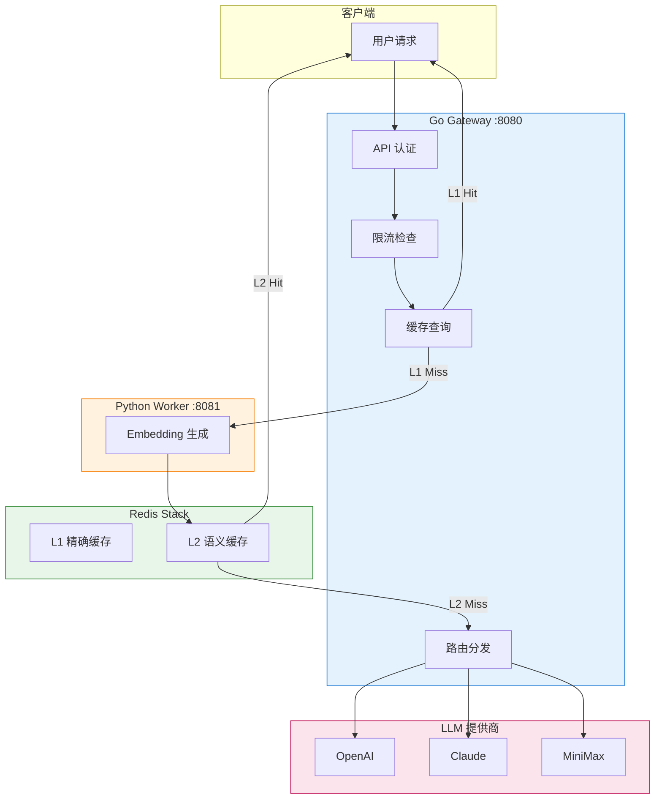

# High-Performance LLM Gateway

高性能 LLM 网关 - 企业级大模型流量管理方案，支持多提供商、智能缓存和限流。

## 特性

- **多模型支持**: OpenAI, Anthropic (Claude), MiniMax
- **分层缓存**:
  - L1 精确缓存: Redis Hash (SHA256), <1ms 延迟
  - L2 语义缓存: Redis Vector (Embedding 相似度 >0.95), 10-50ms 延迟
- **Token 限流**: 令牌桶算法 + TikToken Go
- **高性能**: 10,000+ QPS 吞吐量
- **认证鉴权**: API Key 认证 + Redis 缓存
- **管理后台**: Key 管理与使用统计

## 架构图



## 快速开始

### 前置要求

- Go 1.21+
- Redis (缓存)
- PostgreSQL (持久化)

### 本地运行

```bash
# 克隆仓库
git clone https://github.com/Oxidaner/High-Performance-LLM-Gateway.git
cd High-Performance-LLM-Gateway

# 复制配置文件
cp configs/config.yaml configs/config.yaml
# 编辑 config.yaml 填入你的 API keys

# 运行服务
go run cmd/server/main.go
```

### 配置

编辑 `configs/config.yaml`:

```yaml
server:
  host: 0.0.0.0
  port: 8080
  mode: debug

logger:
  level: info
  format: console
  output_path: stdout

providers:
  openai:
    api_key: your-openai-key
    base_url: https://api.openai.com/v1
  anthropic:
    api_key: your-anthropic-key
```

## API 接口

### OpenAI 兼容接口

```bash
# 聊天完成
curl -X POST http://localhost:8080/v1/chat/completions \
  -H "Authorization: Bearer YOUR_API_KEY" \
  -H "Content-Type: application -d '{
/json" \
     "model": "gpt-4",
    "messages": [{"role": "user", "content": "你好!"}]
  }'

# 模型列表
curl http://localhost:8080/v1/models

# 向量嵌入
curl -X POST http://localhost:8080/v1/embeddings \
  -H "Authorization: Bearer YOUR_API_KEY" \
  -H "Content-Type: application/json" \
  -d '{
    "model": "text-embedding-ada-002",
    "input": "Hello world"
  }'
```

### 管理后台接口

```bash
# 创建 API Key
curl -X POST http://localhost:8080/api/v1/keys \
  -H "Content-Type: application/json" \
  -d '{"name": "my-key", "rate_limit": 1000}'

# 列出 API Keys
curl http://localhost:8080/api/v1/keys

# 使用统计
curl http://localhost:8080/api/v1/stats
```

## 性能目标

| 指标 | 目标 |
|------|------|
| QPS | 10,000+ |
| P99 延迟 | < 500ms |
| L1 缓存命中 | < 1ms |
| L2 缓存命中 | 10-50ms |
| 缓存命中率 | 80% |

## 项目结构

```
llm-gateway/
├── cmd/server/           # 入口文件
├── internal/
│   ├── config/          # 配置加载
│   ├── handler/        # HTTP 处理器
│   ├── logger/         # Zap 日志
│   ├── middleware/     # 认证、限流
│   └── storage/        # Redis、PostgreSQL 客户端
├── configs/            # 配置文件
└── go.mod
```

## 技术栈

- **网关**: Go + Gin
- **AI Worker**: Python + FastAPI + sentence-transformers
- **缓存**: Redis Stack (向量搜索 + 缓存)
- **数据库**: PostgreSQL
- **部署**: Kubernetes

## 许可证

MIT
