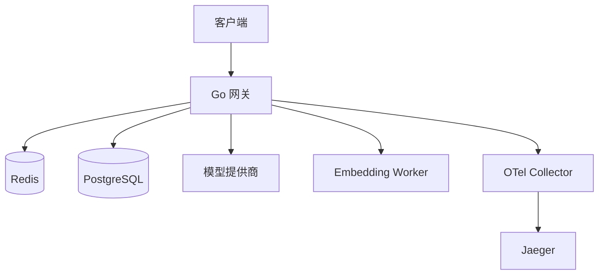

# [English](./README.md) | 中文

# High-Performance LLM Gateway

一个使用 Go 构建的 OpenAI 兼容 LLM 网关。

项目定位是“推理网关 + Agent 基础设施层”，而不是完整 Agent 平台。

## 项目定位

本仓库当前适合：

- 提供 OpenAI 兼容的聊天与向量接口
- 统一接入多个上游模型提供商
- 做 API Key 鉴权、限流、管理接口
- 提供路由、缓存、追踪、workflow 可观测能力

本仓库当前不包括：

- 完整 Agent Runtime
- 完整 RAG 产品面
- 可直接替代 LiteLLM/Portkey 的生产级全量能力

## 当前能力

已实现：

- `GET /health`
- `POST /v1/chat/completions`
- `POST /v1/embeddings`
- `GET /v1/models`
- `POST /api/v1/keys`
- `GET /api/v1/keys`
- `DELETE /api/v1/keys/:id`
- `GET /api/v1/stats`
- `GET /api/v1/workflows/:session_id/summary`
- `GET /api/v1/workflows/summaries`
- API Key 鉴权中间件
- 全局 + 模型级限流
- Chat L1 精确缓存
- Chat L2 语义缓存（在线链路 `L1 -> L2 -> provider`）
- Provider 抽象与 Registry
- 加权路由 + fallback
- 熔断器（provider/model 维度）
- Embedding Worker 健康检查 + 重试
- 请求日志（模型、延迟、状态、缓存命中）
- PostgreSQL 持久化请求日志（带内存兜底）
- Workflow 追踪模型与 JSONL replay 输出（`logs/workflow_replay.jsonl`）
- 分阶段路由策略（`planning` / `execution` / `summarization`）
- OpenTelemetry trace（HTTP + cache/provider/worker 子 span）
- OTLP 导出支持（Docker 本地链路：`gateway -> otel-collector -> jaeger`）
- Docker 本地集成环境（`deployments/docker`）
- 基础压测脚本（`scripts/loadtest`）
- 核心路径单元测试（鉴权、限流、缓存、路由、workflow）

计划中但未完成：

- 更精细的 workflow 成本计价模型
- workflow summary 持久化流水线（当前为内存聚合）

## 架构



## Chat 请求链路

1. 客户端调用 OpenAI 兼容接口。
2. 网关执行 API Key 鉴权与限流。
3. 先查 L1 缓存。
4. L1 未命中后查 L2 语义缓存。
5. L2 未命中后按路由/兜底/熔断策略转发上游。
6. 记录日志与 trace，回写缓存并返回响应。

## 快速开始

### 依赖

- Go 1.21+
- Redis
- PostgreSQL

### 运行

```bash
git clone https://github.com/Oxidaner/High-Performance-LLM-Gateway.git
cd High-Performance-LLM-Gateway
go run ./cmd/server
```

运行前请按需修改 `configs/config.yaml`。

## Docker 本地集成

```bash
cd deployments/docker
docker compose up -d --build
```

详情见 `deployments/docker/README.md`。

## 基础压测

```bash
go run ./scripts/loadtest -url http://localhost:8080/v1/chat/completions -api-key YOUR_API_KEY
```

PowerShell 包装脚本：

```bash
./scripts/loadtest/run.ps1 -ApiKey YOUR_API_KEY -Requests 500 -Concurrency 50
```

## 当前支持模型

由 `configs/config.yaml` 配置，并通过 `GET /v1/models` 暴露：

- `gpt-4`（provider: `openai`）
- `gpt-3.5-turbo`（provider: `openai`）
- `claude-3-haiku`（provider: `anthropic`）

## Chat 请求约束

`POST /v1/chat/completions` 当前校验：

- 请求体必须是 JSON
- `model` 必填
- `messages` 不能为空
- 每条 message 的 `role` 和 `content` 必填
- `role` 仅支持：`system`、`user`、`assistant`、`tool`
- `temperature` 范围 `[0, 2]`
- `top_p` 范围 `[0, 1]`
- `max_tokens` 必须 `>= 0`
- `stop` 最多 4 条

支持的 workflow 请求头：

- `X-Workflow-Session`
- `X-Workflow-Step`
- `X-Workflow-Tool`
- `X-Workflow-Phase`（`planning` / `execution` / `summarization`）
- `X-Workflow-Trace-Id`

## 目录结构

```text
cmd/server/                入口
configs/                   配置
deployments/               Docker / K8s 部署相关
docs/                      文档与路线图
internal/config/           配置加载
internal/handler/          HTTP 处理器
internal/middleware/       鉴权、日志、限流
internal/service/cache/    L1/L2 缓存
internal/service/provider/ provider 适配与 registry
internal/service/workflow/ workflow 追踪与汇总
internal/storage/          Redis / PostgreSQL 客户端
pkg/errors/                API 错误封装
scripts/loadtest/          压测脚本
```

## License

MIT
