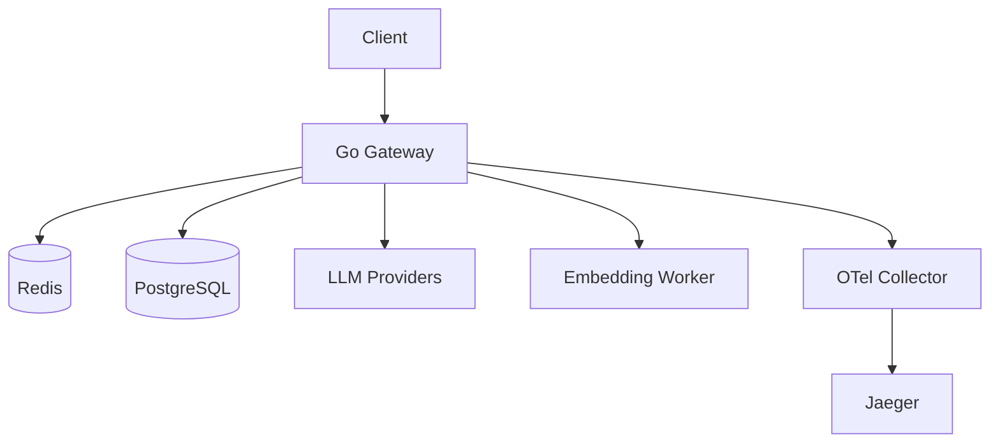

# English | [中文](./README-zh.md)

# High-Performance LLM Gateway

An OpenAI-compatible LLM gateway built in Go.

The project is positioned as an inference gateway and agent-infrastructure layer, not a full agent platform.

## Positioning

This repository is for:

- OpenAI-compatible chat and embeddings APIs
- multi-provider access behind one gateway
- API key auth, rate limiting, and admin operations
- routing, caching, tracing, and workflow observability for agent-heavy workloads

This repository is not yet:

- a full agent runtime
- a RAG platform
- a production-complete replacement for products like LiteLLM or Portkey

## Current Status

Implemented today:

- `GET /health`
- `POST /v1/chat/completions`
- `POST /v1/embeddings`
- `GET /v1/models`
- `POST /api/v1/keys`
- `GET /api/v1/keys`
- `DELETE /api/v1/keys/:id`
- `GET /api/v1/stats`
- `GET /api/v1/workflows/:session_id/summary`
- `GET /api/v1/workflows/summaries`
- API key auth middleware
- global + model-aware rate limiting
- L1 exact cache for chat responses
- L2 semantic cache in live chat path (`L1 -> L2 -> provider`)
- provider interface and provider registry
- weighted routing + fallback
- circuit breaker (per provider/model route)
- embedding worker client with health check + retry strategy
- request logging with model, latency, status, cache hit
- durable request logs in PostgreSQL (with in-memory fallback)
- workflow trace model and replay-friendly JSONL output (`logs/workflow_replay.jsonl`)
- phase-aware model routing policy (`planning` / `execution` / `summarization`)
- OpenTelemetry spans (HTTP + cache/provider/worker sub-spans)
- OTLP trace export support (docker local path: `gateway -> otel-collector -> jaeger`)
- Docker-based local integration environment (`deployments/docker`)
- basic load test scripts (`scripts/loadtest`)
- unit tests for core gateway paths (auth, rate limit, cache, provider routing, workflow tracing)

Planned, but not complete:

- richer pricing model for accurate workflow cost accounting
- durable workflow summary pipeline (currently in-memory aggregation)

## Architecture



## Request Flow (Chat)

1. Client calls an OpenAI-compatible endpoint.
2. Gateway validates API key and applies rate limiting.
3. Gateway checks L1 cache.
4. On L1 miss, gateway checks L2 semantic cache.
5. On L2 miss, gateway routes to upstream provider with fallback/circuit logic.
6. Gateway records logs/traces/workflow lineage and writes back cache.

## Quick Start

### Prerequisites

- Go 1.21+
- Redis
- PostgreSQL

### Run

```bash
git clone https://github.com/Oxidaner/High-Performance-LLM-Gateway.git
cd High-Performance-LLM-Gateway
go run ./cmd/server
```

Edit `configs/config.yaml` before running if you need upstream provider credentials.

## Local Integration (Docker)

```bash
cd deployments/docker
docker compose up -d --build
```

See `deployments/docker/README.md` for details.

## Basic Load Test

```bash
go run ./scripts/loadtest -url http://localhost:8080/v1/chat/completions -api-key YOUR_API_KEY
```

PowerShell wrapper:

```bash
./scripts/loadtest/run.ps1 -ApiKey YOUR_API_KEY -Requests 500 -Concurrency 50
```

## Supported Models (Current)

Configured in `configs/config.yaml` and exposed by `GET /v1/models`:

- `gpt-4` (provider: `openai`)
- `gpt-3.5-turbo` (provider: `openai`)
- `claude-3-haiku` (provider: `anthropic`)

## Chat Request Constraints (Current)

`POST /v1/chat/completions` enforces:

- JSON body is required
- `model` is required
- `messages` must be non-empty
- each message must have non-empty `role` and `content`
- `role` must be one of: `system`, `user`, `assistant`, `tool`
- `temperature` must be in `[0, 2]`
- `top_p` must be in `[0, 1]`
- `max_tokens` must be `>= 0`
- `stop` can contain at most 4 sequences

Workflow headers supported for trace/lineage:

- `X-Workflow-Session`
- `X-Workflow-Step`
- `X-Workflow-Tool`
- `X-Workflow-Phase` (`planning` / `execution` / `summarization`)
- `X-Workflow-Trace-Id`

## Project Structure

```text
cmd/server/                entry point
configs/                   configuration
deployments/               Docker and Kubernetes manifests
docs/                      notes and roadmap
internal/config/           config loading
internal/handler/          HTTP handlers
internal/middleware/       auth, logging, rate limiting
internal/service/cache/    L1 and L2 cache implementations
internal/service/provider/ provider adapters and registry
internal/service/workflow/ workflow tracing and summaries
internal/storage/          Redis and PostgreSQL clients
pkg/errors/                API error helpers
scripts/loadtest/          load test scripts
```

## License

MIT
