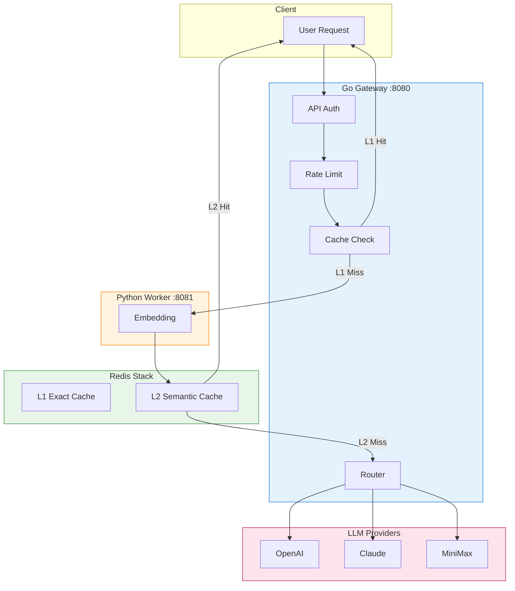

# High-Performance LLM Gateway

Enterprise-grade API gateway for managing LLM (Large Language Model) requests with multi-provider support, intelligent caching, and rate limiting.

## Features

- **Multi-Provider Support**: OpenAI, Anthropic (Claude), MiniMax
- **Layered Caching**:
  - L1 Exact Cache: Redis Hash (SHA256), <1ms latency
  - L2 Semantic Cache: Redis Vector (Embedding similarity >0.95), 10-50ms latency
- **Token Rate Limiting**: Token bucket algorithm with TikToken Go
- **High Performance**: 10,000+ QPS throughput
- **Authentication**: API Key based auth with Redis caching
- **Admin API**: Key management and usage statistics

## Architecture



## Quick Start

### Prerequisites

- Go 1.21+
- Redis (for caching)
- PostgreSQL (for persistence)

### Run Locally

```bash
# Clone the repository
git clone https://github.com/Oxidaner/High-Performance-LLM-Gateway.git
cd High-Performance-LLM-Gateway

# Copy config and set your API keys
cp configs/config.yaml configs/config.yaml
# Edit config.yaml with your API keys

# Run the server
go run cmd/server/main.go
```

### Configuration

Edit `configs/config.yaml`:

```yaml
server:
  host: 0.0.0.0
  port: 8080
  mode: debug

logger:
  level: info
  format: console
  output_path: stdout

providers:
  openai:
    api_key: your-openai-key
    base_url: https://api.openai.com/v1
  anthropic:
    api_key: your-anthropic-key

# ... more config options
```

## API Endpoints

### OpenAI-Compatible API

```bash
# Chat completions
curl -X POST http://localhost:8080/v1/chat/completions \
  -H "Authorization: Bearer YOUR_API_KEY" \
  -H "Content-Type: application/json" \
  -d '{
    "model": "gpt-4",
    "messages": [{"role": "user", "content": "Hello!"}]
  }'

# List models
curl http://localhost:8080/v1/models

# Get embeddings
curl -X POST http://localhost:8080/v1/embeddings \
  -H "Authorization: Bearer YOUR_API_KEY" \
  -H "Content-Type: application/json" \
  -d '{
    "model": "text-embedding-ada-002",
    "input": "Hello world"
  }'
```

### Admin API

```bash
# Create API key
curl -X POST http://localhost:8080/api/v1/keys \
  -H "Content-Type: application/json" \
  -d '{"name": "my-key", "rate_limit": 1000}'

# List API keys
curl http://localhost:8080/api/v1/keys

# Get usage stats
curl http://localhost:8080/api/v1/stats
```

## Performance Targets

| Metric | Target |
|--------|--------|
| QPS | 10,000+ |
| P99 Latency | < 500ms |
| L1 Cache Hit | < 1ms |
| L2 Cache Hit | 10-50ms |
| Cache Hit Rate | 80% |

## Project Structure

```
llm-gateway/
├── cmd/server/           # Entry point
├── internal/
│   ├── config/          # Configuration loading
│   ├── handler/         # HTTP handlers
│   ├── logger/          # Zap logger
│   ├── middleware/      # Auth, rate limiting
│   └── storage/         # Redis, PostgreSQL clients
├── configs/             # Configuration files
└── go.mod
```

## Tech Stack

- **Gateway**: Go + Gin
- **AI Worker**: Python + FastAPI + sentence-transformers
- **Cache**: Redis Stack (vector search + caching)
- **Database**: PostgreSQL
- **Deployment**: Kubernetes

## License

MIT
