# High-Performance LLM Gateway 规格说明书

## 1. 项目概述

### 1.1 项目简介
企业级高性能 LLM 网关 + AI Agent 平台，支持多模型统一接入、分层缓存、Token 限流、Agent 推理和 RAG 企业知识库问答。

### 1.2 项目定位
- **项目类型**: 个人项目 / Side Project
- **部署方式**: Kubernetes
- **技术栈**: Go (API 网关) + Python (AI 任务处理)

### 1.3 核心特性
| 特性 | 描述 | 预期收益 |
|------|------|---------|
| **LLM 网关** | OpenAI/Claude/MiniMax 多提供商统一接入 | 统一API、供应商解耦 |
| **分层缓存** | L1精确缓存 + L2语义缓存 (Redis Vector) | 降低 API 成本 40% |
| **Token 限流** | 令牌桶算法，TikToken 精确计算 | 10k+ QPS 稳定运行 |
| **AI Agent** | ReAct/CoT 推理引擎 + 工具调用 | 多步推理、自主决策 |
| **RAG** | 文档上传 → 向量化 → 向量检索 → LLM生成 | 企业知识库问答 |
| **智能重试** | 指数退避 + 可重试错误码识别 | 请求成功率提升 |
| **Prompt 优化** | 系统提示词缓存 + 历史消息压缩 | Token 消耗降低 |
| **调用链观测** | OpenTelemetry/Jaeger 全链路追踪 | 问题快速定位 |

### 1.4 性能目标
| 指标 | 目标 |
|------|------|
| 吞吐量 | 10,000+ QPS |
| P99 延迟 | < 500ms |
| 可用性 | 99.9% |
| LLM 调用成功率 | > 99.5% |

---

## 2. 功能需求

### 2.1 LLM 提供商集成

| 提供商             | 支持状态 | 优先级 |
| ------------------ | -------- | ------ |
| OpenAI (GPT-4/3.5) | ✅ 支持   | P0     |
| Claude (Anthropic) | ✅ 支持   | P0     |
| minimax            | ✅ 支持   | P1     |

#### 2.1.1 接口统一封装
- 统一请求/响应格式
- 错误码标准化
- 支持流式输出 (SSE)

### 2.2 分层缓存系统

> ⚠️ **性能优化**: 采用 L1 + L2 分层缓存，避免每次请求都走 Embedding 计算

#### 2.2.1 分层缓存架构

| 层级   | 缓存类型 | 实现方式                   | 延迟       | 命中率预估 |
| ------ | -------- | -------------------------- | ---------- | ---------- |
| **L1** | 精确缓存 | Redis Hash (SHA256 prompt) | < 1ms      | 60-80%     |
| **L2** | 语义缓存 | Redis Vector (FT.SEARCH)   | 10-50ms    | 10-20%     |
| **L0** | 无缓存   | 直连 LLM                   | 500-3000ms | -          |

#### 2.2.2 L1 精确缓存
- **缓存键**: `SHA256(prompt + model + temperature)`
- **用途**: 拦截高频重复请求 (如轮询场景、相同 Prompt)
- **特点**: 微秒级查询，无需调用 Python Worker

#### 2.2.3 L2 语义缓存
- **向量模型**: text-embedding-ada-002 / text-embedding-3-small
- **相似度阈值**: > 0.95
- **用途**: 处理语义相似但文本不同的请求

#### 2.2.4 缓存流程 (优化后)
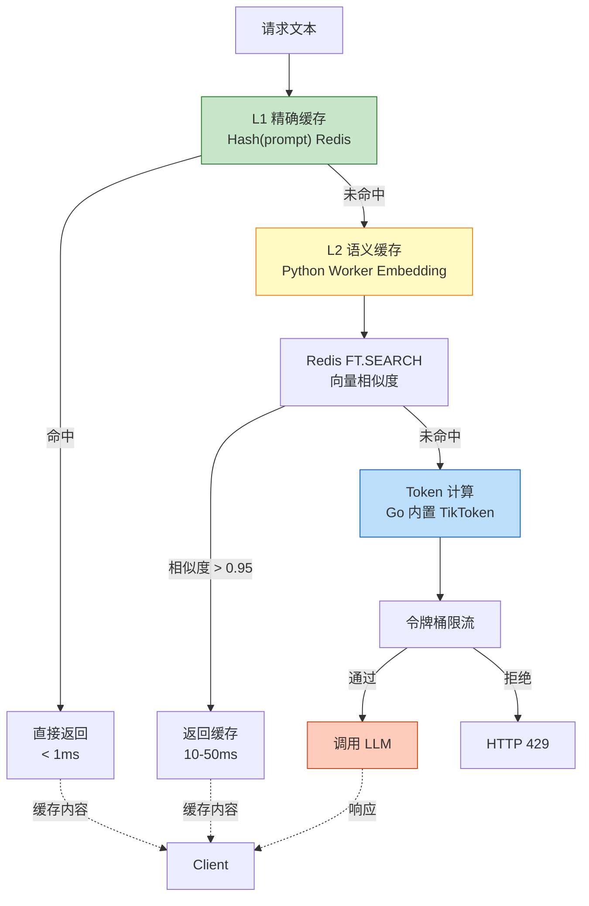

> **面试话术**: "我采用了分层缓存策略，L1 使用 Hash 实现微秒级精确匹配，拦截 80% 的高频重复请求；L2 处理语义相似请求。这样避免每次都进行 Embedding 计算，降低了 P95 延迟。"

#### 2.2.5 缓存命中时的流式处理
| 场景               | 处理方式                                                     |
| ------------------ | ------------------------------------------------------------ |
| 非流式请求命中缓存 | 直接返回完整响应                                             |
| 流式请求命中缓存   | **模拟 SSE 流式行为**，将完整文本拆分为 chunk 发送 (用户体验一致) |
| 流式切分策略       | 按句子/段落切分，每 20-50 字符一个 chunk，模拟真实 LLM 流式输出 |

#### 2.2.6 缓存配置
| 参数                 | 默认值  | 说明                          |
| -------------------- | ------- | ----------------------------- |
| l1_enabled           | true    | L1 精确缓存开关               |
| l2_enabled           | true    | L2 语义缓存开关               |
| l1_ttl               | 1 hour  | L1 缓存过期时间 (短,高频数据) |
| l2_ttl               | 7 days  | L2 缓存过期时间               |
| similarity_threshold | 0.95    | L2 相似度阈值                 |
| max_cache_size       | 100,000 | 最大缓存条目                  |

### 2.3 多模型负载均衡

#### 2.3.1 路由策略
- **主要策略**: 加权轮询 (Weighted Round Robin)
- **权重配置**: 按模型/提供商配置
- **故障转移**: 自动熔断 + 降级

#### 2.3.2 熔断降级
| 状态          | 处理策略           |
| ------------- | ------------------ |
| 连续 3 次失败 | 熔断 30 秒         |
| 熔断期间      | 自动切换到备用模型 |
| 恢复检测      | 成功后自动恢复     |

#### 2.3.3 模型配置示例
```yaml
models:
  - name: gpt-4
    provider: openai
    weight: 5
    fallback: gpt-3.5-turbo
    
  - name: gpt-3.5-turbo
    provider: openai
    weight: 3
    fallback: claude-3-haiku
    
  - name: claude-3-haiku
    provider: anthropic
    weight: 2
```

### 2.4 Token 精确流控

#### 2.4.1 限流算法
- **算法**: 令牌桶 (Token Bucket)
- **Token 计算**: Go 网关层内置 TikToken，**避免 RPC 调用**
  - **OpenAI 模型**: `pkoukk/tiktoken-go` 精确计算 (< 1ms)
  - **非 OpenAI 模型**: 字符数 × 系数估算 (Trade-off)
- **粒度**: 全局限流 + 按模型限流 + 按 API Key 限流

#### 2.4.2 Tokenizer 配置 (Go 内置)
> ⚠️ **性能优化**: Token 计算在 Go 进程内完成，避免每次请求都跨进程调用 Python

| 模型类型           | Tokenizer        | 计算方式 | 精度 |
| ------------------ | ---------------- | -------- | ---- |
| OpenAI (GPT-4/3.5) | tiktoken-go (Go) | 精确计算 | ±2%  |
| Claude (Anthropic) | 字符数 × 0.75    | 估算     | ±10% |
| 通义千问/MiniMax   | 字符数 × 0.6     | 估算     | ±15% |

> **面试话术**: "为了保证 10k QPS 的性能目标，Token 计算在 Go 网关层直接完成，使用 TikToken 的 Go 移植版本。对于非 OpenAI 模型采用字符数估算，这是一个典型的工程 Trade-off。"

#### 2.4.3 限流流程
```
请求 → Go Gateway (内置 TikToken)
        │
        ▼
   Token 计算 (< 1ms)
        │
        ▼
   令牌桶检查 (限流/拦截)
        │
        ▼
   上下文长度检查 (max_tokens > model.max_context?)
        │
        ├─ 超长 → HTTP 400 返回
        │
        └─ 正常 → 转发 LLM
```

#### 2.4.3 限流配置
| 参数        | 默认值     | 说明             |
| ----------- | ---------- | ---------------- |
| global_rate | 10,000 QPS | 全局 QPS 限制    |
| model_rate  | 5,000 QPS  | 单模型 QPS 限制  |
| burst_size  | 500        | 突发容量         |
| max_tokens  | 128,000    | 单请求最大 token |

#### 2.4.4 长文本保护与上下文截断
> ⚠️ **网关层前置拦截**: 在网关层检测并拒绝超长请求，节省 Token 成本

- **前置检查**: Go Gateway 内置 TikToken 计算请求 token 数 (< 1ms)
- **超长拦截**: 请求 token > 模型 max_context 时，**网关直接返回错误**，不调用 LLM
- **错误响应**: 返回 OpenAI 兼容格式的 error message
- **拦截收益**: 避免浪费用户配额 + 节省 LLM API 成本

| 场景                    | 处理方式                         |
| ----------------------- | -------------------------------- |
| token > max_context     | HTTP 400 + "max_tokens exceeded" |
| token > 128k (绝对上限) | HTTP 400 + "request too large"   |
| 正常请求                | 放行至 LLM                       |

#### 2.4.5 异常处理标准化
> ⚠️ **统一封装**: 将各供应商的非标准错误转换为 OpenAI 格式

| LLM 返回状态码 | 原始错误            | 封装后错误 (OpenAI 格式)                                     |
| -------------- | ------------------- | ------------------------------------------------------------ |
| 429            | Rate Limit          | `{"error": {"type": "rate_limit_error", "message": "..."}}`  |
| 500            | Server Error        | `{"error": {"type": "server_error", "message": "..."}}`      |
| 401            | Auth Failed         | `{"error": {"type": "invalid_api_key", "message": "..."}}`   |
| 403            | Permission Denied   | `{"error": {"type": "permission_error", "message": "..."}}`  |
| 503            | Service Unavailable | `{"error": {"type": "service_unavailable", "message": "..."}}` |

> **面试点**: 异常标准化是网关的核心价值之一，确保客户端感知一致

### 2.5 智能重试

> ⚡ **目标**: 提升请求成功率，减少因瞬时故障导致的失败

| 策略 | 描述 | 状态 |
|------|------|------|
| 指数退避 | 重试间隔递增: 1s → 2s → 4s → 8s | 待实现 |
| 最大重试次数 | 默认 3 次，超过则返回错误 | 待实现 |
| 可重试错误码 | 429/500/502/503/504 | 待实现 |
| 熔断期间跳过 | 熔断中的模型直接跳过，不计入重试 | 待实现 |

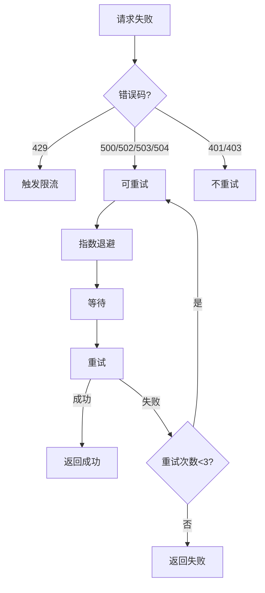

### 2.6 Prompt 优化

> ⚡ **目标**: 减少 Token 消耗，提升响应质量

| 功能 | 描述 | 状态 |
|------|------|------|
| 系统提示词缓存 | 相同系统提示词只传输一次 | 待实现 |
| 历史消息压缩 | 超过 N 条消息时压缩/摘要 | 待实现 |
| 上下文截断 | 超长上下文自动截断，保留关键信息 | 待实现 |

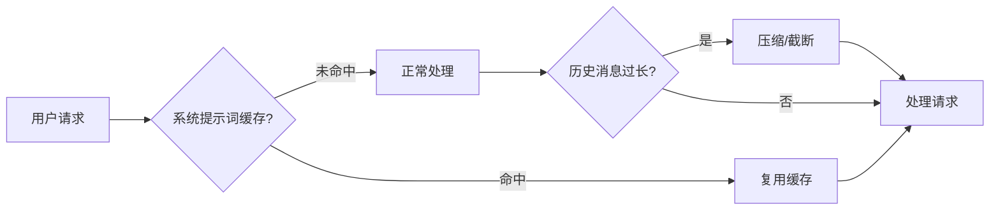

### 2.7 调用链观测

> ⚡ **目标**: 快速定位问题，分析性能瓶颈

| 能力 | 描述 | 状态 |
|------|------|------|
| 全链路追踪 | OpenTelemetry/Jaeger 集成 | 待实现 |
| 请求标识 | 自动生成 TraceID，透传各服务 | 待实现 |
| 关键节点埋点 | 缓存命中、LLM调用、Token计算等 | 待实现 |
| 错误分析 | 记录错误上下文，便于排查 | 待实现 |

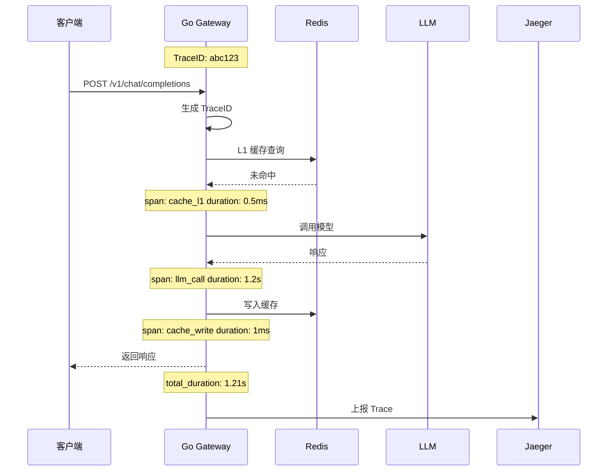

### 2.8 API 接口

#### 2.5.1 对外 API (OpenAI 兼容)
```
POST /v1/chat/completions      # 聊天完成
POST /v1/completions           # 文本完成
POST /v1/embeddings            # 向量嵌入
GET  /v1/models                # 模型列表
```

#### 2.5.2 管理 API
```
POST   /api/v1/keys            # 创建 API Key
GET    /api/v1/keys            # 获取 Key 列表
DELETE /api/v1/keys/:id        # 删除 Key
GET    /api/v1/stats           # 流量统计
POST   /api/v1/models          # 添加模型
PUT    /api/v1/models/:id      # 更新模型配置
```

#### 2.5.3 请求示例
```bash
# 聊天完成
curl -X POST http://localhost:8080/v1/chat/completions \
  -H "Authorization: Bearer sk-xxxx" \
  -H "Content-Type: application/json" \
  -d '{
    "model": "gpt-4",
    "messages": [{"role": "user", "content": "Hello!"}],
    "stream": false
  }'
```

#### 2.5.4 错误响应格式 (OpenAI 兼容)
```json
{
  "error": {
    "message": "Error message description",
    "type": "invalid_request_error",
    "code": "invalid_api_key"
  }
}
```

#### 2.5.5 错误码定义

##### 通用错误码
| HTTP 状态码 | error.type            | error.code          | 说明                      | 排查方向             |
| ----------- | --------------------- | ------------------- | ------------------------- | -------------------- |
| 400         | invalid_request_error | max_tokens_exceeded | 请求 token 超过模型上下文 | 检查 max_tokens 参数 |
| 400         | invalid_request_error | request_too_large   | 请求体过大                | 压缩 prompt          |
| 401         | invalid_api_key       | invalid_api_key     | API Key 无效              | 检查 Key 是否正确    |
| 401         | invalid_api_key       | key_expired         | API Key 已过期            | 续期 Key             |
| 403         | permission_error      | key_disabled        | API Key 已禁用            | 启用 Key             |
| 429         | rate_limit_error      | rate_limit_exceeded | 触发限流                  | 降低请求频率         |
| 429         | rate_limit_error      | quota_exceeded      | 配额耗尽                  | 充值/联系管理员      |
| 500         | server_error          | internal_error      | LLM 服务内部错误          | 重试/切换模型        |
| 502         | server_error          | bad_gateway         | 模型服务商网关错误        | 切换模型             |
| 503         | service_unavailable   | model_overloaded    | 模型过载                  | 降级/重试            |
| 503         | service_unavailable   | model_not_available | 模型暂不可用              | 切换模型             |

##### Agent 错误码
| HTTP 状态码 | error.type         | error.code       | 说明                     | 排查方向           |
| ----------- | ------------------ | ---------------- | ------------------------ | ------------------ |
| 400         | agent_error        | max_steps_exceeded | 超过最大推理步数        | 简化任务           |
| 400         | agent_error        | tool_not_found   | 指定的工具不存在          | 检查工具名称       |
| 400         | agent_error        | tool_timeout     | 工具执行超时              | 检查工具服务       |
| 400         | agent_error        | loop_detected   | 检测到循环调用            | 任务可能过于复杂   |
| 400         | agent_error        | invalid_reasoning | 无效的推理结果           | 重试               |

##### RAG 错误码
| HTTP 状态码 | error.type         | error.code       | 说明                     | 排查方向           |
| ----------- | ------------------ | ---------------- | ------------------------ | ------------------ |
| 400         | rag_error         | document_too_large | 文档过大                 | 拆分文档           |
| 400         | rag_error         | unsupported_format | 不支持的文档格式         | 检查文件类型       |
| 400         | rag_error         | embedding_failed | 向量生成失败             | 检查 Embedding 服务 |
| 400         | rag_error         | no_results       | 检索无结果               | 调整检索参数       |
| 400         | rag_error         | low_similarity   | 相似度过低                | 补充更多文档       |

##### 智能重试错误码
| HTTP 状态码 | error.type         | error_code       | 说明                     | 排查方向           |
| ----------- | ------------------ | ---------------- | ------------------------ | ------------------ |
| 429         | retry_exhausted    | max_retries      | 重试次数已用尽           | 服务暂时不可用     |
| 504         | gateway_timeout    | retry_timeout    | 重试超时                 | 服务响应慢         |

#### 2.5.6 熔断错误处理
| 状态         | 响应                           | 处理策略               |
| ------------ | ------------------------------ | ---------------------- |
| 模型熔断中   | 503 + "model_circuit_breaker"  | 自动切换 fallback 模型 |
| 所有模型熔断 | 503 + "all_models_unavailable" | 返回降级响应           |

### 2.9 认证授权

#### 2.9.1 认证方式
- **API Key**: 简单场景
- **OAuth2**: 企业场景 (可选)

#### 2.6.2 Key 管理
- Key 格式: `sk-` 前缀 + 32 位随机字符串
- 支持设置 Key 有效期
- 支持设置 Key 速率限制

#### 2.6.3 配置热更新机制
> ⚠️ **轻量化方案**: K8s ConfigMap + fsnotify 热更新，无需额外中间件

| 配置项       | 热更新方式                  | 生效时间      |
| ------------ | --------------------------- | ------------- |
| 模型权重     | fsnotify 监听 + 内存 reload | < 1s          |
| 限流参数     | fsnotify 监听 + 内存 reload | < 1s          |
| 缓存阈值     | fsnotify 监听 + 内存 reload | < 1s          |
| 新增 API Key | DB 写入 + Redis 缓存刷新    | 5s (缓存 TTL) |

```
K8s ConfigMap 变更
        │
        ▼
   fsnotify 事件触发
        │
        ├── reload_models()      → 更新内存中的模型配置
        ├── reload_ratelimit()   → 重置令牌桶
        └── reload_cache()       → 更新缓存阈值
```

> **面试话术**: "考虑到个人项目的轻量化需求，我选择了 K8s ConfigMap + fsnotify 的方案。相比 Nacos，这个方案零额外依赖，同时利用 K8s 原生特性，面试时可以展示对 K8s 的理解。"

### 2.10 Admin 管理后台

| 模块     | 功能                                 |
| -------- | ------------------------------------ |
| 仪表盘   | 实时 QPS、延迟、缓存命中率、成本统计 |
| 模型管理 | 添加/编辑/删除模型，配置权重         |
| Key 管理 | 创建/禁用/删除 API Key               |
| 流量分析 | 请求日志、错误统计、趋势图           |
| 系统配置 | 限流参数、缓存配置、告警阈值         |

### 2.11 AI Agent

> ⚡ **架构**: Go 内置 Agent + 预留 Python 扩展接口
> ⚡ **模式**: 混合模式 - 默认技能集内置 + 动态发现扩展

| 能力 | 描述 | 状态 |
|------|------|------|
| ReAct 推理 | 思考→行动→观察循环 | 待实现 |
| CoT 推理 | 思维链逐步推理 | 待实现 |
| 工具调用 | 网络搜索、数据库查询、API调用 | 待实现 |
| 自主决策 | LLM 自主判断是否调用工具 | 待实现 |

#### 2.11.1 默认技能集 (内置)

内置默认工具，保证核心性能和可靠性：

| 工具 | 功能 | 说明 |
|------|------|------|
| `rag_search` | RAG 检索 | 知识库文档检索 |
| `web_search` | 网络搜索 | 实时信息获取 |
| `db_query` | 数据库查询 | 结构化数据查询 |
| `http_call` | API 调用 | 外部 HTTP API |
| `embedding` | 向量生成 | 复用 /v1/embeddings |

> ⚠️ **Token 计算器**: 作为内部服务，不暴露给 Agent，仅用于限流/计费

#### 2.11.2 动态发现接口

预留扩展能力，支持自定义工具：

| 接口 | 方法 | 功能 |
|------|------|------|
| `/v1/agent/tools` | GET | 获取可用工具列表 |
| `/v1/agent/tools/register` | POST | 注册新工具 |
| `/v1/agent/tools/:name` | DELETE | 删除工具 |

#### 2.11.3 统一 Tool 接口

所有工具（内置/动态）遵循统一接口：

```go
type Tool interface {
    Name() string        // 工具名称
    Description() string // 工具描述
    Schema() ToolSchema  // JSON Schema (供 LLM 函数调用)
    Execute(ctx context.Context, params map[string]interface{}) (string, error)
}
```

> 📖 详细接口定义见「13.2.2.3 工具注册与发现」

#### 2.11.4 数据流

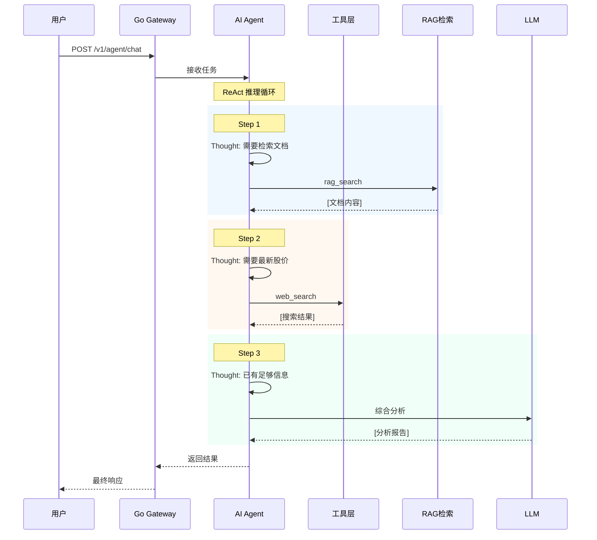

#### 2.11.5 工具调用流程

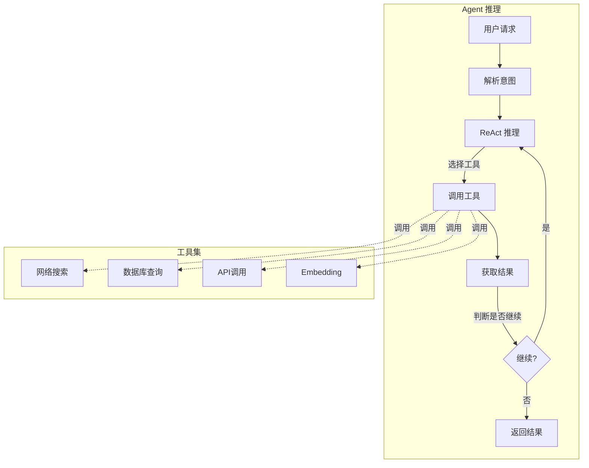

### 2.12 RAG

> ⚡ **向量存储**: Redis Stack

| 功能 | 描述 | 状态 |
|------|------|------|
| 文档上传 | 支持 TXT、MD、PDF、DOCX | 待实现 |
| 文本分块 | 滑动窗口 chunk_size=512 | 待实现 |
| 向量检索 | Redis Vector FT.SEARCH | 待实现 |
| RAG 问答 | 检索 + LLM 生成 | 待实现 |

#### 2.12.1 数据流

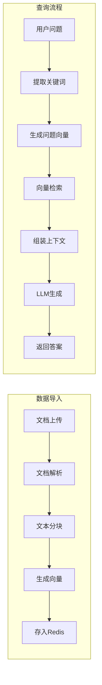

#### 2.12.2 RAG 问答时序

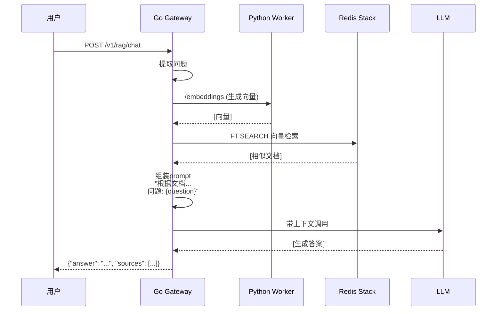

#### 2.12.3 大文档处理

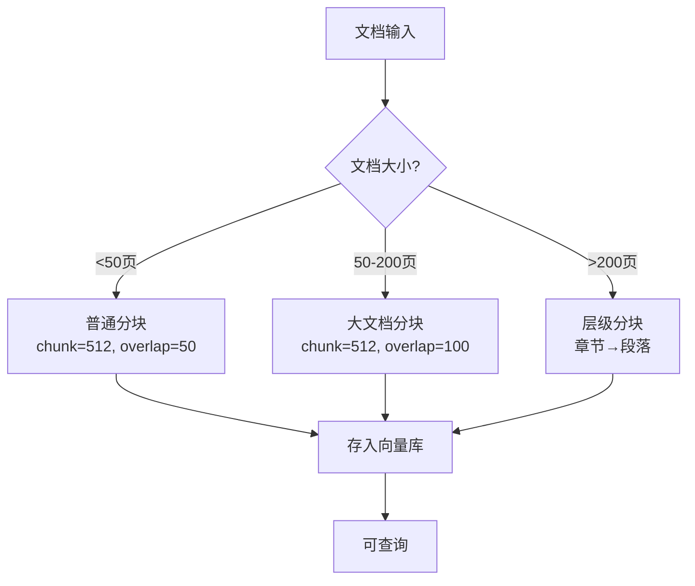

---

## 3. 技术架构

### 3.1 系统架构图

```
┌─────────────────────────────────────────────────────────────────┐
│                         Kubernetes                               │
│                                                                 │
│  ┌─────────────────────────────────────────────────────────────┐
│  │                    Go Gateway (:8080)                        │
│  │  ┌─────────────┐  ┌─────────────┐  ┌─────────────────────┐  │
│  │  │  LLM 网关   │  │  AI Agent   │  │  RAG 引擎          │  │
│  │  │  路由/限流  │  │  ReAct/CoT  │  │  文档检索          │  │
│  │  └─────────────┘  └─────────────┘  └─────────────────────┘  │
│  └────────┬──────────────────────┬──────────────────────┬──────┘
│           │                      │                      │
│           ▼                      ▼                      ▼
│  ┌──────────────┐    ┌──────────────────┐    ┌──────────────┐
│  │  PostgreSQL  │    │  Python Worker   │    │  Redis Stack │
│  │  (持久化)     │    │  (独立 Deployment)│    │  (缓存/向量)  │
│  │  - API Keys  │    │  (:8081)         │    │  - L1/L2缓存 │
│  │  - RAG文档   │    │  - Embedding     │    │  - 向量索引   │
│  │  - 请求日志   │    │  - Token 计算   │    │  - RAG存储   │
│  └──────────────┘    └────────┬─────────┘    └──────────────┘
│                                │                      │
│                                └──────────┬───────────┘
│                                           │
│                                           ▼
│                        ┌──────────────────────────────────────┐
│                        │         LLM Providers                │
│                        │  ┌────────┐ ┌───────┐ ┌─────────┐  │
│                        │  │ OpenAI │ │Claude │ │ Minimax │  │
│                        │  └────────┘ └───────┘ └─────────┘  │
│                        └──────────────────────────────────────┘
└─────────────────────────────────────────────────────────────────┘
┌─────────────────────────────────────────────────────────────────┐
│                    监控/日志/配置 (K8s 集群外)                    │
│  ┌──────────┐  ┌──────────┐  ┌──────────┐  ┌──────────┐       │
│  │Prometheus│  │ Grafana  │  │  Jaeger  │  │K8s CM   │       │
│  └──────────┘  └──────────┘  └──────────┘  └──────────┘       │
│                                                                 │
│  ┌──────────────────────────────────────────────────────────┐  │
│  │                     ELK/EFK (日志收集)                      │  │
│  └──────────────────────────────────────────────────────────┘  │
└─────────────────────────────────────────────────────────────────┘
```

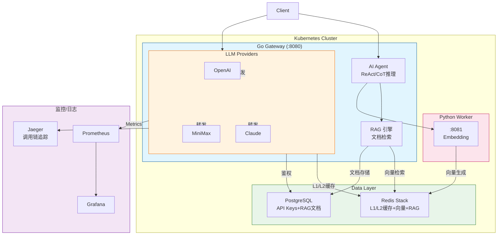

### 3.2 组件职责

#### 3.2.1 Go Gateway (独立 Deployment)
- HTTP/REST API 服务 (处理 10k QPS)
- **LLM 网关**: 请求路由与负载均衡、Token 限流、认证授权
- **AI Agent**: ReAct/CoT 推理引擎、工具注册与调用、自主决策
- **RAG 引擎**: 文档上传、向量检索、上下文组装
- **不直接做 Embedding 计算，调用 Python Worker**

#### 3.2.2 Python Worker (独立 Deployment)
> ⚠️ **重要设计决策**: 不使用 Sidecar 模式，独立部署
> - 原因: Embedding/Token 计算是 CPU 密集型，会抢占 Go Gateway 的 CPU 资源
> - 部署: 独立 Deployment，通过 Service 内网调用

- 向量 Embedding 生成
- 复杂 Token 计算 (非 OpenAI 模型)

#### 3.2.2.1 故障降级策略 (优雅降级)
> ⚠️ **系统韧性**: Python Worker 不是强依赖，是"优化依赖"

| 故障场景             | 降级策略                       | 影响                         |
| -------------------- | ------------------------------ | ---------------------------- |
| Python Worker 不可用 | 跳过 L2 语义缓存，直接透传 LLM | 缓存命中率 ↓，但业务不断     |
| Embedding 超时 (>5s) | 降级为 L1 精确缓存             | 语义缓存失效，精确缓存仍有效 |
| Worker OOM/崩溃      | 自动摘除流量，恢复后自动加入   | 短暂影响，后续请求走 LLM     |

```go
// Go Gateway 伪代码: 优雅降级
func (g *Gateway) handleCache(ctx context.Context, prompt string) (*CacheResult, error) {
    // L1 精确缓存 (不依赖 Python)
    if result := g.l1Cache.Get(prompt); result != nil {
        return result, nil
    }
    
    // L2 语义缓存 (依赖 Python Worker)
    embedding, err := g.pythonClient.GetEmbedding(ctx, prompt)
    if err != nil {
        // 故障降级: 跳过 L2，直接走 LLM
        log.Warn("Python Worker unavailable, skipping L2 cache", "error", err)
        return nil, ErrL2CacheMiss
    }
    
    // ... L2 查找逻辑
}

// Python Worker 健康检查
// - 定期 ping 检查可用性
// - 连续 3 次失败则摘除流量
// - 成功后自动恢复
```

> **面试话术**: "考虑到 Python Worker 承载了不稳定的 AI 推理任务，我在 Go 网关层做了优雅降级设计。当 Worker 不可用时，系统会自动降级为'直连模式'，牺牲缓存命中率，但保证核心业务链路不中断。"

#### 3.2.3 PostgreSQL (持久化存储)
> ⚠️ **核心数据必须持久化**: Redis 是内存数据库，重启会丢失所有数据

| 表名         | 用途            | 核心字段                                                     |
| ------------ | --------------- | ------------------------------------------------------------ |
| api_keys     | API Key 管理    | key, key_hash, name, rate_limit, expires_at, is_active       |
| models       | 模型配置        | name, provider, weight, fallback, max_context, tokenizer, is_active |
| request_logs | 请求日志        | key_id, model, tokens, latency, cost, created_at             |
| knowledge_bases | 知识库管理   | id, name, description, embedding_model                      |
| rag_documents | RAG 文档存储   | id, kb_id, filename, content, metadata                      |
| users        | 用户管理 (预留) | email, role, created_at                                      |

```sql
-- API Keys 表
CREATE TABLE api_keys (
    id UUID PRIMARY KEY DEFAULT gen_random_uuid(),
    key_hash VARCHAR(64) NOT NULL UNIQUE,  -- SHA256 hash of API key
    name VARCHAR(255),
    rate_limit INTEGER DEFAULT 1000,
    is_active BOOLEAN DEFAULT true,
    expires_at TIMESTAMP,
    created_at TIMESTAMP DEFAULT NOW(),
    updated_at TIMESTAMP DEFAULT NOW()
);

-- Models 表
CREATE TABLE models (
    id SERIAL PRIMARY KEY,
    name VARCHAR(255) NOT NULL UNIQUE,
    provider VARCHAR(50) NOT NULL,
    weight INTEGER DEFAULT 1,
    fallback VARCHAR(255),
    max_context INTEGER DEFAULT 8192,
    tokenizer VARCHAR(50) DEFAULT 'tiktoken',
    is_active BOOLEAN DEFAULT true,
    created_at TIMESTAMP DEFAULT NOW()
);

-- Request Logs 表 (可按需分表/分区)
CREATE TABLE request_logs (
    id BIGSERIAL PRIMARY KEY,
    key_id UUID REFERENCES api_keys(id),
    model VARCHAR(255),
    prompt_tokens INTEGER,
    completion_tokens INTEGER,
    latency_ms INTEGER,
    cost DECIMAL(10, 6),
    status VARCHAR(20),
    created_at TIMESTAMP DEFAULT NOW()
);

-- 索引优化 (面试加分项)
CREATE INDEX idx_api_keys_key_hash ON api_keys(key_hash);           -- API Key 校验加速
CREATE INDEX idx_api_keys_is_active ON api_keys(is_active);          -- 活跃 Key 查询
CREATE INDEX idx_request_logs_created_at ON request_logs(created_at); -- 时间范围查询
CREATE INDEX idx_request_logs_key_id ON request_logs(key_id);       -- 用户维度统计
CREATE INDEX idx_request_logs_model ON request_logs(model);         -- 模型维度统计
CREATE INDEX idx_request_logs_status ON request_logs(status);       -- 错误分析

-- 大表分区 (数据量大时)
-- ALTER TABLE request_logs PARTITION BY RANGE (created_at);
```

#### 3.2.4 Redis Stack
- 向量存储与检索 (FT.SEARCH)
- API 响应缓存 (热点数据)
- 限流计数器
- 分布式锁
- **Key 权限缓存** (加速鉴权，5 分钟 TTL)

#### 3.2.5 Redis 内存治理
> ⚠️ **面试加分项**: 防止内存溢出，设置合理的淘汰策略

| 配置项           | 值          | 说明                                     |
| ---------------- | ----------- | ---------------------------------------- |
| maxmemory        | 4GB         | 根据业务量调整                           |
| maxmemory-policy | allkeys-lru | 优先淘汰最近最少使用的 Key               |
| L1 缓存 TTL      | 1 hour      | 精确缓存时效短，LRU 友好                 |
| L2 缓存 TTL      | 7 days      | 向量缓存重要，但内存不足时淘汰旧数据合理 |

```bash
# Redis 配置
redis-server --maxmemory 4gb --maxmemory-policy allkeys-lru
```

> **面试话术**: "Redis 内存治理采用 allkeys-lru 策略。L1 精确缓存时效短，适合淘汰；L2 向量缓存虽然重要，但在内存压力下淘汰旧向量是合理的权衡，避免服务崩溃。"

### 3.3 数据流 (完整链路)

```
Client Request
     │
     ▼
┌─────────────┐    ┌─────────────┐    ┌─────────────┐
│  Auth Check │───▶│ Rate Limit  │───▶│   Router    │
│ (Redis缓存)  │    │ (令牌桶)    │    │             │
└─────────────┘    └─────────────┘    └─────────────┘
                                           │
                                           ▼
                             ┌─────────────────────────────┐
                             │     语义缓存检查             │
                             │  1. 提取 prompt             │
                             │  2. 调用 Python Worker      │
                             │     生成 Embedding          │
                             │  3. Redis FT.SEARCH         │
                             │  4. 相似度 > 0.95?          │
                             └─────────────────────────────┘
                              │                    │
                         YES  │                    │  NO
                              ▼                    ▼
                    ┌────────────────┐    ┌─────────────────┐
                    │  命中缓存       │    │  LLM 调用       │
                    │  (流式模拟)    │    │  (加权轮询)     │
                    └────────────────┘    └─────────────────┘
                              │                    │
                              └────────┬──────────┘
                                       ▼
                              ┌─────────────────┐
                              │  存入向量缓存   │
                              │  (可选)         │
                              └─────────────────┘
                                       │
                                       ▼
                              ┌─────────────────┐
                              │   Response      │
                              │   to Client     │
                              └─────────────────┘
```

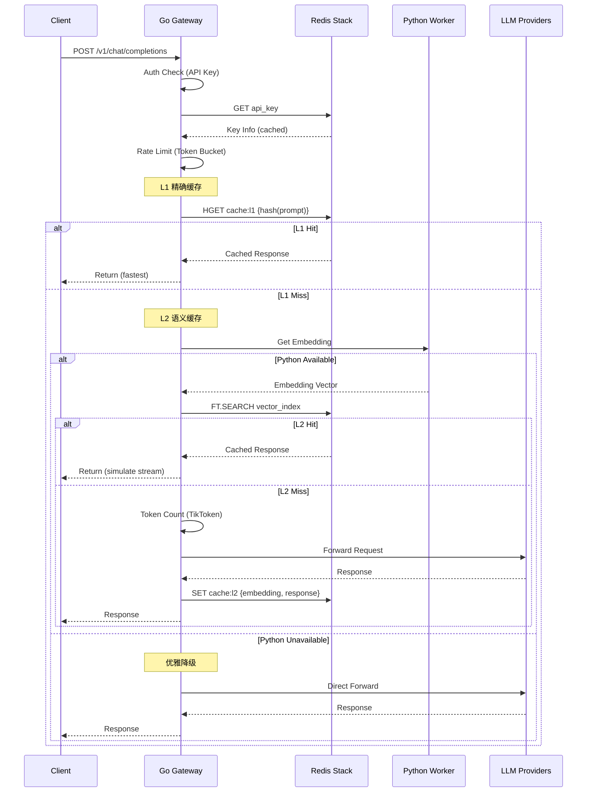

### 3.4 认证流程 (含缓存)
```
请求 → Extract API Key → Redis GET(key) → 命中 → 校验权限
                          │              │
                          └─ 未命中 ──────▶ PostgreSQL GET
                                           │
                                           ▼
                                      权限校验
                                           │
                                           ▼
                                      存入 Redis (TTL 5min)
```

---

## 4. 技术选型

### 4.1 核心技术栈

| 组件           | 技术              | 版本      | 说明                      |
| -------------- | ----------------- | --------- | ------------------------- |
| Gateway        | Go                | 1.21+     | 高性能 HTTP 服务          |
| AI 任务        | Python            | 3.11+     | Token 计算/Embedding      |
| **AI Agent**   | **Go 内置**       | -         | **ReAct/CoT 推理**        |
| **RAG**        | **Redis Stack**   | **7.2+**  | **向量搜索 + 知识库**     |
| 向量存储       | Redis Stack       | 7.2+      | 向量搜索 + 缓存           |
| **持久化存储** | **PostgreSQL**    | **15+**   | **API Key/RAG文档/日志** |
| **配置中心**   | **K8s ConfigMap** | **1.28+** | **配置热更新 (fsnotify)** |
| 监控           | Prometheus        | 2.45+     | Metrics 采集              |
| 可视化         | Grafana           | 10.0+     | 监控面板                  |
| K8s            | Kubernetes        | 1.28+     | 容器编排                  |

### 4.2 Go 依赖
| 包                        | 用途                     |
| ------------------------- | ------------------------ |
| gin-gonic/gin             | HTTP 框架                |
| redis/go-redis/v9         | Redis 客户端             |
| uber-go/zap               | 日志库                   |
| uber-go/ratelimit         | 令牌桶限流               |
| pkoukk/tiktoken-go       | Token 精确计算            |
| prometheus/client_golang  | 监控                     |
| lib/pq                   | PostgreSQL 驱动           |
| godotenv                 | 环境变量加载             |
| yaml.v3                  | YAML 配置解析            |
| **opentelemetry-go**     | **调用链追踪**            |
| **jaeger-client-go**      | **Jaeger 客户端**         |

> 注: Agent、RAG 为项目内部模块，不依赖外部包

### 4.3 Python 依赖
| 包                    | 用途                |
| --------------------- | ------------------- |
| sentence-transformers | 向量 Embedding 生成 |
| fastapi               | HTTP 服务           |
| redis                 | Redis 客户端        |

### 4.4 代码目录结构

#### 4.4.1 Go 项目结构
```
llm-gateway/
├── cmd/
│   └── server/
│       └── main.go              # 入口文件
├── internal/
│   ├── config/
│   │   └── config.go            # 配置加载
│   ├── handler/
│   │   ├── chat.go              # /v1/chat/completions
│   │   ├── embedding.go         # /v1/embeddings
│   │   ├── rag.go               # /v1/rag/* RAG接口
│   │   ├── agent.go             # /v1/agent/* Agent接口
│   │   └── admin.go             # /api/v1 管理接口
│   ├── middleware/
│   │   ├── auth.go              # API Key 鉴权
│   │   ├── ratelimit.go         # 令牌桶限流
│   │   └── logging.go           # 请求日志
│   ├── agent/                   # AI Agent 模块
│   │   ├── agent.go             # Agent 核心逻辑
│   │   ├── react.go             # ReAct 推理引擎
│   │   ├── cot.go               # CoT 推理引擎
│   │   ├── tools/                # 工具集
│   │   │   ├── registry.go      # 工具注册表
│   │   │   ├── web_search.go   # 网络搜索
│   │   │   ├── db_query.go     # 数据库查询
│   │   │   └── api_call.go     # API 调用
│   │   └── decision.go          # 自主决策
│   ├── rag/                     # RAG 模块
│   │   ├── document.go          # 文档处理
│   │   ├── chunker.go           # 文本分块
│   │   ├── retriever.go         # 向量检索
│   │   └── knowledgebase.go     # 知识库管理
│   ├── service/
│   │   ├── router.go            # 负载均衡/路由
│   │   ├── cache/
│   │   │   ├── l1.go            # L1 精确缓存
│   │   │   └── l2.go            # L2 语义缓存
│   │   ├── provider/
│   │   │   ├── openai.go        # OpenAI 适配器
│   │   │   ├── anthropic.go     # Claude 适配器
│   │   │   └── minimax.go       # MiniMax 适配器
│   │   └── circuitbreaker.go    # 熔断器
│   ├── tokenizer/
│   │   └── tiktoken.go          # Go 内置 TikToken
│   ├── model/
│   │   └── model.go             # 模型定义
│   └── storage/
│       ├── redis.go             # Redis 客户端
│       └── postgres.go           # PostgreSQL 客户端
├── pkg/
│   └── errors/
│       └── errors.go             # 错误定义
├── configs/
│   └── config.yaml              # 配置文件
├── deployments/
│   ├── k8s/
│   │   ├── deployment.yaml       # K8s Deployment
│   │   ├── service.yaml
│   │   ├── hpa.yaml
│   │   └── configmap.yaml       # K8s ConfigMap
│   └── docker/
│       └── docker-compose.yaml
├── scripts/
│   └── init_db.sql              # 数据库初始化
├── go.mod
└── go.sum
```

#### 4.4.2 Python 项目结构
```
llm-worker/
├── app/
│   ├── main.py                  # FastAPI 入口
│   ├── routes/
│   │   ├── embedding.py         # 向量生成 API
│   │   └── health.py            # 健康检查
│   └── services/
│       └── embedding_service.py # Embedding 逻辑
├── models/
│   └── cache.py                 # 模型缓存
├── configs/
│   └── config.yaml
├── requirements.txt
└── Dockerfile
```

> **设计原则**:
> - `internal/` 对外不可见，只暴露 `handler` 层
> - `provider` 适配器模式，方便扩展新 LLM
> - `cache` 分层设计，L1/L2 独立模块
> - `agent` 模块化设计，推理引擎与工具解耦
> - `rag` 分层设计，文档处理与检索解耦

---

## 5. 配置说明

### 5.1 配置文件结构
```yaml
# config.yaml
server:
  host: 0.0.0.0
  port: 8080
  
# PostgreSQL (持久化存储)
database:
  host: postgres
  port: 5432
  user: llm_gateway
  password: ${DB_PASSWORD}
  name: llm_gateway
  
# Redis (缓存/向量)
redis:
  address: redis-stack:6379
  password: ""
  db: 0
  
# Python Worker (独立服务)
python_worker:
  address: python-worker:8081
  timeout: 5s
  
providers:
  openai:
    api_key: ${OPENAI_API_KEY}
    base_url: https://api.openai.com/v1
  anthropic:
    api_key: ${ANTHROPIC_API_KEY}
  minimax:
    api_key: ${MINIMAX_API_KEY}
    base_url: https://api.minimax.chat/v1

cache:
  enabled: true
  similarity_threshold: 0.95
  ttl: 604800  # 7 days

ratelimit:
  global_qps: 10000
  burst: 500
  max_tokens: 128000
  # 按模型限流配置
  model_limits:
    gpt-4: 1000
    gpt-3.5-turbo: 3000
    claude-3-haiku: 2000

models:
  - name: gpt-4
    provider: openai
    weight: 5
    fallback: gpt-3.5-turbo
    max_context: 8192
    tokenizer: tiktoken  # 指定 tokenizer 类型
  - name: gpt-3.5-turbo
    provider: openai
    weight: 3
    max_context: 16385
    tokenizer: tiktoken
  - name: claude-3-haiku
    provider: anthropic
    weight: 2
    max_context: 200000
    tokenizer: anthropic  # 使用估算方式
    
# Agent 配置
agent:
  enabled: true
  default_reasoning: react  # react / cot / plan
  max_steps: 10            # 最大推理步骤
  timeout: 60s            # Agent 执行超时
  tools:
    - name: web_search
      enabled: true
      provider: searchapi
    - name: db_query
      enabled: true
      connection: postgres

# RAG 配置
rag:
  enabled: true
  embedding:
    model: text-embedding-ada-002
    dimensions: 1536
  chunking:
    chunk_size: 512
    overlap: 50
  retrieval:
    top_k: 5
    score_threshold: 0.7

# 智能重试配置
retry:
  enabled: true
  max_retries: 3
  base_delay: 1s
  max_delay: 30s
  retryable_codes:
    - 429
    - 500
    - 502
    - 503
    - 504

# Prompt 优化配置
prompt:
  system_cache_enabled: true
  history_compress_enabled: true
  max_history_messages: 10

# 配置管理 (轻量化方案)
# 个人项目推荐: K8s ConfigMap + fsnotify 热更新
config:
  source: k8s_configmap  # 挂载到 /etc/config/config.yaml
  hot_reload:
    enabled: true
    watch_path: /etc/config/
    # 使用 fsnotify 监听文件变更
    debounce: 500ms  # 防抖
    on_change:
      - reload_models      # 重载模型配置
      - reload_ratelimit   # 重载限流配置
      - reload_cache       # 重载缓存配置
  # 示例: K8s ConfigMap
  # kubectl create configmap llm-gateway-config --from-file=config.yaml

monitoring:
  prometheus:
    enabled: true
    port: 9090
  jaeger:
    enabled: true
    endpoint: http://jaeger:14268/api/traces
```

### 5.2 环境变量
```bash
# .env
OPENAI_API_KEY=sk-xxxx
ANTHROPIC_API_KEY=sk-ant-xxxx
MINIMAX_API_KEY=xxxx

REDIS_PASSWORD=
JWT_SECRET=your-secret-key

# K8s 部署时使用 Secret
```

---

## 6. 部署方案

### 6.1 Kubernetes 部署

> ⚠️ **重要设计决策**: Python Worker 独立部署，非 Sidecar 模式
> - 原因: Embedding 计算是 CPU 密集型，会抢占 Go Gateway 资源，影响 10k QPS 性能
> - 架构: 两个独立 Deployment，通过 Service 内网调用

#### 6.1.1 Go Gateway Deployment
```yaml
apiVersion: apps/v1
kind: Deployment
metadata:
  name: llm-gateway
spec:
  replicas: 3
  selector:
    matchLabels:
      app: llm-gateway
  template:
    metadata:
      labels:
        app: llm-gateway
    spec:
      containers:
      - name: gateway
        image: llm-gateway:latest
        ports:
        - containerPort: 8080
        resources:
          requests:
            memory: "512Mi"
            cpu: "1000m"  # 提高 CPU 配额，保障 10k QPS
          limits:
            memory: "1Gi"
            cpu: "2000m"
        env:
        - name: REDIS_ADDRESS
          valueFrom:
            configMapKeyRef:
              name: llm-gateway-config
              key: redis.address
        - name: PYTHON_WORKER_URL
          value: "http://python-worker:8081"
```

#### 6.1.2 Python Worker Deployment (独立)
```yaml
apiVersion: apps/v1
kind: Deployment
metadata:
  name: python-worker
spec:
  replicas: 2  # 少于 Gateway，避免资源争抢
  selector:
    matchLabels:
      app: python-worker
  template:
    metadata:
      labels:
        app: python-worker
    spec:
      containers:
      - name: worker
        image: llm-gateway-python:latest
        ports:
        - containerPort: 8081
        resources:
          requests:
            memory: "2Gi"   # 大内存，用于向量模型加载
            cpu: "2000m"
          limits:
            memory: "4Gi"
            cpu: "4000m"   # 高 CPU 配额，用于 Embedding 计算
```

#### 6.1.3 Service 配置
```yaml
apiVersion: v1
kind: Service
metadata:
  name: llm-gateway
spec:
  selector:
    app: llm-gateway
  ports:
  - port: 80
    targetPort: 8080
  type: ClusterIP

---
apiVersion: v1
kind: Service
metadata:
  name: python-worker
spec:
  selector:
    app: python-worker
  ports:
  - port: 8081
    targetPort: 8081
  # 仅集群内访问
```

#### 6.1.4 HPA 配置

##### Gateway HPA
```yaml
apiVersion: autoscaling/v2
kind: HorizontalPodAutoscaler
metadata:
  name: llm-gateway-hpa
spec:
  scaleTargetRef:
    apiVersion: apps/v1
    kind: Deployment
    name: llm-gateway
  minReplicas: 3
  maxReplicas: 10
  metrics:
  - type: Resource
    resource:
      name: cpu
      target:
        type: Utilization
        averageUtilization: 70
```

##### Python Worker HPA (计算密集型)
```yaml
apiVersion: autoscaling/v2
kind: HorizontalPodAutoscaler
metadata:
  name: python-worker-hpa
spec:
  scaleTargetRef:
    apiVersion: apps/v1
    kind: Deployment
    name: python-worker
  minReplicas: 2
  maxReplicas: 5
  metrics:
  - type: Resource
    resource:
      name: cpu
      target:
        type: Utilization
        averageUtilization: 75  # CPU > 75% 自动扩容
  - type: Pods
    pods:
      metric:
        name: embedding_queue_length
      target:
        type: AverageValue
        averageValue: "10"  # 等待队列 > 10 时扩容
```

### 6.2 Docker Compose (开发环境)
```yaml
version: '3.8'
services:
  # Go Gateway - 主服务
  gateway:
    build: ./gateway
    ports:
      - "8080:8080"
    environment:
      - REDIS_ADDRESS=redis-stack:6379
      - PYTHON_WORKER_URL=http://python-worker:8081
      - DB_HOST=postgres
    depends_on:
      - redis-stack
      - python-worker
      - postgres
  
  # Python Worker - 独立部署 (非 Sidecar)
  python-worker:
    build: ./python-worker
    ports:
      - "8081:8081"
    environment:
      - REDIS_ADDRESS=redis-stack:6379
    deploy:
      resources:
        limits:
          cpus: '2'
          memory: 4G
  
  # PostgreSQL - 持久化存储
  postgres:
    image: postgres:15
    environment:
      POSTGRES_USER: llm_gateway
      POSTGRES_PASSWORD: dev_password
      POSTGRES_DB: llm_gateway
    ports:
      - "5432:5432"
    volumes:
      - postgres_data:/var/lib/postgresql/data
  
  # Redis Stack - 向量搜索 + 缓存
  redis-stack:
    image: redis/redis-stack:latest
    ports:
      - "6379:6379"
  
  # 监控组件
  prometheus:
    image: prom/prometheus:latest
    ports:
      - "9090:9090"
      
  grafana:
    image: grafana/grafana:latest
    ports:
      - "3000:3000"

volumes:
  postgres_data:
```

---

## 7. 监控指标

### 7.1 核心指标

| 指标名                            | 类型      | 描述         |
| --------------------------------- | --------- | ------------ |
| gateway_requests_total            | Counter   | 总请求数     |
| gateway_requests_duration_seconds | Histogram | 请求延迟     |
| gateway_cache_hits_total          | Counter   | 缓存命中数   |
| gateway_cache_misses_total        | Counter   | 缓存未命中数 |
| gateway_rate_limit_rejected_total | Counter   | 限流拒绝数   |
| gateway_model_requests_total      | Counter   | 各模型请求数 |
| gateway_model_errors_total        | Counter   | 各模型错误数 |
| gateway_tokens_total              | Counter   | Token 消耗量 |

### 7.2 Agent 指标

| 指标名                            | 类型      | 描述         |
| --------------------------------- | --------- | ------------ |
| agent_requests_total              | Counter   | Agent 请求数 |
| agent_steps_total                 | Counter   | Agent 推理步数 |
| agent_tool_calls_total            | Counter   | 工具调用次数 |
| agent_tool_duration_seconds       | Histogram | 工具执行延迟 |
| agent_retries_total              | Counter   | Agent 重试次数 |

### 7.3 RAG 指标

| 指标名                            | 类型      | 描述         |
| --------------------------------- | --------- | ------------ |
| rag_documents_total              | Counter   | RAG 文档数   |
| rag_chunks_total                 | Counter   | 文档分块数   |
| rag_retrieval_duration_seconds   | Histogram | 向量检索延迟 |
| rag_retrieval_hits_total         | Counter   | 检索命中数   |
| rag_retrieval_misses_total       | Counter   | 检索未命中   |

### 7.4 调用链追踪

| 指标名                            | 类型      | 描述         |
| --------------------------------- | --------- | ------------ |
| trace_duration_seconds            | Histogram | 全链路延迟   |
| span_cache_l1_duration_ms         | Gauge     | L1 缓存延迟  |
| span_cache_l2_duration_ms        | Gauge     | L2 缓存延迟  |
| span_llm_duration_seconds        | Gauge     | LLM 调用延迟 |
| span_embedding_duration_ms        | Gauge     | 向量生成延迟 |

### 7.5 Grafana 面板

#### 7.5.1 仪表盘指标
- 实时 QPS
- P50/P95/P99 延迟
- 缓存命中率
- 各模型调用占比
- Token 消耗趋势
- 成本估算
- 错误率

#### 7.5.2 Agent 面板
- Agent 请求量
- 平均推理步数
- 工具调用分布
- 工具执行延迟

#### 7.5.3 RAG 面板
- 文档数量
- 向量检索延迟
- 检索命中率

---

## 8. API Key 管理

### 8.1 Key 格式
```
sk-{随机字符串 32 位}
```

### 8.2 Key 属性
```json
{
  "id": "key_xxxx",
  "key": "sk-xxxxxxxxxxxxxxxxxxxxxxxxxxxxxxxx",
  "name": "Production Key",
  "rate_limit": 1000,
  "expires_at": "2025-12-31T23:59:59Z",
  "created_at": "2024-01-01T00:00:00Z",
  "is_active": true
}
```

### 8.3 权限模型
- **read**: 查询模型、统计
- **write**: 创建 Key、修改配置
- **admin**: 所有权限

---

## 13. AI Agent 功能 (Phase 6)

> ⚡ **架构设计**: Go 内置 Agent + 预留 Python 扩展接口
> - Agent 作为 RAG 的智能调度层
> - 支持 ReAct/CoT 多步推理
> - 工具调用 + 自主决策

### 13.1 Agent 核心架构

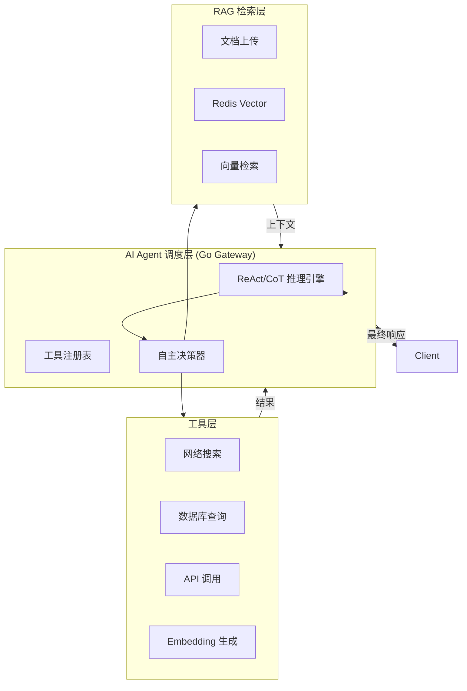

### 13.2 Agent 能力定义

#### 13.2.1 多步推理 (ReAct/CoT)
| 推理模式 | 描述 | 适用场景 |
|---------|------|---------|
| ReAct | 思考(Thought)→行动(Action)→观察(Observation)循环 | 需要外部工具的复杂任务 |
| Chain-of-Thought | 逐步推理，不调用外部工具 | 数学、逻辑分析 |
| Plan-and-Execute | 先制定计划，再逐步执行 | 复杂多步骤任务 |

#### 13.2.2 工具调用

| 工具 | 功能 | 实现难度 | 预计工时 |
|------|------|---------|---------|
| **网络搜索** | 调用外部搜索引擎获取实时信息 | 中等 | 2天 |
| **数据库查询** | 执行 SQL 查询返回结构化数据 | 中等 | 2天 |
| API 调用 | 调用外部 HTTP API | 低 | 1天 |
| Embedding 生成 | 调用向量生成接口 | 低 | 已实现 |

#### 13.2.2.1 网络搜索工具 (Web Search)

> ⚡ **演示场景**: "基于上传的财报分析股价走势，同时调用搜索获取最新股价"

```go
// 工具定义
type WebSearchTool struct {
    Name        string `json:"name"`
    Description string `json:"description"`
    Provider    string `json:"provider"` // serpapi / baidu / google
}

// 工具调用
type SearchRequest struct {
    Query string `json:"query"` // 搜索关键词
    Num   int    `json:"num"`  // 返回结果数量，默认5
}

type SearchResult struct {
    Title   string `json:"title"`
    Link    string `json:"link"`
    Snippet string `json:"snippet"`
}
```

| 配置项 | 值 | 说明 |
|--------|-----|------|
| provider | serpapi / custom | 搜索服务提供商 |
| api_key | 环境变量注入 | API 密钥 |
| timeout | 10s | 请求超时 |
| default_num | 5 | 默认返回结果数 |

**调用示例**:
```bash
# Agent 推理过程
Thought: 我需要获取最新股价信息来补充财报分析
Action: web_search
Action Input: "AAPL 股票 2026年2月 最新股价"
Observation: {"results": [{"title": "Apple Inc. (AAPL) Stock Price", "price": "$185.50", ...}]}
```

#### 13.2.2.2 数据库查询工具 (Database Query)

> ⚡ **演示场景**: "查询上周 GPT-4 的调用成本 Top3 的 API Key"

```go
// 工具定义
type DBQueryTool struct {
    Name        string `json:"name"`
    Description string `json:"description"`
    Connection  string `json:"connection"` // postgres
}

// 预定义查询模板 (安全限制)
type QueryTemplate struct {
    Name        string `json:"name"`
    Description string `json:"description"`
    SQL         string `json:"sql"`           // 参数化查询
    Parameters  []string `json:"parameters"`  // 可用参数
}

// 可用查询模板
var QueryTemplates = []QueryTemplate{
    {
        Name:        "cost_by_model",
        Description: "按模型统计调用成本",
        SQL:         `SELECT model, SUM(cost) as total_cost FROM request_logs WHERE created_at > $1 GROUP BY model ORDER BY total_cost DESC LIMIT $2`,
        Parameters:  []string{"start_time", "limit"},
    },
    {
        Name:        "cost_by_api_key",
        Description: "按 API Key 统计调用成本",
        SQL:         `SELECT ak.name, SUM(rl.cost) as total_cost FROM request_logs rl JOIN api_keys ak ON rl.key_id = ak.id WHERE rl.created_at > $1 GROUP BY ak.name ORDER BY total_cost DESC LIMIT $2`,
        Parameters:  []string{"start_time", "limit"},
    },
    {
        Name:        "usage_by_model",
        Description: "按模型统计请求次数",
        SQL:         `SELECT model, COUNT(*) as request_count FROM request_logs WHERE created_at > $1 GROUP BY model ORDER BY request_count DESC`,
        Parameters:  []string{"start_time"},
    },
    {
        Name:        "latency_p95",
        Description: "查询 P95 延迟",
        SQL:         `SELECT model, PERCENTILE_CONT(0.95) WITHIN GROUP(ORDER BY latency_ms) as p95_latency FROM request_logs WHERE created_at > $1 GROUP BY model`,
        Parameters:  []string{"start_time"},
    },
}
```

| 配置项 | 值 | 说明 |
|--------|-----|------|
| connection | postgres | 数据库连接 |
| max_rows | 100 | 最大返回行数 |
| timeout | 30s | 查询超时 |
| allowed_queries | [cost_by_model, cost_by_api_key, ...] | 白名单查询 |

**安全限制**:
- 仅支持预定义查询模板，禁止自由 SQL
- 参数化查询，防止 SQL 注入
- 限制返回行数，避免大数据量

**调用示例**:
```bash
# Agent 推理过程
Thought: 用户想知道上周 GPT-4 调用成本 Top3 的 API Key
Action: db_query
Action Input: {"template": "cost_by_api_key", "params": {"start_time": "2026-02-14", "limit": 3}}
Observation: [{"name": "Production Key 1", "total_cost": 125.50}, {"name": "Dev Key 2", "total_cost": 89.30}, ...]
```

#### 13.2.2.3 工具注册与发现

```go
// 工具注册表
type ToolRegistry struct {
    tools map[string]Tool
    mu    sync.RWMutex
}

type Tool interface {
    Name() string
    Description() string
    Schema() ToolSchema  // LLM 工具调用格式
    Execute(ctx context.Context, input string) (string, error)
}

// 注册工具
func RegisterTool(t Tool) {
    registry.Register(t)
}

// 获取可用工具列表
func (r *ToolRegistry) ListTools() []ToolSchema {
    // 返回所有工具的 JSON Schema
}
```

**工具 Schema 示例 (LLM 使用)**:
```json
{
  "type": "function",
  "function": {
    "name": "web_search",
    "description": "搜索网络获取实时信息，适用于查询最新新闻、股价、天气等实时数据",
    "parameters": {
      "type": "object",
      "properties": {
        "query": {"type": "string", "description": "搜索关键词"},
        "num": {"type": "integer", "description": "返回结果数量"}
      },
      "required": ["query"]
    }
  }
}
```

#### 13.2.3 自主决策
- LLM 根据任务描述自主判断是否需要调用工具
- 工具选择基于任务语义匹配
- 支持工具链组合调用

#### 13.2.4 边缘场景处理

| 场景 | 处理策略 | 配置 |
|------|---------|------|
| **最大步数限制** | 超过则终止推理 | max_steps=10 |
| **循环调用检测** | 同一工具连续调用3次自动终止 | max_consecutive=3 |
| **工具超时** | 超过 30s 返回错误 | tool_timeout=30s |
| **无有效工具** | 连续 2 次无工具调用则返回结果 | max_no_tool=2 |

```go
// Agent 边缘场景处理
type AgentConfig struct {
    MaxSteps           int           // 最大推理步数 (默认 10)
    MaxConsecutive     int           // 同一工具最大连续调用 (默认 3)
    ToolTimeout        time.Duration // 工具超时 (默认 30s)
    MaxNoToolCalls     int           // 无工具调用最大次数 (默认 2)
}

// 循环终止条件
func shouldTerminate(steps []Step) bool {
    if len(steps) >= config.MaxSteps {
        return true // 超过最大步数
    }
    // 检测连续调用同一工具
    if len(steps) >= 3 {
        last3 := steps[len(steps)-3:]
        if last3[0].Tool == last3[1].Tool &&
           last3[1].Tool == last3[2].Tool {
            return true // 连续调用同一工具 3 次
        }
    }
    return false
}
```

### 13.3 Agent API 接口

```
POST /v1/agent/chat          # Agent 对话 (含推理过程)
POST /v1/agent/execute       # 执行特定工具链
GET  /v1/agent/tools         # 获取可用工具列表
POST /v1/agent/tools/register # 注册新工具
```

### 13.4 Agent 配置

```yaml
agent:
  enabled: true
  default_reasoning: react  # react / cot / plan
  max_steps: 10            # 最大推理步骤
  timeout: 60s            # Agent 执行超时
  tools:
    - name: web_search
      enabled: true
      provider: searchapi
      priority: 1
    - name: db_query
      enabled: true
      connection: postgres
      priority: 2
    - name: api_call
      enabled: true
      timeout: 10s
      priority: 3
    - name: embedding
      enabled: true
      priority: 4
```

---

## 14. RAG 功能 (Retrieval-Augmented Generation)

> ⚡ **核心业务闭环**: 文档上传 → 向量化 → 向量检索 → 上下文增强 → LLM 生成
> - 使用 Redis Stack 作为向量存储
> - 支持多种文档格式

### 14.1 RAG 架构

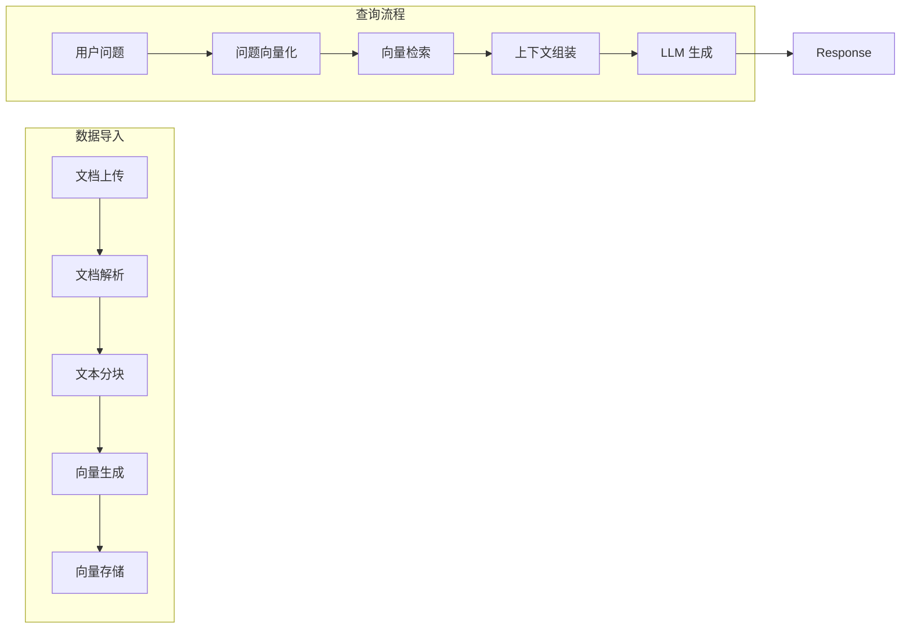

### 14.2 RAG 核心组件

#### 14.2.1 文档管理
| 功能 | 描述 |
|------|------|
| 文档上传 | 支持 TXT、PDF、MD、DOCX 格式 |
| 文档解析 | 提取文本内容，保留结构 |
| 文本分块 | 滑动窗口 + 重叠策略 (chunk_size=512, overlap=50) |
| 元数据 | 文档名称、来源、上传时间、标签 |

#### 14.2.2 向量存储 (Redis Vector)
| 参数 | 值 | 说明 |
|------|-----|------|
| Index Name | rag:documents | 索引名称 |
| Vector Field | embedding | 向量字段 |
| Dimensions | 1536 / 768 | 根据 embedding 模型 |
| Distance | COSINE | 余弦相似度 |
| Score Threshold | 0.7 | 最小相似度 |

#### 14.2.3 检索策略
| 策略 | 描述 | 适用场景 |
|------|------|---------|
| Similarity Search | 返回 top-k 最相似文档 | 精确匹配 |
| MMR (Max Marginal Relevance) | 多样性重排，避免重复 | 广泛检索 |
| Hybrid Search | 关键词 + 向量混合 | 复杂查询 |

### 14.3 RAG API 接口

```
# 文档管理
POST   /v1/rag/documents           # 上传文档
GET    /v1/rag/documents            # 列表文档
GET    /v1/rag/documents/:id        # 获取文档详情
DELETE /v1/rag/documents/:id        # 删除文档

# 知识库管理
POST   /v1/rag/knowledge-bases      # 创建知识库
GET    /v1/rag/knowledge-bases      # 列表知识库
DELETE /v1/rag/knowledge-bases/:id  # 删除知识库

# RAG 问答
POST   /v1/rag/chat                # RAG 问答 (检索 + 生成)
GET    /v1/rag/search              # 仅检索 (不生成)
```

### 14.4 RAG 配置

```yaml
rag:
  enabled: true
  embedding:
    model: text-embedding-ada-002  # 或 text-embedding-3-small
    dimensions: 1536
    batch_size: 100

  chunking:
    chunk_size: 512
    overlap: 50
    strategy: sliding_window

  retrieval:
    top_k: 5
    score_threshold: 0.7
    strategy: similarity  # similarity / mmr / hybrid

  storage:
    redis_index: rag:documents
    redis_prefix: rag:doc:
    ttl: 30 days

  generation:
    include_sources: true  # 返回引用来源
    max_context_tokens: 4000
```

### 14.5 RAG + Agent 集成

> ⚡ **智能调度**: Agent 作为 RAG 的调度层，根据任务类型自动选择检索策略

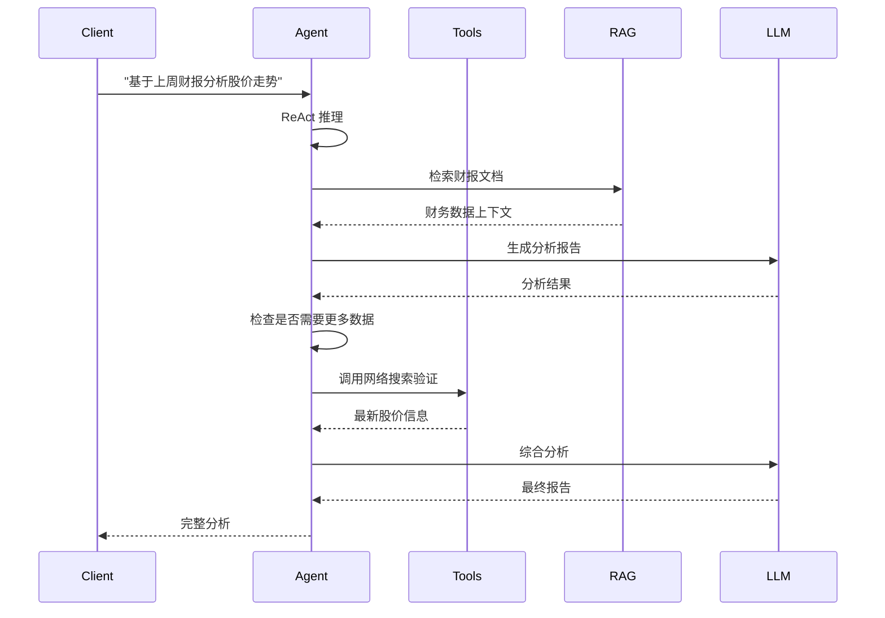

### 14.6 边缘场景处理

#### 14.6.1 大文档分块策略

| 场景 | 策略 | 参数 |
|------|------|------|
| 普通文档 (< 50页) | 固定窗口滑动 | chunk_size=512, overlap=50 |
| 大文档 (50-200页) | 按章节分块 + 窗口重叠 | 重叠增加到 100 |
| 超大文档 (> 200页) | 层级分块: 章节 → 段落 | 两级检索 |

```go
// 大文档分块策略
func chunkLargeDocument(content string, pageCount int) []string {
    if pageCount > 200 {
        // 超大文档: 层级分块
        return hierarchicalChunking(content)
    } else if pageCount > 50 {
        // 大文档: 增加重叠
        return slidingWindowChunking(content, 512, 100)
    }
    // 普通文档
    return slidingWindowChunking(content, 512, 50)
}
```

#### 14.6.2 低相似度处理

| 场景 | 处理策略 |
|------|---------|
| 最高相似度 < 0.5 | 返回空结果，提示"未找到相关内容" |
| 0.5 ≤ 相似度 < 0.7 | 返回结果但标注"低置信度" |
| 相似度 ≥ 0.7 | 正常返回 |

#### 14.6.3 缓存优化策略

| 场景 | 处理策略 |
|------|---------|
| 大请求 (> 10k Token) | 跳过 L1 缓存，避免 Redis 内存占用 |
| 超大请求 (> 50k Token) | 拒绝请求，返回错误 |

```go
// 缓存跳过策略
func shouldSkipCache(tokens int) bool {
    return tokens > 10000 // 大请求跳过 L1 缓存
}
```

---

## 15. 技术扩展

### 15.1 Python Worker 扩展接口

> ⚡ **预留扩展**: Agent 复杂推理可委托 Python 处理

```go
// Go Agent 调用 Python Worker
type PythonAgentRequest struct {
    Task       string                 `json:"task"`
    Context    map[string]interface{} `json:"context"`
    Tools      []string               `json:"tools"`
    Reasoning  string                 `json:"reasoning"` // react / cot / plan
}

type PythonAgentResponse struct {
    Result     string                 `json:"result"`
    Steps      []ReasoningStep        `json:"steps"`
    ToolsUsed  []string               `json:"tools_used"`
}
```

### 15.2 数据库表扩展 (RAG)

```sql
-- 知识库表
CREATE TABLE knowledge_bases (
    id UUID PRIMARY KEY DEFAULT gen_random_uuid(),
    name VARCHAR(255) NOT NULL,
    description TEXT,
    embedding_model VARCHAR(50) DEFAULT 'text-embedding-ada-002',
    created_at TIMESTAMP DEFAULT NOW(),
    updated_at TIMESTAMP DEFAULT NOW()
);

-- 文档表
CREATE TABLE rag_documents (
    id UUID PRIMARY KEY DEFAULT gen_random_uuid(),
    kb_id UUID REFERENCES knowledge_bases(id),
    filename VARCHAR(255),
    content TEXT NOT NULL,
    metadata JSONB,
    chunk_count INTEGER,
    created_at TIMESTAMP DEFAULT NOW()
);

-- 文档 chunks 表 (可选，用于详细溯源)
CREATE TABLE document_chunks (
    id UUID PRIMARY KEY DEFAULT gen_random_uuid(),
    doc_id UUID REFERENCES rag_documents(id),
    chunk_text TEXT NOT NULL,
    embedding VECTOR(1536),
    token_count INTEGER,
    created_at TIMESTAMP DEFAULT NOW()
);

-- 索引
CREATE INDEX idx_kb_id ON rag_documents(kb_id);
CREATE INDEX idx_doc_id ON document_chunks(doc_id);
```

---

## 16. 开发计划

### Week 17-18: RAG 基础功能

- [ ] Task 6.1: 文档上传接口 (支持 TXT/MD)
- [ ] Task 6.2: 文档解析与分块
- [ ] Task 6.3: 向量生成调用
- [ ] Task 6.4: Redis Vector 索引创建
- [ ] Task 6.5: 知识库 CRUD

### Week 19-20: RAG 检索 + Agent 基础

- [ ] Task 6.6: 向量相似度检索
- [ ] Task 6.7: RAG 问答接口 (检索 + 生成)
- [ ] Task 6.8: Agent 框架 (Go 内置)
- [ ] Task 6.9: ReAct 推理引擎

### Week 21-22: Agent 工具集成

- [ ] Task 6.10: 工具注册表
- [ ] Task 6.11: 网络搜索工具
- [ ] Task 6.12: 数据库查询工具
- [ ] Task 6.13: API 调用工具
- [ ] Task 6.14: Embedding 工具复用

### Week 23-24: 优化与测试

- [ ] Task 6.15: Agent 自主决策优化
- [ ] Task 6.16: RAG + Agent 集成测试
- [ ] Task 6.17: 性能优化
- [ ] Task 6.18: 文档完善

---

## 17. 附录

### 17.1 参考资料
- [OpenAI API Docs](https://platform.openai.com/docs)
- [Redis Stack向量搜索](https://redis.io/docs/stack/search/)
- [TikToken](https://github.com/openai/tiktoken)
- [Kubernetes Documentation](https://kubernetes.io/docs/)
- [ReAct 论文](https://arxiv.org/abs/2210.03629)
- [LangChain Go](https://github.com/tiktoken-org/tiktoken-go) - Agent 参考

### 17.2 术语表
| 术语             | 解释                 |
| ---------------- | -------------------- |
| QPS              | 每秒查询数           |
| P99              | 99% 分位延迟         |
| Token            | LLM 输入/输出单位    |
| Vector Embedding | 文本向量表示         |
| 语义缓存         | 基于向量相似度的缓存 |
| RAG              | 检索增强生成         |
| Agent            | AI 智能代理          |
| ReAct            | 推理+行动模式        |
| CoT              | 思维链               |

---

*文档版本: v1.4*
*最后更新: 2026-02-21*
*精简文档，删除安全性/成本优化/开发计划/验收标准*
