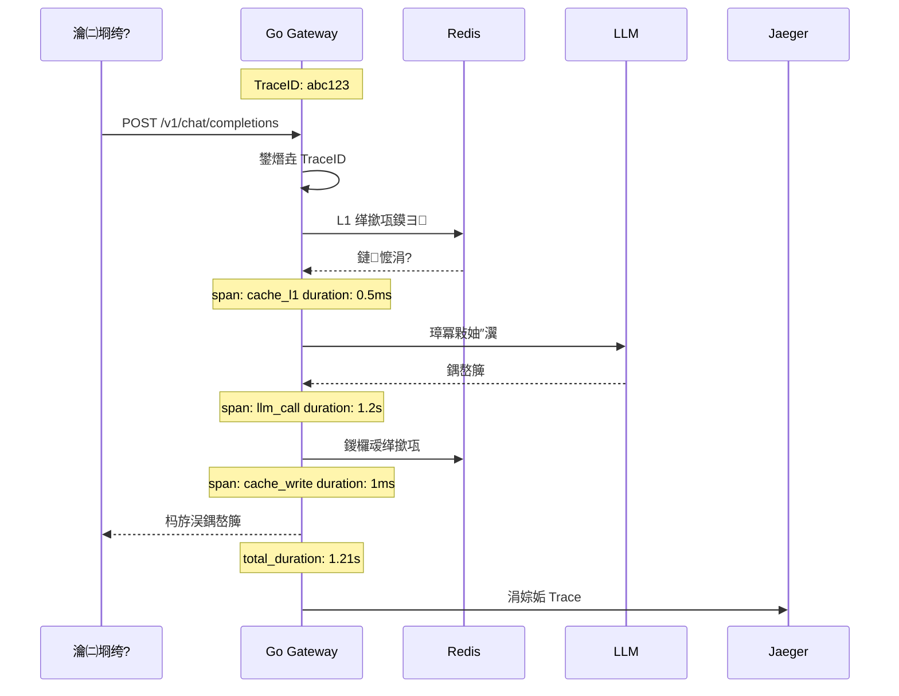
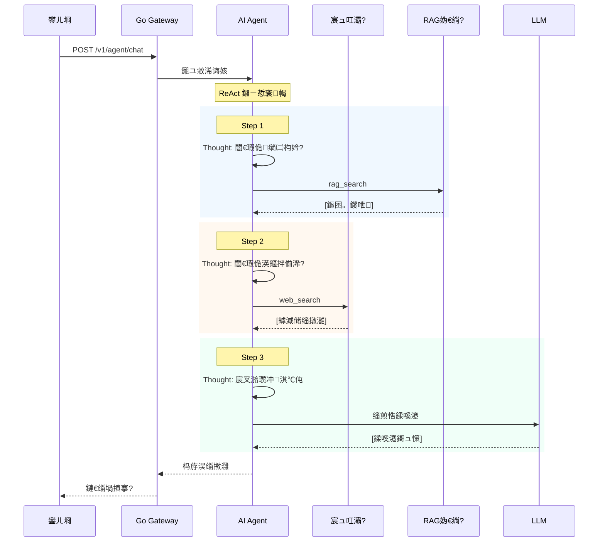
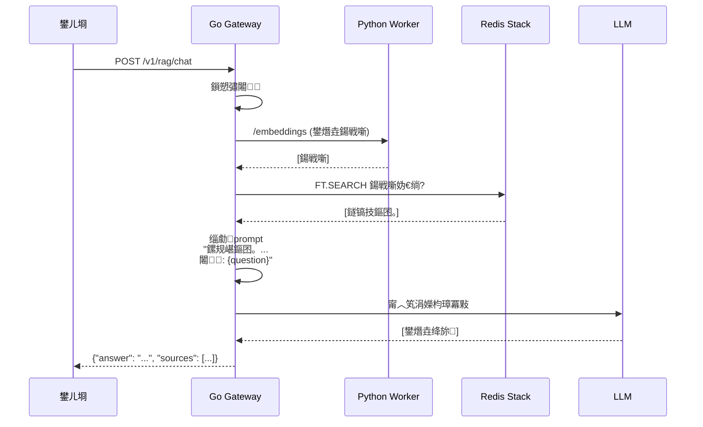
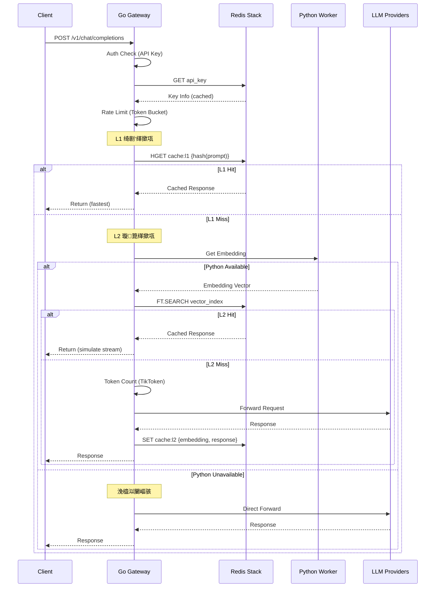
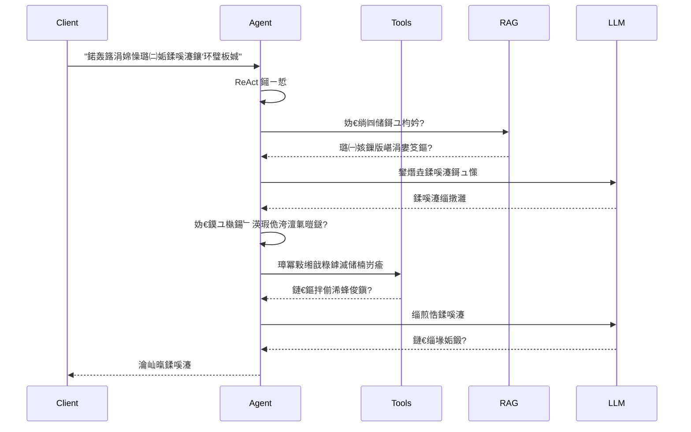

> Status Note (2026-03-24)
> This SPEC is a historical design reference and is not the source of truth for shipped features.
> Current implementation status is maintained in `README.md` and `docs/Todo.md`.
> Phase 6 Agent/RAG tasks remain de-prioritized unless explicitly re-scoped.
# High-Performance LLM Gateway 瑙勬牸璇存槑涔?

## 1. 椤圭洰姒傝堪

### 1.1 椤圭洰绠€浠?
浼佷笟绾ч珮鎬ц兘 LLM 缃戝叧 + AI Agent 骞冲彴锛屾敮鎸佸妯″瀷缁熶竴鎺ュ叆銆佸垎灞傜紦瀛樸€乀oken 闄愭祦銆丄gent 鎺ㄧ悊鍜?RAG 浼佷笟鐭ヨ瘑搴撻棶绛斻€?

### 1.2 椤圭洰瀹氫綅
- **椤圭洰绫诲瀷**: 涓汉椤圭洰 / Side Project
- **閮ㄧ讲鏂瑰紡**: Kubernetes
- **鎶€鏈爤**: Go (API 缃戝叧) + Python (AI 浠诲姟澶勭悊)

### 1.3 鏍稿績鐗规€?
| 鐗规€?| 鎻忚堪 | 棰勬湡鏀剁泭 |
|------|------|---------|
| **LLM 缃戝叧** | OpenAI/Claude/MiniMax 澶氭彁渚涘晢缁熶竴鎺ュ叆 | 缁熶竴API銆佷緵搴斿晢瑙ｈ€?|
| **鍒嗗眰缂撳瓨** | L1绮剧‘缂撳瓨 + L2璇箟缂撳瓨 (Redis Vector) | 闄嶄綆 API 鎴愭湰 40% |
| **Token 闄愭祦** | 浠ょ墝妗剁畻娉曪紝TikToken 绮剧‘璁＄畻 | 10k+ QPS 绋冲畾杩愯 |
| **AI Agent** | ReAct/CoT 鎺ㄧ悊寮曟搸 + 宸ュ叿璋冪敤 | 澶氭鎺ㄧ悊銆佽嚜涓诲喅绛?|
| **RAG** | 鏂囨。涓婁紶 鈫?鍚戦噺鍖?鈫?鍚戦噺妫€绱?鈫?LLM鐢熸垚 | 浼佷笟鐭ヨ瘑搴撻棶绛?|
| **鏅鸿兘閲嶈瘯** | 鎸囨暟閫€閬?+ 鍙噸璇曢敊璇爜璇嗗埆 | 璇锋眰鎴愬姛鐜囨彁鍗?|
| **Prompt 浼樺寲** | 绯荤粺鎻愮ず璇嶇紦瀛?+ 鍘嗗彶娑堟伅鍘嬬缉 | Token 娑堣€楅檷浣?|
| **璋冪敤閾捐娴?* | OpenTelemetry/Jaeger 鍏ㄩ摼璺拷韪?| 闂蹇€熷畾浣?|

### 1.4 鎬ц兘鐩爣
| 鎸囨爣 | 鐩爣 |
|------|------|
| 鍚炲悙閲?| 10,000+ QPS |
| P99 寤惰繜 | < 500ms |
| 鍙敤鎬?| 99.9% |
| LLM 璋冪敤鎴愬姛鐜?| > 99.5% |

---

## 2. 鍔熻兘闇€姹?

### 2.1 LLM 鎻愪緵鍟嗛泦鎴?

| 鎻愪緵鍟?            | 鏀寔鐘舵€?| 浼樺厛绾?|
| ------------------ | -------- | ------ |
| OpenAI (GPT-4/3.5) | 鉁?鏀寔   | P0     |
| Claude (Anthropic) | 鉁?鏀寔   | P0     |
| minimax            | 鉁?鏀寔   | P1     |

#### 2.1.1 鎺ュ彛缁熶竴灏佽
- 缁熶竴璇锋眰/鍝嶅簲鏍煎紡
- 閿欒鐮佹爣鍑嗗寲
- 鏀寔娴佸紡杈撳嚭 (SSE)

### 2.2 鍒嗗眰缂撳瓨绯荤粺

> 鈿狅笍 **鎬ц兘浼樺寲**: 閲囩敤 L1 + L2 鍒嗗眰缂撳瓨锛岄伩鍏嶆瘡娆¤姹傞兘璧?Embedding 璁＄畻

#### 2.2.1 鍒嗗眰缂撳瓨鏋舵瀯

| 灞傜骇   | 缂撳瓨绫诲瀷 | 瀹炵幇鏂瑰紡                   | 寤惰繜       | 鍛戒腑鐜囬浼?|
| ------ | -------- | -------------------------- | ---------- | ---------- |
| **L1** | 绮剧‘缂撳瓨 | Redis Hash (SHA256 prompt) | < 1ms      | 60-80%     |
| **L2** | 璇箟缂撳瓨 | Redis Vector (FT.SEARCH)   | 10-50ms    | 10-20%     |
| **L0** | 鏃犵紦瀛?  | 鐩磋繛 LLM                   | 500-3000ms | -          |

#### 2.2.2 L1 绮剧‘缂撳瓨
- **缂撳瓨閿?*: `SHA256(prompt + model + temperature)`
- **鐢ㄩ€?*: 鎷︽埅楂橀閲嶅璇锋眰 (濡傝疆璇㈠満鏅€佺浉鍚?Prompt)
- **鐗圭偣**: 寰绾ф煡璇紝鏃犻渶璋冪敤 Python Worker

#### 2.2.3 L2 璇箟缂撳瓨
- **鍚戦噺妯″瀷**: text-embedding-ada-002 / text-embedding-3-small
- **鐩镐技搴﹂槇鍊?*: > 0.95
- **鐢ㄩ€?*: 澶勭悊璇箟鐩镐技浣嗘枃鏈笉鍚岀殑璇锋眰

#### 2.2.4 缂撳瓨娴佺▼ (浼樺寲鍚?
```mermaid
flowchart TD
    Start["璇锋眰鏂囨湰"] --> L1["L1 绮剧‘缂撳瓨<br/>Hash(prompt) Redis"]
    L1 -->|鍛戒腑| L1_Hit["鐩存帴杩斿洖<br/>< 1ms"]
    L1 -->|鏈懡涓瓅 L2["L2 璇箟缂撳瓨<br/>Python Worker Embedding"]
    L2 --> Vector["Redis FT.SEARCH<br/>鍚戦噺鐩镐技搴?]
    Vector -->|鐩镐技搴?> 0.95| L2_Hit["杩斿洖缂撳瓨<br/>10-50ms"]
    Vector -->|鏈懡涓瓅 Token["Token 璁＄畻<br/>Go 鍐呯疆 TikToken"]
    Token --> Rate["浠ょ墝妗堕檺娴?]
    Rate -->|閫氳繃| LLM["璋冪敤 LLM"]
    Rate -->|鎷掔粷| Reject["HTTP 429"]
    
    L1_Hit -.->|缂撳瓨鍐呭| Client
    L2_Hit -.->|缂撳瓨鍐呭| Client
    LLM -.->|鍝嶅簲| Client
    
    style L1 fill:#c8e6c9,stroke:#2e7d32
    style L2 fill:#fff9c4,stroke:#f57f17
    style Token fill:#bbdefb,stroke:#1565c0
    style LLM fill:#ffccbc,stroke:#d84315
```

> **闈㈣瘯璇濇湳**: "鎴戦噰鐢ㄤ簡鍒嗗眰缂撳瓨绛栫暐锛孡1 浣跨敤 Hash 瀹炵幇寰绾х簿纭尮閰嶏紝鎷︽埅 80% 鐨勯珮棰戦噸澶嶈姹傦紱L2 澶勭悊璇箟鐩镐技璇锋眰銆傝繖鏍烽伩鍏嶆瘡娆￠兘杩涜 Embedding 璁＄畻锛岄檷浣庝簡 P95 寤惰繜銆?

#### 2.2.5 缂撳瓨鍛戒腑鏃剁殑娴佸紡澶勭悊
| 鍦烘櫙               | 澶勭悊鏂瑰紡                                                     |
| ------------------ | ------------------------------------------------------------ |
| 闈炴祦寮忚姹傚懡涓紦瀛?| 鐩存帴杩斿洖瀹屾暣鍝嶅簲                                             |
| 娴佸紡璇锋眰鍛戒腑缂撳瓨   | **妯℃嫙 SSE 娴佸紡琛屼负**锛屽皢瀹屾暣鏂囨湰鎷嗗垎涓?chunk 鍙戦€?(鐢ㄦ埛浣撻獙涓€鑷? |
| 娴佸紡鍒囧垎绛栫暐       | 鎸夊彞瀛?娈佃惤鍒囧垎锛屾瘡 20-50 瀛楃涓€涓?chunk锛屾ā鎷熺湡瀹?LLM 娴佸紡杈撳嚭 |

#### 2.2.6 缂撳瓨閰嶇疆
| 鍙傛暟                 | 榛樿鍊? | 璇存槑                          |
| -------------------- | ------- | ----------------------------- |
| l1_enabled           | true    | L1 绮剧‘缂撳瓨寮€鍏?              |
| l2_enabled           | true    | L2 璇箟缂撳瓨寮€鍏?              |
| l1_ttl               | 1 hour  | L1 缂撳瓨杩囨湡鏃堕棿 (鐭?楂橀鏁版嵁) |
| l2_ttl               | 7 days  | L2 缂撳瓨杩囨湡鏃堕棿               |
| similarity_threshold | 0.95    | L2 鐩镐技搴﹂槇鍊?                |
| max_cache_size       | 100,000 | 鏈€澶х紦瀛樻潯鐩?                 |

### 2.3 澶氭ā鍨嬭礋杞藉潎琛?

#### 2.3.1 璺敱绛栫暐
- **涓昏绛栫暐**: 鍔犳潈杞 (Weighted Round Robin)
- **鏉冮噸閰嶇疆**: 鎸夋ā鍨?鎻愪緵鍟嗛厤缃?
- **鏁呴殰杞Щ**: 鑷姩鐔旀柇 + 闄嶇骇

#### 2.3.2 鐔旀柇闄嶇骇
| 鐘舵€?         | 澶勭悊绛栫暐           |
| ------------- | ------------------ |
| 杩炵画 3 娆″け璐?| 鐔旀柇 30 绉?        |
| 鐔旀柇鏈熼棿      | 鑷姩鍒囨崲鍒板鐢ㄦā鍨?|
| 鎭㈠妫€娴?     | 鎴愬姛鍚庤嚜鍔ㄦ仮澶?    |

#### 2.3.3 妯″瀷閰嶇疆绀轰緥
```yaml
models:
  - name: gpt-4
    provider: openai
    weight: 5
    fallback: gpt-3.5-turbo
    
  - name: gpt-3.5-turbo
    provider: openai
    weight: 3
    fallback: claude-3-haiku
    
  - name: claude-3-haiku
    provider: anthropic
    weight: 2
```

### 2.4 Token 绮剧‘娴佹帶

#### 2.4.1 闄愭祦绠楁硶
- **绠楁硶**: 浠ょ墝妗?(Token Bucket)
- **Token 璁＄畻**: Go 缃戝叧灞傚唴缃?TikToken锛?*閬垮厤 RPC 璋冪敤**
  - **OpenAI 妯″瀷**: `pkoukk/tiktoken-go` 绮剧‘璁＄畻 (< 1ms)
  - **闈?OpenAI 妯″瀷**: 瀛楃鏁?脳 绯绘暟浼扮畻 (Trade-off)
- **绮掑害**: 鍏ㄥ眬闄愭祦 + 鎸夋ā鍨嬮檺娴?+ 鎸?API Key 闄愭祦

#### 2.4.2 Tokenizer 閰嶇疆 (Go 鍐呯疆)
> 鈿狅笍 **鎬ц兘浼樺寲**: Token 璁＄畻鍦?Go 杩涚▼鍐呭畬鎴愶紝閬垮厤姣忔璇锋眰閮借法杩涚▼璋冪敤 Python

| 妯″瀷绫诲瀷           | Tokenizer        | 璁＄畻鏂瑰紡 | 绮惧害 |
| ------------------ | ---------------- | -------- | ---- |
| OpenAI (GPT-4/3.5) | tiktoken-go (Go) | 绮剧‘璁＄畻 | 卤2%  |
| Claude (Anthropic) | 瀛楃鏁?脳 0.75    | 浼扮畻     | 卤10% |
| 閫氫箟鍗冮棶/MiniMax   | 瀛楃鏁?脳 0.6     | 浼扮畻     | 卤15% |

> **闈㈣瘯璇濇湳**: "涓轰簡淇濊瘉 10k QPS 鐨勬€ц兘鐩爣锛孴oken 璁＄畻鍦?Go 缃戝叧灞傜洿鎺ュ畬鎴愶紝浣跨敤 TikToken 鐨?Go 绉绘鐗堟湰銆傚浜庨潪 OpenAI 妯″瀷閲囩敤瀛楃鏁颁及绠楋紝杩欐槸涓€涓吀鍨嬬殑宸ョ▼ Trade-off銆?

#### 2.4.3 闄愭祦娴佺▼
```
璇锋眰 鈫?Go Gateway (鍐呯疆 TikToken)
        鈹?
        鈻?
   Token 璁＄畻 (< 1ms)
        鈹?
        鈻?
   浠ょ墝妗舵鏌?(闄愭祦/鎷︽埅)
        鈹?
        鈻?
   涓婁笅鏂囬暱搴︽鏌?(max_tokens > model.max_context?)
        鈹?
        鈹溾攢 瓒呴暱 鈫?HTTP 400 杩斿洖
        鈹?
        鈹斺攢 姝ｅ父 鈫?杞彂 LLM
```

#### 2.4.3 闄愭祦閰嶇疆
| 鍙傛暟        | 榛樿鍊?    | 璇存槑             |
| ----------- | ---------- | ---------------- |
| global_rate | 10,000 QPS | 鍏ㄥ眬 QPS 闄愬埗    |
| model_rate  | 5,000 QPS  | 鍗曟ā鍨?QPS 闄愬埗  |
| burst_size  | 500        | 绐佸彂瀹归噺         |
| max_tokens  | 128,000    | 鍗曡姹傛渶澶?token |

#### 2.4.4 闀挎枃鏈繚鎶や笌涓婁笅鏂囨埅鏂?
> 鈿狅笍 **缃戝叧灞傚墠缃嫤鎴?*: 鍦ㄧ綉鍏冲眰妫€娴嬪苟鎷掔粷瓒呴暱璇锋眰锛岃妭鐪?Token 鎴愭湰

- **鍓嶇疆妫€鏌?*: Go Gateway 鍐呯疆 TikToken 璁＄畻璇锋眰 token 鏁?(< 1ms)
- **瓒呴暱鎷︽埅**: 璇锋眰 token > 妯″瀷 max_context 鏃讹紝**缃戝叧鐩存帴杩斿洖閿欒**锛屼笉璋冪敤 LLM
- **閿欒鍝嶅簲**: 杩斿洖 OpenAI 鍏煎鏍煎紡鐨?error message
- **鎷︽埅鏀剁泭**: 閬垮厤娴垂鐢ㄦ埛閰嶉 + 鑺傜渷 LLM API 鎴愭湰

| 鍦烘櫙                    | 澶勭悊鏂瑰紡                         |
| ----------------------- | -------------------------------- |
| token > max_context     | HTTP 400 + "max_tokens exceeded" |
| token > 128k (缁濆涓婇檺) | HTTP 400 + "request too large"   |
| 姝ｅ父璇锋眰                | 鏀捐鑷?LLM                       |

#### 2.4.5 寮傚父澶勭悊鏍囧噯鍖?
> 鈿狅笍 **缁熶竴灏佽**: 灏嗗悇渚涘簲鍟嗙殑闈炴爣鍑嗛敊璇浆鎹负 OpenAI 鏍煎紡

| LLM 杩斿洖鐘舵€佺爜 | 鍘熷閿欒            | 灏佽鍚庨敊璇?(OpenAI 鏍煎紡)                                     |
| -------------- | ------------------- | ------------------------------------------------------------ |
| 429            | Rate Limit          | `{"error": {"type": "rate_limit_error", "message": "..."}}`  |
| 500            | Server Error        | `{"error": {"type": "server_error", "message": "..."}}`      |
| 401            | Auth Failed         | `{"error": {"type": "invalid_api_key", "message": "..."}}`   |
| 403            | Permission Denied   | `{"error": {"type": "permission_error", "message": "..."}}`  |
| 503            | Service Unavailable | `{"error": {"type": "service_unavailable", "message": "..."}}` |

> **闈㈣瘯鐐?*: 寮傚父鏍囧噯鍖栨槸缃戝叧鐨勬牳蹇冧环鍊间箣涓€锛岀‘淇濆鎴风鎰熺煡涓€鑷?

### 2.5 鏅鸿兘閲嶈瘯

> 鈿?**鐩爣**: 鎻愬崌璇锋眰鎴愬姛鐜囷紝鍑忓皯鍥犵灛鏃舵晠闅滃鑷寸殑澶辫触

| 绛栫暐 | 鎻忚堪 | 鐘舵€?|
|------|------|------|
| 鎸囨暟閫€閬?| 閲嶈瘯闂撮殧閫掑: 1s 鈫?2s 鈫?4s 鈫?8s | 寰呭疄鐜?|
| 鏈€澶ч噸璇曟鏁?| 榛樿 3 娆★紝瓒呰繃鍒欒繑鍥為敊璇?| 寰呭疄鐜?|
| 鍙噸璇曢敊璇爜 | 429/500/502/503/504 | 寰呭疄鐜?|
| 鐔旀柇鏈熼棿璺宠繃 | 鐔旀柇涓殑妯″瀷鐩存帴璺宠繃锛屼笉璁″叆閲嶈瘯 | 寰呭疄鐜?|

```mermaid
flowchart TD
    Start[璇锋眰澶辫触] --> ErrorCode{閿欒鐮?}
    ErrorCode -->|429| RateLimit[瑙﹀彂闄愭祦]
    ErrorCode -->|500/502/503/504| Retry[鍙噸璇昡
    ErrorCode -->|401/403| NoRetry[涓嶉噸璇昡

    Retry --> Backoff[鎸囨暟閫€閬縘
    Backoff --> Wait[绛夊緟]
    Wait --> TryAgain[閲嶈瘯]

    TryAgain -->|鎴愬姛| Success[杩斿洖鎴愬姛]
    TryAgain -->|澶辫触| Count{閲嶈瘯娆℃暟<3?}
    Count -->|鏄瘄 Retry
    Count -->|鍚 Fail[杩斿洖澶辫触]
```

### 2.6 Prompt 浼樺寲

> 鈿?**鐩爣**: 鍑忓皯 Token 娑堣€楋紝鎻愬崌鍝嶅簲璐ㄩ噺

| 鍔熻兘 | 鎻忚堪 | 鐘舵€?|
|------|------|------|
| 绯荤粺鎻愮ず璇嶇紦瀛?| 鐩稿悓绯荤粺鎻愮ず璇嶅彧浼犺緭涓€娆?| 寰呭疄鐜?|
| 鍘嗗彶娑堟伅鍘嬬缉 | 瓒呰繃 N 鏉℃秷鎭椂鍘嬬缉/鎽樿 | 寰呭疄鐜?|
| 涓婁笅鏂囨埅鏂?| 瓒呴暱涓婁笅鏂囪嚜鍔ㄦ埅鏂紝淇濈暀鍏抽敭淇℃伅 | 寰呭疄鐜?|

```mermaid
flowchart LR
    Input[鐢ㄦ埛璇锋眰] --> Check1{绯荤粺鎻愮ず璇嶇紦瀛?}
    Check1 -->|鍛戒腑| Reuse[澶嶇敤缂撳瓨]
    Check1 -->|鏈懡涓瓅 Normal[姝ｅ父澶勭悊]

    Check2{鍘嗗彶娑堟伅杩囬暱?}
    Normal --> Check2
    Check2 -->|鏄瘄 Compress[鍘嬬缉/鎴柇]
    Compress --> Process[澶勭悊璇锋眰]
    Check2 -->|鍚 Process

    Reuse --> Process
```

### 2.7 璋冪敤閾捐娴?

> 鈿?**鐩爣**: 蹇€熷畾浣嶉棶棰橈紝鍒嗘瀽鎬ц兘鐡堕

| 鑳藉姏 | 鎻忚堪 | 鐘舵€?|
|------|------|------|
| 鍏ㄩ摼璺拷韪?| OpenTelemetry/Jaeger 闆嗘垚 | 寰呭疄鐜?|
| 璇锋眰鏍囪瘑 | 鑷姩鐢熸垚 TraceID锛岄€忎紶鍚勬湇鍔?| 寰呭疄鐜?|
| 鍏抽敭鑺傜偣鍩嬬偣 | 缂撳瓨鍛戒腑銆丩LM璋冪敤銆乀oken璁＄畻绛?| 寰呭疄鐜?|
| 閿欒鍒嗘瀽 | 璁板綍閿欒涓婁笅鏂囷紝渚夸簬鎺掓煡 | 寰呭疄鐜?|



### 2.8 API 鎺ュ彛

#### 2.5.1 瀵瑰 API (OpenAI 鍏煎)
```
POST /v1/chat/completions      # 鑱婂ぉ瀹屾垚
POST /v1/completions           # 鏂囨湰瀹屾垚
POST /v1/embeddings            # 鍚戦噺宓屽叆
GET  /v1/models                # 妯″瀷鍒楄〃
```

#### 2.5.2 绠＄悊 API
```
POST   /api/v1/keys            # 鍒涘缓 API Key
GET    /api/v1/keys            # 鑾峰彇 Key 鍒楄〃
DELETE /api/v1/keys/:id        # 鍒犻櫎 Key
GET    /api/v1/stats           # 娴侀噺缁熻
POST   /api/v1/models          # 娣诲姞妯″瀷
PUT    /api/v1/models/:id      # 鏇存柊妯″瀷閰嶇疆
```

#### 2.5.3 璇锋眰绀轰緥
```bash
# 鑱婂ぉ瀹屾垚
curl -X POST http://localhost:8080/v1/chat/completions \
  -H "Authorization: Bearer sk-xxxx" \
  -H "Content-Type: application/json" \
  -d '{
    "model": "gpt-4",
    "messages": [{"role": "user", "content": "Hello!"}],
    "stream": false
  }'
```

#### 2.5.4 閿欒鍝嶅簲鏍煎紡 (OpenAI 鍏煎)
```json
{
  "error": {
    "message": "Error message description",
    "type": "invalid_request_error",
    "code": "invalid_api_key"
  }
}
```

#### 2.5.5 閿欒鐮佸畾涔?

##### 閫氱敤閿欒鐮?
| HTTP 鐘舵€佺爜 | error.type            | error.code          | 璇存槑                      | 鎺掓煡鏂瑰悜             |
| ----------- | --------------------- | ------------------- | ------------------------- | -------------------- |
| 400         | invalid_request_error | max_tokens_exceeded | 璇锋眰 token 瓒呰繃妯″瀷涓婁笅鏂?| 妫€鏌?max_tokens 鍙傛暟 |
| 400         | invalid_request_error | request_too_large   | 璇锋眰浣撹繃澶?               | 鍘嬬缉 prompt          |
| 401         | invalid_api_key       | invalid_api_key     | API Key 鏃犳晥              | 妫€鏌?Key 鏄惁姝ｇ‘    |
| 401         | invalid_api_key       | key_expired         | API Key 宸茶繃鏈?           | 缁湡 Key             |
| 403         | permission_error      | key_disabled        | API Key 宸茬鐢?           | 鍚敤 Key             |
| 429         | rate_limit_error      | rate_limit_exceeded | 瑙﹀彂闄愭祦                  | 闄嶄綆璇锋眰棰戠巼         |
| 429         | rate_limit_error      | quota_exceeded      | 閰嶉鑰楀敖                  | 鍏呭€?鑱旂郴绠＄悊鍛?     |
| 500         | server_error          | internal_error      | LLM 鏈嶅姟鍐呴儴閿欒          | 閲嶈瘯/鍒囨崲妯″瀷        |
| 502         | server_error          | bad_gateway         | 妯″瀷鏈嶅姟鍟嗙綉鍏抽敊璇?       | 鍒囨崲妯″瀷             |
| 503         | service_unavailable   | model_overloaded    | 妯″瀷杩囪浇                  | 闄嶇骇/閲嶈瘯            |
| 503         | service_unavailable   | model_not_available | 妯″瀷鏆備笉鍙敤              | 鍒囨崲妯″瀷             |

##### Agent 閿欒鐮?
| HTTP 鐘舵€佺爜 | error.type         | error.code       | 璇存槑                     | 鎺掓煡鏂瑰悜           |
| ----------- | ------------------ | ---------------- | ------------------------ | ------------------ |
| 400         | agent_error        | max_steps_exceeded | 瓒呰繃鏈€澶ф帹鐞嗘鏁?       | 绠€鍖栦换鍔?          |
| 400         | agent_error        | tool_not_found   | 鎸囧畾鐨勫伐鍏蜂笉瀛樺湪          | 妫€鏌ュ伐鍏峰悕绉?      |
| 400         | agent_error        | tool_timeout     | 宸ュ叿鎵ц瓒呮椂              | 妫€鏌ュ伐鍏锋湇鍔?      |
| 400         | agent_error        | loop_detected   | 妫€娴嬪埌寰幆璋冪敤            | 浠诲姟鍙兘杩囦簬澶嶆潅   |
| 400         | agent_error        | invalid_reasoning | 鏃犳晥鐨勬帹鐞嗙粨鏋?          | 閲嶈瘯               |

##### RAG 閿欒鐮?
| HTTP 鐘舵€佺爜 | error.type         | error.code       | 璇存槑                     | 鎺掓煡鏂瑰悜           |
| ----------- | ------------------ | ---------------- | ------------------------ | ------------------ |
| 400         | rag_error         | document_too_large | 鏂囨。杩囧ぇ                 | 鎷嗗垎鏂囨。           |
| 400         | rag_error         | unsupported_format | 涓嶆敮鎸佺殑鏂囨。鏍煎紡         | 妫€鏌ユ枃浠剁被鍨?      |
| 400         | rag_error         | embedding_failed | 鍚戦噺鐢熸垚澶辫触             | 妫€鏌?Embedding 鏈嶅姟 |
| 400         | rag_error         | no_results       | 妫€绱㈡棤缁撴灉               | 璋冩暣妫€绱㈠弬鏁?      |
| 400         | rag_error         | low_similarity   | 鐩镐技搴﹁繃浣?               | 琛ュ厖鏇村鏂囨。       |

##### 鏅鸿兘閲嶈瘯閿欒鐮?
| HTTP 鐘舵€佺爜 | error.type         | error_code       | 璇存槑                     | 鎺掓煡鏂瑰悜           |
| ----------- | ------------------ | ---------------- | ------------------------ | ------------------ |
| 429         | retry_exhausted    | max_retries      | 閲嶈瘯娆℃暟宸茬敤灏?          | 鏈嶅姟鏆傛椂涓嶅彲鐢?    |
| 504         | gateway_timeout    | retry_timeout    | 閲嶈瘯瓒呮椂                 | 鏈嶅姟鍝嶅簲鎱?        |

#### 2.5.6 鐔旀柇閿欒澶勭悊
| 鐘舵€?        | 鍝嶅簲                           | 澶勭悊绛栫暐               |
| ------------ | ------------------------------ | ---------------------- |
| 妯″瀷鐔旀柇涓?  | 503 + "model_circuit_breaker"  | 鑷姩鍒囨崲 fallback 妯″瀷 |
| 鎵€鏈夋ā鍨嬬啍鏂?| 503 + "all_models_unavailable" | 杩斿洖闄嶇骇鍝嶅簲           |

### 2.9 璁よ瘉鎺堟潈

#### 2.9.1 璁よ瘉鏂瑰紡
- **API Key**: 绠€鍗曞満鏅?
- **OAuth2**: 浼佷笟鍦烘櫙 (鍙€?

#### 2.6.2 Key 绠＄悊
- Key 鏍煎紡: `sk-` 鍓嶇紑 + 32 浣嶉殢鏈哄瓧绗︿覆
- 鏀寔璁剧疆 Key 鏈夋晥鏈?
- 鏀寔璁剧疆 Key 閫熺巼闄愬埗

#### 2.6.3 閰嶇疆鐑洿鏂版満鍒?
> 鈿狅笍 **杞婚噺鍖栨柟妗?*: K8s ConfigMap + fsnotify 鐑洿鏂帮紝鏃犻渶棰濆涓棿浠?

| 閰嶇疆椤?      | 鐑洿鏂版柟寮?                 | 鐢熸晥鏃堕棿      |
| ------------ | --------------------------- | ------------- |
| 妯″瀷鏉冮噸     | fsnotify 鐩戝惉 + 鍐呭瓨 reload | < 1s          |
| 闄愭祦鍙傛暟     | fsnotify 鐩戝惉 + 鍐呭瓨 reload | < 1s          |
| 缂撳瓨闃堝€?    | fsnotify 鐩戝惉 + 鍐呭瓨 reload | < 1s          |
| 鏂板 API Key | DB 鍐欏叆 + Redis 缂撳瓨鍒锋柊    | 5s (缂撳瓨 TTL) |

```
K8s ConfigMap 鍙樻洿
        鈹?
        鈻?
   fsnotify 浜嬩欢瑙﹀彂
        鈹?
        鈹溾攢鈹€ reload_models()      鈫?鏇存柊鍐呭瓨涓殑妯″瀷閰嶇疆
        鈹溾攢鈹€ reload_ratelimit()   鈫?閲嶇疆浠ょ墝妗?
        鈹斺攢鈹€ reload_cache()       鈫?鏇存柊缂撳瓨闃堝€?
```

> **闈㈣瘯璇濇湳**: "鑰冭檻鍒颁釜浜洪」鐩殑杞婚噺鍖栭渶姹傦紝鎴戦€夋嫨浜?K8s ConfigMap + fsnotify 鐨勬柟妗堛€傜浉姣?Nacos锛岃繖涓柟妗堥浂棰濆渚濊禆锛屽悓鏃跺埄鐢?K8s 鍘熺敓鐗规€э紝闈㈣瘯鏃跺彲浠ュ睍绀哄 K8s 鐨勭悊瑙ｃ€?

### 2.10 Admin 绠＄悊鍚庡彴

| 妯″潡     | 鍔熻兘                                 |
| -------- | ------------------------------------ |
| 浠〃鐩?  | 瀹炴椂 QPS銆佸欢杩熴€佺紦瀛樺懡涓巼銆佹垚鏈粺璁?|
| 妯″瀷绠＄悊 | 娣诲姞/缂栬緫/鍒犻櫎妯″瀷锛岄厤缃潈閲?        |
| Key 绠＄悊 | 鍒涘缓/绂佺敤/鍒犻櫎 API Key               |
| 娴侀噺鍒嗘瀽 | 璇锋眰鏃ュ織銆侀敊璇粺璁°€佽秼鍔垮浘           |
| 绯荤粺閰嶇疆 | 闄愭祦鍙傛暟銆佺紦瀛橀厤缃€佸憡璀﹂槇鍊?        |

### 2.11 AI Agent

> 鈿?**鏋舵瀯**: Go 鍐呯疆 Agent + 棰勭暀 Python 鎵╁睍鎺ュ彛
> 鈿?**妯″紡**: 娣峰悎妯″紡 - 榛樿鎶€鑳介泦鍐呯疆 + 鍔ㄦ€佸彂鐜版墿灞?

| 鑳藉姏 | 鎻忚堪 | 鐘舵€?|
|------|------|------|
| ReAct 鎺ㄧ悊 | 鎬濊€冣啋琛屽姩鈫掕瀵熷惊鐜?| 寰呭疄鐜?|
| CoT 鎺ㄧ悊 | 鎬濈淮閾鹃€愭鎺ㄧ悊 | 寰呭疄鐜?|
| 宸ュ叿璋冪敤 | 缃戠粶鎼滅储銆佹暟鎹簱鏌ヨ銆丄PI璋冪敤 | 寰呭疄鐜?|
| 鑷富鍐崇瓥 | LLM 鑷富鍒ゆ柇鏄惁璋冪敤宸ュ叿 | 寰呭疄鐜?|

#### 2.11.1 榛樿鎶€鑳介泦 (鍐呯疆)

鍐呯疆榛樿宸ュ叿锛屼繚璇佹牳蹇冩€ц兘鍜屽彲闈犳€э細

| 宸ュ叿 | 鍔熻兘 | 璇存槑 |
|------|------|------|
| `rag_search` | RAG 妫€绱?| 鐭ヨ瘑搴撴枃妗ｆ绱?|
| `web_search` | 缃戠粶鎼滅储 | 瀹炴椂淇℃伅鑾峰彇 |
| `db_query` | 鏁版嵁搴撴煡璇?| 缁撴瀯鍖栨暟鎹煡璇?|
| `http_call` | API 璋冪敤 | 澶栭儴 HTTP API |
| `embedding` | 鍚戦噺鐢熸垚 | 澶嶇敤 /v1/embeddings |

> 鈿狅笍 **Token 璁＄畻鍣?*: 浣滀负鍐呴儴鏈嶅姟锛屼笉鏆撮湶缁?Agent锛屼粎鐢ㄤ簬闄愭祦/璁¤垂

#### 2.11.2 鍔ㄦ€佸彂鐜版帴鍙?

棰勭暀鎵╁睍鑳藉姏锛屾敮鎸佽嚜瀹氫箟宸ュ叿锛?

| 鎺ュ彛 | 鏂规硶 | 鍔熻兘 |
|------|------|------|
| `/v1/agent/tools` | GET | 鑾峰彇鍙敤宸ュ叿鍒楄〃 |
| `/v1/agent/tools/register` | POST | 娉ㄥ唽鏂板伐鍏?|
| `/v1/agent/tools/:name` | DELETE | 鍒犻櫎宸ュ叿 |

#### 2.11.3 缁熶竴 Tool 鎺ュ彛

鎵€鏈夊伐鍏凤紙鍐呯疆/鍔ㄦ€侊級閬靛惊缁熶竴鎺ュ彛锛?

```go
type Tool interface {
    Name() string        // 宸ュ叿鍚嶇О
    Description() string // 宸ュ叿鎻忚堪
    Schema() ToolSchema  // JSON Schema (渚?LLM 鍑芥暟璋冪敤)
    Execute(ctx context.Context, params map[string]interface{}) (string, error)
}
```

> 馃摉 璇︾粏鎺ュ彛瀹氫箟瑙併€?3.2.2.3 宸ュ叿娉ㄥ唽涓庡彂鐜般€?

#### 2.11.4 鏁版嵁娴?



#### 2.11.5 宸ュ叿璋冪敤娴佺▼

```mermaid
flowchart TB
    subgraph Agent["Agent 鎺ㄧ悊"]
        Start[鐢ㄦ埛璇锋眰] --> Parse[瑙ｆ瀽鎰忓浘]
        Parse --> Reasoning[ReAct 鎺ㄧ悊]
        Reasoning -->|閫夋嫨宸ュ叿| ToolCall[璋冪敤宸ュ叿]
        ToolCall --> Result[鑾峰彇缁撴灉]
        Result -->|鍒ゆ柇鏄惁缁х画| Continue{缁х画?}
        Continue -->|鏄瘄 Reasoning
        Continue -->|鍚 Final[杩斿洖缁撴灉]
    end

    subgraph Tools["宸ュ叿闆?]
        Search[缃戠粶鎼滅储]
        DB[鏁版嵁搴撴煡璇
        API[API璋冪敤]
        Embed[Embedding]
    end

    ToolCall -.->|璋冪敤| Search
    ToolCall -.->|璋冪敤| DB
    ToolCall -.->|璋冪敤| API
    ToolCall -.->|璋冪敤| Embed
```

### 2.12 RAG

> 鈿?**鍚戦噺瀛樺偍**: Redis Stack

| 鍔熻兘 | 鎻忚堪 | 鐘舵€?|
|------|------|------|
| 鏂囨。涓婁紶 | 鏀寔 TXT銆丮D銆丳DF銆丏OCX | 寰呭疄鐜?|
| 鏂囨湰鍒嗗潡 | 婊戝姩绐楀彛 chunk_size=512 | 寰呭疄鐜?|
| 鍚戦噺妫€绱?| Redis Vector FT.SEARCH | 寰呭疄鐜?|
| RAG 闂瓟 | 妫€绱?+ LLM 鐢熸垚 | 寰呭疄鐜?|

#### 2.12.1 鏁版嵁娴?

```mermaid
flowchart LR
    subgraph Ingest["鏁版嵁瀵煎叆"]
        Upload[鏂囨。涓婁紶] --> Parse[鏂囨。瑙ｆ瀽]
        Parse --> Chunk[鏂囨湰鍒嗗潡]
        Chunk --> Embed[鐢熸垚鍚戦噺]
        Embed --> Store[瀛樺叆Redis]
    end

    subgraph Query["鏌ヨ娴佺▼"]
        Question[鐢ㄦ埛闂] --> Extract[鎻愬彇鍏抽敭璇峕
        Extract --> QueryEmbed[鐢熸垚闂鍚戦噺]
        QueryEmbed --> Search[鍚戦噺妫€绱
        Search --> Assemble[缁勮涓婁笅鏂嘳
        Assemble --> Generate[LLM鐢熸垚]
        Generate --> Response[杩斿洖绛旀]
    end
```

#### 2.12.2 RAG 闂瓟鏃跺簭



#### 2.12.3 澶ф枃妗ｅ鐞?

```mermaid
flowchart TB
    Input[鏂囨。杈撳叆] --> SizeCheck{鏂囨。澶у皬?}
    SizeCheck -->|<50椤祙 Normal[鏅€氬垎鍧?br/>chunk=512, overlap=50]
    SizeCheck -->|50-200椤祙 Large[澶ф枃妗ｅ垎鍧?br/>chunk=512, overlap=100]
    SizeCheck -->|>200椤祙 Huge[灞傜骇鍒嗗潡<br/>绔犺妭鈫掓钀絔

    Normal --> Store[瀛樺叆鍚戦噺搴揮
    Large --> Store
    Huge --> Store

    Store --> Query[鍙煡璇
```

---

## 3. 鎶€鏈灦鏋?

### 3.1 绯荤粺鏋舵瀯鍥?

```
鈹屸攢鈹€鈹€鈹€鈹€鈹€鈹€鈹€鈹€鈹€鈹€鈹€鈹€鈹€鈹€鈹€鈹€鈹€鈹€鈹€鈹€鈹€鈹€鈹€鈹€鈹€鈹€鈹€鈹€鈹€鈹€鈹€鈹€鈹€鈹€鈹€鈹€鈹€鈹€鈹€鈹€鈹€鈹€鈹€鈹€鈹€鈹€鈹€鈹€鈹€鈹€鈹€鈹€鈹€鈹€鈹€鈹€鈹€鈹€鈹€鈹€鈹€鈹€鈹€鈹€鈹?
鈹?                        Kubernetes                               鈹?
鈹?                                                                鈹?
鈹? 鈹屸攢鈹€鈹€鈹€鈹€鈹€鈹€鈹€鈹€鈹€鈹€鈹€鈹€鈹€鈹€鈹€鈹€鈹€鈹€鈹€鈹€鈹€鈹€鈹€鈹€鈹€鈹€鈹€鈹€鈹€鈹€鈹€鈹€鈹€鈹€鈹€鈹€鈹€鈹€鈹€鈹€鈹€鈹€鈹€鈹€鈹€鈹€鈹€鈹€鈹€鈹€鈹€鈹€鈹€鈹€鈹€鈹€鈹€鈹€鈹€鈹€鈹?
鈹? 鈹?                   Go Gateway (:8080)                        鈹?
鈹? 鈹? 鈹屸攢鈹€鈹€鈹€鈹€鈹€鈹€鈹€鈹€鈹€鈹€鈹€鈹€鈹? 鈹屸攢鈹€鈹€鈹€鈹€鈹€鈹€鈹€鈹€鈹€鈹€鈹€鈹€鈹? 鈹屸攢鈹€鈹€鈹€鈹€鈹€鈹€鈹€鈹€鈹€鈹€鈹€鈹€鈹€鈹€鈹€鈹€鈹€鈹€鈹€鈹€鈹? 鈹?
鈹? 鈹? 鈹? LLM 缃戝叧   鈹? 鈹? AI Agent   鈹? 鈹? RAG 寮曟搸          鈹? 鈹?
鈹? 鈹? 鈹? 璺敱/闄愭祦  鈹? 鈹? ReAct/CoT  鈹? 鈹? 鏂囨。妫€绱?         鈹? 鈹?
鈹? 鈹? 鈹斺攢鈹€鈹€鈹€鈹€鈹€鈹€鈹€鈹€鈹€鈹€鈹€鈹€鈹? 鈹斺攢鈹€鈹€鈹€鈹€鈹€鈹€鈹€鈹€鈹€鈹€鈹€鈹€鈹? 鈹斺攢鈹€鈹€鈹€鈹€鈹€鈹€鈹€鈹€鈹€鈹€鈹€鈹€鈹€鈹€鈹€鈹€鈹€鈹€鈹€鈹€鈹? 鈹?
鈹? 鈹斺攢鈹€鈹€鈹€鈹€鈹€鈹€鈹€鈹攢鈹€鈹€鈹€鈹€鈹€鈹€鈹€鈹€鈹€鈹€鈹€鈹€鈹€鈹€鈹€鈹€鈹€鈹€鈹€鈹€鈹€鈹攢鈹€鈹€鈹€鈹€鈹€鈹€鈹€鈹€鈹€鈹€鈹€鈹€鈹€鈹€鈹€鈹€鈹€鈹€鈹€鈹€鈹€鈹攢鈹€鈹€鈹€鈹€鈹€鈹?
鈹?          鈹?                     鈹?                     鈹?
鈹?          鈻?                     鈻?                     鈻?
鈹? 鈹屸攢鈹€鈹€鈹€鈹€鈹€鈹€鈹€鈹€鈹€鈹€鈹€鈹€鈹€鈹?   鈹屸攢鈹€鈹€鈹€鈹€鈹€鈹€鈹€鈹€鈹€鈹€鈹€鈹€鈹€鈹€鈹€鈹€鈹€鈹?   鈹屸攢鈹€鈹€鈹€鈹€鈹€鈹€鈹€鈹€鈹€鈹€鈹€鈹€鈹€鈹?
鈹? 鈹? PostgreSQL  鈹?   鈹? Python Worker   鈹?   鈹? Redis Stack 鈹?
鈹? 鈹? (鎸佷箙鍖?     鈹?   鈹? (鐙珛 Deployment)鈹?   鈹? (缂撳瓨/鍚戦噺)  鈹?
鈹? 鈹? - API Keys  鈹?   鈹? (:8081)         鈹?   鈹? - L1/L2缂撳瓨 鈹?
鈹? 鈹? - RAG鏂囨。   鈹?   鈹? - Embedding     鈹?   鈹? - 鍚戦噺绱㈠紩   鈹?
鈹? 鈹? - 璇锋眰鏃ュ織   鈹?   鈹? - Token 璁＄畻   鈹?   鈹? - RAG瀛樺偍   鈹?
鈹? 鈹斺攢鈹€鈹€鈹€鈹€鈹€鈹€鈹€鈹€鈹€鈹€鈹€鈹€鈹€鈹?   鈹斺攢鈹€鈹€鈹€鈹€鈹€鈹€鈹€鈹攢鈹€鈹€鈹€鈹€鈹€鈹€鈹€鈹€鈹?   鈹斺攢鈹€鈹€鈹€鈹€鈹€鈹€鈹€鈹€鈹€鈹€鈹€鈹€鈹€鈹?
鈹?                               鈹?                     鈹?
鈹?                               鈹斺攢鈹€鈹€鈹€鈹€鈹€鈹€鈹€鈹€鈹€鈹攢鈹€鈹€鈹€鈹€鈹€鈹€鈹€鈹€鈹€鈹€鈹?
鈹?                                          鈹?
鈹?                                          鈻?
鈹?                       鈹屸攢鈹€鈹€鈹€鈹€鈹€鈹€鈹€鈹€鈹€鈹€鈹€鈹€鈹€鈹€鈹€鈹€鈹€鈹€鈹€鈹€鈹€鈹€鈹€鈹€鈹€鈹€鈹€鈹€鈹€鈹€鈹€鈹€鈹€鈹€鈹€鈹€鈹€鈹?
鈹?                       鈹?        LLM Providers                鈹?
鈹?                       鈹? 鈹屸攢鈹€鈹€鈹€鈹€鈹€鈹€鈹€鈹?鈹屸攢鈹€鈹€鈹€鈹€鈹€鈹€鈹?鈹屸攢鈹€鈹€鈹€鈹€鈹€鈹€鈹€鈹€鈹? 鈹?
鈹?                       鈹? 鈹?OpenAI 鈹?鈹侰laude 鈹?鈹?Minimax 鈹? 鈹?
鈹?                       鈹? 鈹斺攢鈹€鈹€鈹€鈹€鈹€鈹€鈹€鈹?鈹斺攢鈹€鈹€鈹€鈹€鈹€鈹€鈹?鈹斺攢鈹€鈹€鈹€鈹€鈹€鈹€鈹€鈹€鈹? 鈹?
鈹?                       鈹斺攢鈹€鈹€鈹€鈹€鈹€鈹€鈹€鈹€鈹€鈹€鈹€鈹€鈹€鈹€鈹€鈹€鈹€鈹€鈹€鈹€鈹€鈹€鈹€鈹€鈹€鈹€鈹€鈹€鈹€鈹€鈹€鈹€鈹€鈹€鈹€鈹€鈹€鈹?
鈹斺攢鈹€鈹€鈹€鈹€鈹€鈹€鈹€鈹€鈹€鈹€鈹€鈹€鈹€鈹€鈹€鈹€鈹€鈹€鈹€鈹€鈹€鈹€鈹€鈹€鈹€鈹€鈹€鈹€鈹€鈹€鈹€鈹€鈹€鈹€鈹€鈹€鈹€鈹€鈹€鈹€鈹€鈹€鈹€鈹€鈹€鈹€鈹€鈹€鈹€鈹€鈹€鈹€鈹€鈹€鈹€鈹€鈹€鈹€鈹€鈹€鈹€鈹€鈹€鈹€鈹?
鈹屸攢鈹€鈹€鈹€鈹€鈹€鈹€鈹€鈹€鈹€鈹€鈹€鈹€鈹€鈹€鈹€鈹€鈹€鈹€鈹€鈹€鈹€鈹€鈹€鈹€鈹€鈹€鈹€鈹€鈹€鈹€鈹€鈹€鈹€鈹€鈹€鈹€鈹€鈹€鈹€鈹€鈹€鈹€鈹€鈹€鈹€鈹€鈹€鈹€鈹€鈹€鈹€鈹€鈹€鈹€鈹€鈹€鈹€鈹€鈹€鈹€鈹€鈹€鈹€鈹€鈹?
鈹?                   鐩戞帶/鏃ュ織/閰嶇疆 (K8s 闆嗙兢澶?                    鈹?
鈹? 鈹屸攢鈹€鈹€鈹€鈹€鈹€鈹€鈹€鈹€鈹€鈹? 鈹屸攢鈹€鈹€鈹€鈹€鈹€鈹€鈹€鈹€鈹€鈹? 鈹屸攢鈹€鈹€鈹€鈹€鈹€鈹€鈹€鈹€鈹€鈹? 鈹屸攢鈹€鈹€鈹€鈹€鈹€鈹€鈹€鈹€鈹€鈹?      鈹?
鈹? 鈹侾rometheus鈹? 鈹?Grafana  鈹? 鈹? Jaeger  鈹? 鈹侹8s CM   鈹?      鈹?
鈹? 鈹斺攢鈹€鈹€鈹€鈹€鈹€鈹€鈹€鈹€鈹€鈹? 鈹斺攢鈹€鈹€鈹€鈹€鈹€鈹€鈹€鈹€鈹€鈹? 鈹斺攢鈹€鈹€鈹€鈹€鈹€鈹€鈹€鈹€鈹€鈹? 鈹斺攢鈹€鈹€鈹€鈹€鈹€鈹€鈹€鈹€鈹€鈹?      鈹?
鈹?                                                                鈹?
鈹? 鈹屸攢鈹€鈹€鈹€鈹€鈹€鈹€鈹€鈹€鈹€鈹€鈹€鈹€鈹€鈹€鈹€鈹€鈹€鈹€鈹€鈹€鈹€鈹€鈹€鈹€鈹€鈹€鈹€鈹€鈹€鈹€鈹€鈹€鈹€鈹€鈹€鈹€鈹€鈹€鈹€鈹€鈹€鈹€鈹€鈹€鈹€鈹€鈹€鈹€鈹€鈹€鈹€鈹€鈹€鈹€鈹€鈹€鈹€鈹? 鈹?
鈹? 鈹?                    ELK/EFK (鏃ュ織鏀堕泦)                      鈹? 鈹?
鈹? 鈹斺攢鈹€鈹€鈹€鈹€鈹€鈹€鈹€鈹€鈹€鈹€鈹€鈹€鈹€鈹€鈹€鈹€鈹€鈹€鈹€鈹€鈹€鈹€鈹€鈹€鈹€鈹€鈹€鈹€鈹€鈹€鈹€鈹€鈹€鈹€鈹€鈹€鈹€鈹€鈹€鈹€鈹€鈹€鈹€鈹€鈹€鈹€鈹€鈹€鈹€鈹€鈹€鈹€鈹€鈹€鈹€鈹€鈹€鈹? 鈹?
鈹斺攢鈹€鈹€鈹€鈹€鈹€鈹€鈹€鈹€鈹€鈹€鈹€鈹€鈹€鈹€鈹€鈹€鈹€鈹€鈹€鈹€鈹€鈹€鈹€鈹€鈹€鈹€鈹€鈹€鈹€鈹€鈹€鈹€鈹€鈹€鈹€鈹€鈹€鈹€鈹€鈹€鈹€鈹€鈹€鈹€鈹€鈹€鈹€鈹€鈹€鈹€鈹€鈹€鈹€鈹€鈹€鈹€鈹€鈹€鈹€鈹€鈹€鈹€鈹€鈹€鈹?
```

```mermaid
flowchart TB
    subgraph K8s["Kubernetes Cluster"]
        subgraph Gateway["Go Gateway (:8080)"]
            LLM["LLM 缃戝叧<br/>璺敱/闄愭祦/閴存潈"]
            Agent["AI Agent<br/>ReAct/CoT鎺ㄧ悊"]
            RAG["RAG 寮曟搸<br/>鏂囨。妫€绱?]
        end

        subgraph Worker["Python Worker"]
            P[":8081<br/>Embedding"]
        end

        subgraph Data["Data Layer"]
            Redis["Redis Stack<br/>L1/L2缂撳瓨+鍚戦噺+RAG"]
            DB["PostgreSQL<br/>API Keys+RAG鏂囨。"]
        end

        subgraph LLM["LLM Providers"]
            OpenAI["OpenAI"]
            Claude["Claude"]
            MiniMax["MiniMax"]
        end
    end

    subgraph Monitor["鐩戞帶/鏃ュ織"]
        Prom["Prometheus"]
        Graf["Grafana"]
        Jaeger["Jaeger<br/>璋冪敤閾捐拷韪?]
    end

    Client --> LLM
    Client --> Agent
    Agent --> RAG

    LLM -->|L1/L2缂撳瓨| Redis
    LLM -->|閴存潈| DB

    RAG -->|鍚戦噺妫€绱 Redis
    RAG -->|鏂囨。瀛樺偍| DB

    Agent --> P
    P -->|鍚戦噺鐢熸垚| Redis

    LLM -->|杞彂| OpenAI
    LLM -->|杞彂| Claude
    LLM -->|杞彂| MiniMax

    LLM -->|Metrics| Prom
    Prom --> Graf
    LLM -->|Trace| Jaeger

    style Gateway fill:#e1f5fe,stroke:#01579b
    style Worker fill:#fce4ec,stroke:#c2185b
    style Data fill:#e8f5e9,stroke:#2e7d32
    style LLM fill:#fff3e0,stroke:#ef6c00
    style Monitor fill:#f3e5f5,stroke:#7b1fa2
```

### 3.2 缁勪欢鑱岃矗

#### 3.2.1 Go Gateway (鐙珛 Deployment)
- HTTP/REST API 鏈嶅姟 (澶勭悊 10k QPS)
- **LLM 缃戝叧**: 璇锋眰璺敱涓庤礋杞藉潎琛°€乀oken 闄愭祦銆佽璇佹巿鏉?
- **AI Agent**: ReAct/CoT 鎺ㄧ悊寮曟搸銆佸伐鍏锋敞鍐屼笌璋冪敤銆佽嚜涓诲喅绛?
- **RAG 寮曟搸**: 鏂囨。涓婁紶銆佸悜閲忔绱€佷笂涓嬫枃缁勮
- **涓嶇洿鎺ュ仛 Embedding 璁＄畻锛岃皟鐢?Python Worker**

#### 3.2.2 Python Worker (鐙珛 Deployment)
> 鈿狅笍 **閲嶈璁捐鍐崇瓥**: 涓嶄娇鐢?Sidecar 妯″紡锛岀嫭绔嬮儴缃?
> - 鍘熷洜: Embedding/Token 璁＄畻鏄?CPU 瀵嗛泦鍨嬶紝浼氭姠鍗?Go Gateway 鐨?CPU 璧勬簮
> - 閮ㄧ讲: 鐙珛 Deployment锛岄€氳繃 Service 鍐呯綉璋冪敤

- 鍚戦噺 Embedding 鐢熸垚
- 澶嶆潅 Token 璁＄畻 (闈?OpenAI 妯″瀷)

#### 3.2.2.1 鏁呴殰闄嶇骇绛栫暐 (浼橀泤闄嶇骇)
> 鈿狅笍 **绯荤粺闊ф€?*: Python Worker 涓嶆槸寮轰緷璧栵紝鏄?浼樺寲渚濊禆"

| 鏁呴殰鍦烘櫙             | 闄嶇骇绛栫暐                       | 褰卞搷                         |
| -------------------- | ------------------------------ | ---------------------------- |
| Python Worker 涓嶅彲鐢?| 璺宠繃 L2 璇箟缂撳瓨锛岀洿鎺ラ€忎紶 LLM | 缂撳瓨鍛戒腑鐜?鈫擄紝浣嗕笟鍔′笉鏂?    |
| Embedding 瓒呮椂 (>5s) | 闄嶇骇涓?L1 绮剧‘缂撳瓨             | 璇箟缂撳瓨澶辨晥锛岀簿纭紦瀛樹粛鏈夋晥 |
| Worker OOM/宕╂簝      | 鑷姩鎽橀櫎娴侀噺锛屾仮澶嶅悗鑷姩鍔犲叆   | 鐭殏褰卞搷锛屽悗缁姹傝蛋 LLM     |

```go
// Go Gateway 浼唬鐮? 浼橀泤闄嶇骇
func (g *Gateway) handleCache(ctx context.Context, prompt string) (*CacheResult, error) {
    // L1 绮剧‘缂撳瓨 (涓嶄緷璧?Python)
    if result := g.l1Cache.Get(prompt); result != nil {
        return result, nil
    }
    
    // L2 璇箟缂撳瓨 (渚濊禆 Python Worker)
    embedding, err := g.pythonClient.GetEmbedding(ctx, prompt)
    if err != nil {
        // 鏁呴殰闄嶇骇: 璺宠繃 L2锛岀洿鎺ヨ蛋 LLM
        log.Warn("Python Worker unavailable, skipping L2 cache", "error", err)
        return nil, ErrL2CacheMiss
    }
    
    // ... L2 鏌ユ壘閫昏緫
}

// Python Worker 鍋ュ悍妫€鏌?
// - 瀹氭湡 ping 妫€鏌ュ彲鐢ㄦ€?
// - 杩炵画 3 娆″け璐ュ垯鎽橀櫎娴侀噺
// - 鎴愬姛鍚庤嚜鍔ㄦ仮澶?
```

> **闈㈣瘯璇濇湳**: "鑰冭檻鍒?Python Worker 鎵胯浇浜嗕笉绋冲畾鐨?AI 鎺ㄧ悊浠诲姟锛屾垜鍦?Go 缃戝叧灞傚仛浜嗕紭闆呴檷绾ц璁°€傚綋 Worker 涓嶅彲鐢ㄦ椂锛岀郴缁熶細鑷姩闄嶇骇涓?鐩磋繛妯″紡'锛岀壓鐗茬紦瀛樺懡涓巼锛屼絾淇濊瘉鏍稿績涓氬姟閾捐矾涓嶄腑鏂€?

#### 3.2.3 PostgreSQL (鎸佷箙鍖栧瓨鍌?
> 鈿狅笍 **鏍稿績鏁版嵁蹇呴』鎸佷箙鍖?*: Redis 鏄唴瀛樻暟鎹簱锛岄噸鍚細涓㈠け鎵€鏈夋暟鎹?

| 琛ㄥ悕         | 鐢ㄩ€?           | 鏍稿績瀛楁                                                     |
| ------------ | --------------- | ------------------------------------------------------------ |
| api_keys     | API Key 绠＄悊    | key, key_hash, name, rate_limit, expires_at, is_active       |
| models       | 妯″瀷閰嶇疆        | name, provider, weight, fallback, max_context, tokenizer, is_active |
| request_logs | 璇锋眰鏃ュ織        | key_id, model, tokens, latency, cost, created_at             |
| knowledge_bases | 鐭ヨ瘑搴撶鐞?  | id, name, description, embedding_model                      |
| rag_documents | RAG 鏂囨。瀛樺偍   | id, kb_id, filename, content, metadata                      |
| users        | 鐢ㄦ埛绠＄悊 (棰勭暀) | email, role, created_at                                      |

```sql
-- API Keys 琛?
CREATE TABLE api_keys (
    id UUID PRIMARY KEY DEFAULT gen_random_uuid(),
    key_hash VARCHAR(64) NOT NULL UNIQUE,  -- SHA256 hash of API key
    name VARCHAR(255),
    rate_limit INTEGER DEFAULT 1000,
    is_active BOOLEAN DEFAULT true,
    expires_at TIMESTAMP,
    created_at TIMESTAMP DEFAULT NOW(),
    updated_at TIMESTAMP DEFAULT NOW()
);

-- Models 琛?
CREATE TABLE models (
    id SERIAL PRIMARY KEY,
    name VARCHAR(255) NOT NULL UNIQUE,
    provider VARCHAR(50) NOT NULL,
    weight INTEGER DEFAULT 1,
    fallback VARCHAR(255),
    max_context INTEGER DEFAULT 8192,
    tokenizer VARCHAR(50) DEFAULT 'tiktoken',
    is_active BOOLEAN DEFAULT true,
    created_at TIMESTAMP DEFAULT NOW()
);

-- Request Logs 琛?(鍙寜闇€鍒嗚〃/鍒嗗尯)
CREATE TABLE request_logs (
    id BIGSERIAL PRIMARY KEY,
    key_id UUID REFERENCES api_keys(id),
    model VARCHAR(255),
    prompt_tokens INTEGER,
    completion_tokens INTEGER,
    latency_ms INTEGER,
    cost DECIMAL(10, 6),
    status VARCHAR(20),
    created_at TIMESTAMP DEFAULT NOW()
);

-- 绱㈠紩浼樺寲 (闈㈣瘯鍔犲垎椤?
CREATE INDEX idx_api_keys_key_hash ON api_keys(key_hash);           -- API Key 鏍￠獙鍔犻€?
CREATE INDEX idx_api_keys_is_active ON api_keys(is_active);          -- 娲昏穬 Key 鏌ヨ
CREATE INDEX idx_request_logs_created_at ON request_logs(created_at); -- 鏃堕棿鑼冨洿鏌ヨ
CREATE INDEX idx_request_logs_key_id ON request_logs(key_id);       -- 鐢ㄦ埛缁村害缁熻
CREATE INDEX idx_request_logs_model ON request_logs(model);         -- 妯″瀷缁村害缁熻
CREATE INDEX idx_request_logs_status ON request_logs(status);       -- 閿欒鍒嗘瀽

-- 澶ц〃鍒嗗尯 (鏁版嵁閲忓ぇ鏃?
-- ALTER TABLE request_logs PARTITION BY RANGE (created_at);
```

#### 3.2.4 Redis Stack
- 鍚戦噺瀛樺偍涓庢绱?(FT.SEARCH)
- API 鍝嶅簲缂撳瓨 (鐑偣鏁版嵁)
- 闄愭祦璁℃暟鍣?
- 鍒嗗竷寮忛攣
- **Key 鏉冮檺缂撳瓨** (鍔犻€熼壌鏉冿紝5 鍒嗛挓 TTL)

#### 3.2.5 Redis 鍐呭瓨娌荤悊
> 鈿狅笍 **闈㈣瘯鍔犲垎椤?*: 闃叉鍐呭瓨婧㈠嚭锛岃缃悎鐞嗙殑娣樻卑绛栫暐

| 閰嶇疆椤?          | 鍊?         | 璇存槑                                     |
| ---------------- | ----------- | ---------------------------------------- |
| maxmemory        | 4GB         | 鏍规嵁涓氬姟閲忚皟鏁?                          |
| maxmemory-policy | allkeys-lru | 浼樺厛娣樻卑鏈€杩戞渶灏戜娇鐢ㄧ殑 Key               |
| L1 缂撳瓨 TTL      | 1 hour      | 绮剧‘缂撳瓨鏃舵晥鐭紝LRU 鍙嬪ソ                 |
| L2 缂撳瓨 TTL      | 7 days      | 鍚戦噺缂撳瓨閲嶈锛屼絾鍐呭瓨涓嶈冻鏃舵窐姹版棫鏁版嵁鍚堢悊 |

```bash
# Redis 閰嶇疆
redis-server --maxmemory 4gb --maxmemory-policy allkeys-lru
```

> **闈㈣瘯璇濇湳**: "Redis 鍐呭瓨娌荤悊閲囩敤 allkeys-lru 绛栫暐銆侺1 绮剧‘缂撳瓨鏃舵晥鐭紝閫傚悎娣樻卑锛汱2 鍚戦噺缂撳瓨铏界劧閲嶈锛屼絾鍦ㄥ唴瀛樺帇鍔涗笅娣樻卑鏃у悜閲忔槸鍚堢悊鐨勬潈琛★紝閬垮厤鏈嶅姟宕╂簝銆?

### 3.3 鏁版嵁娴?(瀹屾暣閾捐矾)

```
Client Request
     鈹?
     鈻?
鈹屸攢鈹€鈹€鈹€鈹€鈹€鈹€鈹€鈹€鈹€鈹€鈹€鈹€鈹?   鈹屸攢鈹€鈹€鈹€鈹€鈹€鈹€鈹€鈹€鈹€鈹€鈹€鈹€鈹?   鈹屸攢鈹€鈹€鈹€鈹€鈹€鈹€鈹€鈹€鈹€鈹€鈹€鈹€鈹?
鈹? Auth Check 鈹傗攢鈹€鈹€鈻垛攤 Rate Limit  鈹傗攢鈹€鈹€鈻垛攤   Router    鈹?
鈹?(Redis缂撳瓨)  鈹?   鈹?(浠ょ墝妗?    鈹?   鈹?            鈹?
鈹斺攢鈹€鈹€鈹€鈹€鈹€鈹€鈹€鈹€鈹€鈹€鈹€鈹€鈹?   鈹斺攢鈹€鈹€鈹€鈹€鈹€鈹€鈹€鈹€鈹€鈹€鈹€鈹€鈹?   鈹斺攢鈹€鈹€鈹€鈹€鈹€鈹€鈹€鈹€鈹€鈹€鈹€鈹€鈹?
                                           鈹?
                                           鈻?
                             鈹屸攢鈹€鈹€鈹€鈹€鈹€鈹€鈹€鈹€鈹€鈹€鈹€鈹€鈹€鈹€鈹€鈹€鈹€鈹€鈹€鈹€鈹€鈹€鈹€鈹€鈹€鈹€鈹€鈹€鈹?
                             鈹?    璇箟缂撳瓨妫€鏌?            鈹?
                             鈹? 1. 鎻愬彇 prompt             鈹?
                             鈹? 2. 璋冪敤 Python Worker      鈹?
                             鈹?    鐢熸垚 Embedding          鈹?
                             鈹? 3. Redis FT.SEARCH         鈹?
                             鈹? 4. 鐩镐技搴?> 0.95?          鈹?
                             鈹斺攢鈹€鈹€鈹€鈹€鈹€鈹€鈹€鈹€鈹€鈹€鈹€鈹€鈹€鈹€鈹€鈹€鈹€鈹€鈹€鈹€鈹€鈹€鈹€鈹€鈹€鈹€鈹€鈹€鈹?
                              鈹?                   鈹?
                         YES  鈹?                   鈹? NO
                              鈻?                   鈻?
                    鈹屸攢鈹€鈹€鈹€鈹€鈹€鈹€鈹€鈹€鈹€鈹€鈹€鈹€鈹€鈹€鈹€鈹?   鈹屸攢鈹€鈹€鈹€鈹€鈹€鈹€鈹€鈹€鈹€鈹€鈹€鈹€鈹€鈹€鈹€鈹€鈹?
                    鈹? 鍛戒腑缂撳瓨       鈹?   鈹? LLM 璋冪敤       鈹?
                    鈹? (娴佸紡妯℃嫙)    鈹?   鈹? (鍔犳潈杞)     鈹?
                    鈹斺攢鈹€鈹€鈹€鈹€鈹€鈹€鈹€鈹€鈹€鈹€鈹€鈹€鈹€鈹€鈹€鈹?   鈹斺攢鈹€鈹€鈹€鈹€鈹€鈹€鈹€鈹€鈹€鈹€鈹€鈹€鈹€鈹€鈹€鈹€鈹?
                              鈹?                   鈹?
                              鈹斺攢鈹€鈹€鈹€鈹€鈹€鈹€鈹€鈹攢鈹€鈹€鈹€鈹€鈹€鈹€鈹€鈹€鈹€鈹?
                                       鈻?
                              鈹屸攢鈹€鈹€鈹€鈹€鈹€鈹€鈹€鈹€鈹€鈹€鈹€鈹€鈹€鈹€鈹€鈹€鈹?
                              鈹? 瀛樺叆鍚戦噺缂撳瓨   鈹?
                              鈹? (鍙€?         鈹?
                              鈹斺攢鈹€鈹€鈹€鈹€鈹€鈹€鈹€鈹€鈹€鈹€鈹€鈹€鈹€鈹€鈹€鈹€鈹?
                                       鈹?
                                       鈻?
                              鈹屸攢鈹€鈹€鈹€鈹€鈹€鈹€鈹€鈹€鈹€鈹€鈹€鈹€鈹€鈹€鈹€鈹€鈹?
                              鈹?  Response      鈹?
                              鈹?  to Client     鈹?
                              鈹斺攢鈹€鈹€鈹€鈹€鈹€鈹€鈹€鈹€鈹€鈹€鈹€鈹€鈹€鈹€鈹€鈹€鈹?
```



### 3.4 璁よ瘉娴佺▼ (鍚紦瀛?
```
璇锋眰 鈫?Extract API Key 鈫?Redis GET(key) 鈫?鍛戒腑 鈫?鏍￠獙鏉冮檺
                          鈹?             鈹?
                          鈹斺攢 鏈懡涓?鈹€鈹€鈹€鈹€鈹€鈹€鈻?PostgreSQL GET
                                           鈹?
                                           鈻?
                                      鏉冮檺鏍￠獙
                                           鈹?
                                           鈻?
                                      瀛樺叆 Redis (TTL 5min)
```

---

## 4. 鎶€鏈€夊瀷

### 4.1 鏍稿績鎶€鏈爤

| 缁勪欢           | 鎶€鏈?             | 鐗堟湰      | 璇存槑                      |
| -------------- | ----------------- | --------- | ------------------------- |
| Gateway        | Go                | 1.21+     | 楂樻€ц兘 HTTP 鏈嶅姟          |
| AI 浠诲姟        | Python            | 3.11+     | Token 璁＄畻/Embedding      |
| **AI Agent**   | **Go 鍐呯疆**       | -         | **ReAct/CoT 鎺ㄧ悊**        |
| **RAG**        | **Redis Stack**   | **7.2+**  | **鍚戦噺鎼滅储 + 鐭ヨ瘑搴?*     |
| 鍚戦噺瀛樺偍       | Redis Stack       | 7.2+      | 鍚戦噺鎼滅储 + 缂撳瓨           |
| **鎸佷箙鍖栧瓨鍌?* | **PostgreSQL**    | **15+**   | **API Key/RAG鏂囨。/鏃ュ織** |
| **閰嶇疆涓績**   | **K8s ConfigMap** | **1.28+** | **閰嶇疆鐑洿鏂?(fsnotify)** |
| 鐩戞帶           | Prometheus        | 2.45+     | Metrics 閲囬泦              |
| 鍙鍖?        | Grafana           | 10.0+     | 鐩戞帶闈㈡澘                  |
| K8s            | Kubernetes        | 1.28+     | 瀹瑰櫒缂栨帓                  |

### 4.2 Go 渚濊禆
| 鍖?                       | 鐢ㄩ€?                    |
| ------------------------- | ------------------------ |
| gin-gonic/gin             | HTTP 妗嗘灦                |
| redis/go-redis/v9         | Redis 瀹㈡埛绔?            |
| uber-go/zap               | 鏃ュ織搴?                  |
| uber-go/ratelimit         | 浠ょ墝妗堕檺娴?              |
| pkoukk/tiktoken-go       | Token 绮剧‘璁＄畻            |
| prometheus/client_golang  | 鐩戞帶                     |
| lib/pq                   | PostgreSQL 椹卞姩           |
| godotenv                 | 鐜鍙橀噺鍔犺浇             |
| yaml.v3                  | YAML 閰嶇疆瑙ｆ瀽            |
| **opentelemetry-go**     | **璋冪敤閾捐拷韪?*            |
| **jaeger-client-go**      | **Jaeger 瀹㈡埛绔?*         |

> 娉? Agent銆丷AG 涓洪」鐩唴閮ㄦā鍧楋紝涓嶄緷璧栧閮ㄥ寘

### 4.3 Python 渚濊禆
| 鍖?                   | 鐢ㄩ€?               |
| --------------------- | ------------------- |
| sentence-transformers | 鍚戦噺 Embedding 鐢熸垚 |
| fastapi               | HTTP 鏈嶅姟           |
| redis                 | Redis 瀹㈡埛绔?       |

### 4.4 浠ｇ爜鐩綍缁撴瀯

#### 4.4.1 Go 椤圭洰缁撴瀯
```
llm-gateway/
鈹溾攢鈹€ cmd/
鈹?  鈹斺攢鈹€ server/
鈹?      鈹斺攢鈹€ main.go              # 鍏ュ彛鏂囦欢
鈹溾攢鈹€ internal/
鈹?  鈹溾攢鈹€ config/
鈹?  鈹?  鈹斺攢鈹€ config.go            # 閰嶇疆鍔犺浇
鈹?  鈹溾攢鈹€ handler/
鈹?  鈹?  鈹溾攢鈹€ chat.go              # /v1/chat/completions
鈹?  鈹?  鈹溾攢鈹€ embedding.go         # /v1/embeddings
鈹?  鈹?  鈹溾攢鈹€ rag.go               # /v1/rag/* RAG鎺ュ彛
鈹?  鈹?  鈹溾攢鈹€ agent.go             # /v1/agent/* Agent鎺ュ彛
鈹?  鈹?  鈹斺攢鈹€ admin.go             # /api/v1 绠＄悊鎺ュ彛
鈹?  鈹溾攢鈹€ middleware/
鈹?  鈹?  鈹溾攢鈹€ auth.go              # API Key 閴存潈
鈹?  鈹?  鈹溾攢鈹€ ratelimit.go         # 浠ょ墝妗堕檺娴?
鈹?  鈹?  鈹斺攢鈹€ logging.go           # 璇锋眰鏃ュ織
鈹?  鈹溾攢鈹€ agent/                   # AI Agent 妯″潡
鈹?  鈹?  鈹溾攢鈹€ agent.go             # Agent 鏍稿績閫昏緫
鈹?  鈹?  鈹溾攢鈹€ react.go             # ReAct 鎺ㄧ悊寮曟搸
鈹?  鈹?  鈹溾攢鈹€ cot.go               # CoT 鎺ㄧ悊寮曟搸
鈹?  鈹?  鈹溾攢鈹€ tools/                # 宸ュ叿闆?
鈹?  鈹?  鈹?  鈹溾攢鈹€ registry.go      # 宸ュ叿娉ㄥ唽琛?
鈹?  鈹?  鈹?  鈹溾攢鈹€ web_search.go   # 缃戠粶鎼滅储
鈹?  鈹?  鈹?  鈹溾攢鈹€ db_query.go     # 鏁版嵁搴撴煡璇?
鈹?  鈹?  鈹?  鈹斺攢鈹€ api_call.go     # API 璋冪敤
鈹?  鈹?  鈹斺攢鈹€ decision.go          # 鑷富鍐崇瓥
鈹?  鈹溾攢鈹€ rag/                     # RAG 妯″潡
鈹?  鈹?  鈹溾攢鈹€ document.go          # 鏂囨。澶勭悊
鈹?  鈹?  鈹溾攢鈹€ chunker.go           # 鏂囨湰鍒嗗潡
鈹?  鈹?  鈹溾攢鈹€ retriever.go         # 鍚戦噺妫€绱?
鈹?  鈹?  鈹斺攢鈹€ knowledgebase.go     # 鐭ヨ瘑搴撶鐞?
鈹?  鈹溾攢鈹€ service/
鈹?  鈹?  鈹溾攢鈹€ router.go            # 璐熻浇鍧囪　/璺敱
鈹?  鈹?  鈹溾攢鈹€ cache/
鈹?  鈹?  鈹?  鈹溾攢鈹€ l1.go            # L1 绮剧‘缂撳瓨
鈹?  鈹?  鈹?  鈹斺攢鈹€ l2.go            # L2 璇箟缂撳瓨
鈹?  鈹?  鈹溾攢鈹€ provider/
鈹?  鈹?  鈹?  鈹溾攢鈹€ openai.go        # OpenAI 閫傞厤鍣?
鈹?  鈹?  鈹?  鈹溾攢鈹€ anthropic.go     # Claude 閫傞厤鍣?
鈹?  鈹?  鈹?  鈹斺攢鈹€ minimax.go       # MiniMax 閫傞厤鍣?
鈹?  鈹?  鈹斺攢鈹€ circuitbreaker.go    # 鐔旀柇鍣?
鈹?  鈹溾攢鈹€ tokenizer/
鈹?  鈹?  鈹斺攢鈹€ tiktoken.go          # Go 鍐呯疆 TikToken
鈹?  鈹溾攢鈹€ model/
鈹?  鈹?  鈹斺攢鈹€ model.go             # 妯″瀷瀹氫箟
鈹?  鈹斺攢鈹€ storage/
鈹?      鈹溾攢鈹€ redis.go             # Redis 瀹㈡埛绔?
鈹?      鈹斺攢鈹€ postgres.go           # PostgreSQL 瀹㈡埛绔?
鈹溾攢鈹€ pkg/
鈹?  鈹斺攢鈹€ errors/
鈹?      鈹斺攢鈹€ errors.go             # 閿欒瀹氫箟
鈹溾攢鈹€ configs/
鈹?  鈹斺攢鈹€ config.yaml              # 閰嶇疆鏂囦欢
鈹溾攢鈹€ deployments/
鈹?  鈹溾攢鈹€ k8s/
鈹?  鈹?  鈹溾攢鈹€ deployment.yaml       # K8s Deployment
鈹?  鈹?  鈹溾攢鈹€ service.yaml
鈹?  鈹?  鈹溾攢鈹€ hpa.yaml
鈹?  鈹?  鈹斺攢鈹€ configmap.yaml       # K8s ConfigMap
鈹?  鈹斺攢鈹€ docker/
鈹?      鈹斺攢鈹€ docker-compose.yaml
鈹溾攢鈹€ scripts/
鈹?  鈹斺攢鈹€ init_db.sql              # 鏁版嵁搴撳垵濮嬪寲
鈹溾攢鈹€ go.mod
鈹斺攢鈹€ go.sum
```

#### 4.4.2 Python 椤圭洰缁撴瀯
```
llm-worker/
鈹溾攢鈹€ app/
鈹?  鈹溾攢鈹€ main.py                  # FastAPI 鍏ュ彛
鈹?  鈹溾攢鈹€ routes/
鈹?  鈹?  鈹溾攢鈹€ embedding.py         # 鍚戦噺鐢熸垚 API
鈹?  鈹?  鈹斺攢鈹€ health.py            # 鍋ュ悍妫€鏌?
鈹?  鈹斺攢鈹€ services/
鈹?      鈹斺攢鈹€ embedding_service.py # Embedding 閫昏緫
鈹溾攢鈹€ models/
鈹?  鈹斺攢鈹€ cache.py                 # 妯″瀷缂撳瓨
鈹溾攢鈹€ configs/
鈹?  鈹斺攢鈹€ config.yaml
鈹溾攢鈹€ requirements.txt
鈹斺攢鈹€ Dockerfile
```

> **璁捐鍘熷垯**:
> - `internal/` 瀵瑰涓嶅彲瑙侊紝鍙毚闇?`handler` 灞?
> - `provider` 閫傞厤鍣ㄦā寮忥紝鏂逛究鎵╁睍鏂?LLM
> - `cache` 鍒嗗眰璁捐锛孡1/L2 鐙珛妯″潡
> - `agent` 妯″潡鍖栬璁★紝鎺ㄧ悊寮曟搸涓庡伐鍏疯В鑰?
> - `rag` 鍒嗗眰璁捐锛屾枃妗ｅ鐞嗕笌妫€绱㈣В鑰?

---

## 5. 閰嶇疆璇存槑

### 5.1 閰嶇疆鏂囦欢缁撴瀯
```yaml
# config.yaml
server:
  host: 0.0.0.0
  port: 8080
  
# PostgreSQL (鎸佷箙鍖栧瓨鍌?
database:
  host: postgres
  port: 5432
  user: llm_gateway
  password: ${DB_PASSWORD}
  name: llm_gateway
  
# Redis (缂撳瓨/鍚戦噺)
redis:
  address: redis-stack:6379
  password: ""
  db: 0
  
# Python Worker (鐙珛鏈嶅姟)
python_worker:
  address: python-worker:8081
  timeout: 5s
  
providers:
  openai:
    api_key: ${OPENAI_API_KEY}
    base_url: https://api.openai.com/v1
  anthropic:
    api_key: ${ANTHROPIC_API_KEY}
  minimax:
    api_key: ${MINIMAX_API_KEY}
    base_url: https://api.minimax.chat/v1

cache:
  enabled: true
  similarity_threshold: 0.95
  ttl: 604800  # 7 days

ratelimit:
  global_qps: 10000
  burst: 500
  max_tokens: 128000
  # 鎸夋ā鍨嬮檺娴侀厤缃?
  model_limits:
    gpt-4: 1000
    gpt-3.5-turbo: 3000
    claude-3-haiku: 2000

models:
  - name: gpt-4
    provider: openai
    weight: 5
    fallback: gpt-3.5-turbo
    max_context: 8192
    tokenizer: tiktoken  # 鎸囧畾 tokenizer 绫诲瀷
  - name: gpt-3.5-turbo
    provider: openai
    weight: 3
    max_context: 16385
    tokenizer: tiktoken
  - name: claude-3-haiku
    provider: anthropic
    weight: 2
    max_context: 200000
    tokenizer: anthropic  # 浣跨敤浼扮畻鏂瑰紡
    
# Agent 閰嶇疆
agent:
  enabled: true
  default_reasoning: react  # react / cot / plan
  max_steps: 10            # 鏈€澶ф帹鐞嗘楠?
  timeout: 60s            # Agent 鎵ц瓒呮椂
  tools:
    - name: web_search
      enabled: true
      provider: searchapi
    - name: db_query
      enabled: true
      connection: postgres

# RAG 閰嶇疆
rag:
  enabled: true
  embedding:
    model: text-embedding-ada-002
    dimensions: 1536
  chunking:
    chunk_size: 512
    overlap: 50
  retrieval:
    top_k: 5
    score_threshold: 0.7

# 鏅鸿兘閲嶈瘯閰嶇疆
retry:
  enabled: true
  max_retries: 3
  base_delay: 1s
  max_delay: 30s
  retryable_codes:
    - 429
    - 500
    - 502
    - 503
    - 504

# Prompt 浼樺寲閰嶇疆
prompt:
  system_cache_enabled: true
  history_compress_enabled: true
  max_history_messages: 10

# 閰嶇疆绠＄悊 (杞婚噺鍖栨柟妗?
# 涓汉椤圭洰鎺ㄨ崘: K8s ConfigMap + fsnotify 鐑洿鏂?
config:
  source: k8s_configmap  # 鎸傝浇鍒?/etc/config/config.yaml
  hot_reload:
    enabled: true
    watch_path: /etc/config/
    # 浣跨敤 fsnotify 鐩戝惉鏂囦欢鍙樻洿
    debounce: 500ms  # 闃叉姈
    on_change:
      - reload_models      # 閲嶈浇妯″瀷閰嶇疆
      - reload_ratelimit   # 閲嶈浇闄愭祦閰嶇疆
      - reload_cache       # 閲嶈浇缂撳瓨閰嶇疆
  # 绀轰緥: K8s ConfigMap
  # kubectl create configmap llm-gateway-config --from-file=config.yaml

monitoring:
  prometheus:
    enabled: true
    port: 9090
  jaeger:
    enabled: true
    endpoint: http://jaeger:14268/api/traces
```

### 5.2 鐜鍙橀噺
```bash
# .env
OPENAI_API_KEY=sk-xxxx
ANTHROPIC_API_KEY=sk-ant-xxxx
MINIMAX_API_KEY=xxxx

REDIS_PASSWORD=
JWT_SECRET=your-secret-key

# K8s 閮ㄧ讲鏃朵娇鐢?Secret
```

---

## 6. 閮ㄧ讲鏂规

### 6.1 Kubernetes 閮ㄧ讲

> 鈿狅笍 **閲嶈璁捐鍐崇瓥**: Python Worker 鐙珛閮ㄧ讲锛岄潪 Sidecar 妯″紡
> - 鍘熷洜: Embedding 璁＄畻鏄?CPU 瀵嗛泦鍨嬶紝浼氭姠鍗?Go Gateway 璧勬簮锛屽奖鍝?10k QPS 鎬ц兘
> - 鏋舵瀯: 涓や釜鐙珛 Deployment锛岄€氳繃 Service 鍐呯綉璋冪敤

#### 6.1.1 Go Gateway Deployment
```yaml
apiVersion: apps/v1
kind: Deployment
metadata:
  name: llm-gateway
spec:
  replicas: 3
  selector:
    matchLabels:
      app: llm-gateway
  template:
    metadata:
      labels:
        app: llm-gateway
    spec:
      containers:
      - name: gateway
        image: llm-gateway:latest
        ports:
        - containerPort: 8080
        resources:
          requests:
            memory: "512Mi"
            cpu: "1000m"  # 鎻愰珮 CPU 閰嶉锛屼繚闅?10k QPS
          limits:
            memory: "1Gi"
            cpu: "2000m"
        env:
        - name: REDIS_ADDRESS
          valueFrom:
            configMapKeyRef:
              name: llm-gateway-config
              key: redis.address
        - name: PYTHON_WORKER_URL
          value: "http://python-worker:8081"
```

#### 6.1.2 Python Worker Deployment (鐙珛)
```yaml
apiVersion: apps/v1
kind: Deployment
metadata:
  name: python-worker
spec:
  replicas: 2  # 灏戜簬 Gateway锛岄伩鍏嶈祫婧愪簤鎶?
  selector:
    matchLabels:
      app: python-worker
  template:
    metadata:
      labels:
        app: python-worker
    spec:
      containers:
      - name: worker
        image: llm-gateway-python:latest
        ports:
        - containerPort: 8081
        resources:
          requests:
            memory: "2Gi"   # 澶у唴瀛橈紝鐢ㄤ簬鍚戦噺妯″瀷鍔犺浇
            cpu: "2000m"
          limits:
            memory: "4Gi"
            cpu: "4000m"   # 楂?CPU 閰嶉锛岀敤浜?Embedding 璁＄畻
```

#### 6.1.3 Service 閰嶇疆
```yaml
apiVersion: v1
kind: Service
metadata:
  name: llm-gateway
spec:
  selector:
    app: llm-gateway
  ports:
  - port: 80
    targetPort: 8080
  type: ClusterIP

---
apiVersion: v1
kind: Service
metadata:
  name: python-worker
spec:
  selector:
    app: python-worker
  ports:
  - port: 8081
    targetPort: 8081
  # 浠呴泦缇ゅ唴璁块棶
```

#### 6.1.4 HPA 閰嶇疆

##### Gateway HPA
```yaml
apiVersion: autoscaling/v2
kind: HorizontalPodAutoscaler
metadata:
  name: llm-gateway-hpa
spec:
  scaleTargetRef:
    apiVersion: apps/v1
    kind: Deployment
    name: llm-gateway
  minReplicas: 3
  maxReplicas: 10
  metrics:
  - type: Resource
    resource:
      name: cpu
      target:
        type: Utilization
        averageUtilization: 70
```

##### Python Worker HPA (璁＄畻瀵嗛泦鍨?
```yaml
apiVersion: autoscaling/v2
kind: HorizontalPodAutoscaler
metadata:
  name: python-worker-hpa
spec:
  scaleTargetRef:
    apiVersion: apps/v1
    kind: Deployment
    name: python-worker
  minReplicas: 2
  maxReplicas: 5
  metrics:
  - type: Resource
    resource:
      name: cpu
      target:
        type: Utilization
        averageUtilization: 75  # CPU > 75% 鑷姩鎵╁
  - type: Pods
    pods:
      metric:
        name: embedding_queue_length
      target:
        type: AverageValue
        averageValue: "10"  # 绛夊緟闃熷垪 > 10 鏃舵墿瀹?
```

### 6.2 Docker Compose (寮€鍙戠幆澧?
```yaml
version: '3.8'
services:
  # Go Gateway - 涓绘湇鍔?
  gateway:
    build: ./gateway
    ports:
      - "8080:8080"
    environment:
      - REDIS_ADDRESS=redis-stack:6379
      - PYTHON_WORKER_URL=http://python-worker:8081
      - DB_HOST=postgres
    depends_on:
      - redis-stack
      - python-worker
      - postgres
  
  # Python Worker - 鐙珛閮ㄧ讲 (闈?Sidecar)
  python-worker:
    build: ./python-worker
    ports:
      - "8081:8081"
    environment:
      - REDIS_ADDRESS=redis-stack:6379
    deploy:
      resources:
        limits:
          cpus: '2'
          memory: 4G
  
  # PostgreSQL - 鎸佷箙鍖栧瓨鍌?
  postgres:
    image: postgres:15
    environment:
      POSTGRES_USER: llm_gateway
      POSTGRES_PASSWORD: dev_password
      POSTGRES_DB: llm_gateway
    ports:
      - "5432:5432"
    volumes:
      - postgres_data:/var/lib/postgresql/data
  
  # Redis Stack - 鍚戦噺鎼滅储 + 缂撳瓨
  redis-stack:
    image: redis/redis-stack:latest
    ports:
      - "6379:6379"
  
  # 鐩戞帶缁勪欢
  prometheus:
    image: prom/prometheus:latest
    ports:
      - "9090:9090"
      
  grafana:
    image: grafana/grafana:latest
    ports:
      - "3000:3000"

volumes:
  postgres_data:
```

---

## 7. 鐩戞帶鎸囨爣

### 7.1 鏍稿績鎸囨爣

| 鎸囨爣鍚?                           | 绫诲瀷      | 鎻忚堪         |
| --------------------------------- | --------- | ------------ |
| gateway_requests_total            | Counter   | 鎬昏姹傛暟     |
| gateway_requests_duration_seconds | Histogram | 璇锋眰寤惰繜     |
| gateway_cache_hits_total          | Counter   | 缂撳瓨鍛戒腑鏁?  |
| gateway_cache_misses_total        | Counter   | 缂撳瓨鏈懡涓暟 |
| gateway_rate_limit_rejected_total | Counter   | 闄愭祦鎷掔粷鏁?  |
| gateway_model_requests_total      | Counter   | 鍚勬ā鍨嬭姹傛暟 |
| gateway_model_errors_total        | Counter   | 鍚勬ā鍨嬮敊璇暟 |
| gateway_tokens_total              | Counter   | Token 娑堣€楅噺 |

### 7.2 Agent 鎸囨爣

| 鎸囨爣鍚?                           | 绫诲瀷      | 鎻忚堪         |
| --------------------------------- | --------- | ------------ |
| agent_requests_total              | Counter   | Agent 璇锋眰鏁?|
| agent_steps_total                 | Counter   | Agent 鎺ㄧ悊姝ユ暟 |
| agent_tool_calls_total            | Counter   | 宸ュ叿璋冪敤娆℃暟 |
| agent_tool_duration_seconds       | Histogram | 宸ュ叿鎵ц寤惰繜 |
| agent_retries_total              | Counter   | Agent 閲嶈瘯娆℃暟 |

### 7.3 RAG 鎸囨爣

| 鎸囨爣鍚?                           | 绫诲瀷      | 鎻忚堪         |
| --------------------------------- | --------- | ------------ |
| rag_documents_total              | Counter   | RAG 鏂囨。鏁?  |
| rag_chunks_total                 | Counter   | 鏂囨。鍒嗗潡鏁?  |
| rag_retrieval_duration_seconds   | Histogram | 鍚戦噺妫€绱㈠欢杩?|
| rag_retrieval_hits_total         | Counter   | 妫€绱㈠懡涓暟   |
| rag_retrieval_misses_total       | Counter   | 妫€绱㈡湭鍛戒腑   |

### 7.4 璋冪敤閾捐拷韪?

| 鎸囨爣鍚?                           | 绫诲瀷      | 鎻忚堪         |
| --------------------------------- | --------- | ------------ |
| trace_duration_seconds            | Histogram | 鍏ㄩ摼璺欢杩?  |
| span_cache_l1_duration_ms         | Gauge     | L1 缂撳瓨寤惰繜  |
| span_cache_l2_duration_ms        | Gauge     | L2 缂撳瓨寤惰繜  |
| span_llm_duration_seconds        | Gauge     | LLM 璋冪敤寤惰繜 |
| span_embedding_duration_ms        | Gauge     | 鍚戦噺鐢熸垚寤惰繜 |

### 7.5 Grafana 闈㈡澘

#### 7.5.1 浠〃鐩樻寚鏍?
- 瀹炴椂 QPS
- P50/P95/P99 寤惰繜
- 缂撳瓨鍛戒腑鐜?
- 鍚勬ā鍨嬭皟鐢ㄥ崰姣?
- Token 娑堣€楄秼鍔?
- 鎴愭湰浼扮畻
- 閿欒鐜?

#### 7.5.2 Agent 闈㈡澘
- Agent 璇锋眰閲?
- 骞冲潎鎺ㄧ悊姝ユ暟
- 宸ュ叿璋冪敤鍒嗗竷
- 宸ュ叿鎵ц寤惰繜

#### 7.5.3 RAG 闈㈡澘
- 鏂囨。鏁伴噺
- 鍚戦噺妫€绱㈠欢杩?
- 妫€绱㈠懡涓巼

---

## 8. API Key 绠＄悊

### 8.1 Key 鏍煎紡
```
sk-{闅忔満瀛楃涓?32 浣峿
```

### 8.2 Key 灞炴€?
```json
{
  "id": "key_xxxx",
  "key": "sk-xxxxxxxxxxxxxxxxxxxxxxxxxxxxxxxx",
  "name": "Production Key",
  "rate_limit": 1000,
  "expires_at": "2025-12-31T23:59:59Z",
  "created_at": "2024-01-01T00:00:00Z",
  "is_active": true
}
```

### 8.3 鏉冮檺妯″瀷
- **read**: 鏌ヨ妯″瀷銆佺粺璁?
- **write**: 鍒涘缓 Key銆佷慨鏀归厤缃?
- **admin**: 鎵€鏈夋潈闄?

---

## 13. AI Agent 鍔熻兘 (Phase 6)

> 鈿?**鏋舵瀯璁捐**: Go 鍐呯疆 Agent + 棰勭暀 Python 鎵╁睍鎺ュ彛
> - Agent 浣滀负 RAG 鐨勬櫤鑳借皟搴﹀眰
> - 鏀寔 ReAct/CoT 澶氭鎺ㄧ悊
> - 宸ュ叿璋冪敤 + 鑷富鍐崇瓥

### 13.1 Agent 鏍稿績鏋舵瀯

```mermaid
flowchart TB
    subgraph Agent["AI Agent 璋冨害灞?(Go Gateway)"]
        ReAct["ReAct/CoT 鎺ㄧ悊寮曟搸"]
        ToolReg["宸ュ叿娉ㄥ唽琛?]
        Decision["鑷富鍐崇瓥鍣?]
    end

    subgraph Tools["宸ュ叿灞?]
        Search["缃戠粶鎼滅储"]
        DB["鏁版嵁搴撴煡璇?]
        API["API 璋冪敤"]
        Embed["Embedding 鐢熸垚"]
    end

    subgraph RAG["RAG 妫€绱㈠眰"]
        DocUpload["鏂囨。涓婁紶"]
        VectorStore["Redis Vector"]
        Retriever["鍚戦噺妫€绱?]
    end

    Client --> Agent
    Agent --> ReAct
    ReAct --> Decision
    Decision --> Tools
    Decision --> RAG
    Tools -->|缁撴灉| Agent
    RAG -->|涓婁笅鏂噟 Agent
    Agent -->|鏈€缁堝搷搴攟 Client
```

### 13.2 Agent 鑳藉姏瀹氫箟

#### 13.2.1 澶氭鎺ㄧ悊 (ReAct/CoT)
| 鎺ㄧ悊妯″紡 | 鎻忚堪 | 閫傜敤鍦烘櫙 |
|---------|------|---------|
| ReAct | 鎬濊€?Thought)鈫掕鍔?Action)鈫掕瀵?Observation)寰幆 | 闇€瑕佸閮ㄥ伐鍏风殑澶嶆潅浠诲姟 |
| Chain-of-Thought | 閫愭鎺ㄧ悊锛屼笉璋冪敤澶栭儴宸ュ叿 | 鏁板銆侀€昏緫鍒嗘瀽 |
| Plan-and-Execute | 鍏堝埗瀹氳鍒掞紝鍐嶉€愭鎵ц | 澶嶆潅澶氭楠や换鍔?|

#### 13.2.2 宸ュ叿璋冪敤

| 宸ュ叿 | 鍔熻兘 | 瀹炵幇闅惧害 | 棰勮宸ユ椂 |
|------|------|---------|---------|
| **缃戠粶鎼滅储** | 璋冪敤澶栭儴鎼滅储寮曟搸鑾峰彇瀹炴椂淇℃伅 | 涓瓑 | 2澶?|
| **鏁版嵁搴撴煡璇?* | 鎵ц SQL 鏌ヨ杩斿洖缁撴瀯鍖栨暟鎹?| 涓瓑 | 2澶?|
| API 璋冪敤 | 璋冪敤澶栭儴 HTTP API | 浣?| 1澶?|
| Embedding 鐢熸垚 | 璋冪敤鍚戦噺鐢熸垚鎺ュ彛 | 浣?| 宸插疄鐜?|

#### 13.2.2.1 缃戠粶鎼滅储宸ュ叿 (Web Search)

> 鈿?**婕旂ず鍦烘櫙**: "鍩轰簬涓婁紶鐨勮储鎶ュ垎鏋愯偂浠疯蛋鍔匡紝鍚屾椂璋冪敤鎼滅储鑾峰彇鏈€鏂拌偂浠?

```go
// 宸ュ叿瀹氫箟
type WebSearchTool struct {
    Name        string `json:"name"`
    Description string `json:"description"`
    Provider    string `json:"provider"` // serpapi / baidu / google
}

// 宸ュ叿璋冪敤
type SearchRequest struct {
    Query string `json:"query"` // 鎼滅储鍏抽敭璇?
    Num   int    `json:"num"`  // 杩斿洖缁撴灉鏁伴噺锛岄粯璁?
}

type SearchResult struct {
    Title   string `json:"title"`
    Link    string `json:"link"`
    Snippet string `json:"snippet"`
}
```

| 閰嶇疆椤?| 鍊?| 璇存槑 |
|--------|-----|------|
| provider | serpapi / custom | 鎼滅储鏈嶅姟鎻愪緵鍟?|
| api_key | 鐜鍙橀噺娉ㄥ叆 | API 瀵嗛挜 |
| timeout | 10s | 璇锋眰瓒呮椂 |
| default_num | 5 | 榛樿杩斿洖缁撴灉鏁?|

**璋冪敤绀轰緥**:
```bash
# Agent 鎺ㄧ悊杩囩▼
Thought: 鎴戦渶瑕佽幏鍙栨渶鏂拌偂浠蜂俊鎭潵琛ュ厖璐㈡姤鍒嗘瀽
Action: web_search
Action Input: "AAPL 鑲＄エ 2026骞?鏈?鏈€鏂拌偂浠?
Observation: {"results": [{"title": "Apple Inc. (AAPL) Stock Price", "price": "$185.50", ...}]}
```

#### 13.2.2.2 鏁版嵁搴撴煡璇㈠伐鍏?(Database Query)

> 鈿?**婕旂ず鍦烘櫙**: "鏌ヨ涓婂懆 GPT-4 鐨勮皟鐢ㄦ垚鏈?Top3 鐨?API Key"

```go
// 宸ュ叿瀹氫箟
type DBQueryTool struct {
    Name        string `json:"name"`
    Description string `json:"description"`
    Connection  string `json:"connection"` // postgres
}

// 棰勫畾涔夋煡璇㈡ā鏉?(瀹夊叏闄愬埗)
type QueryTemplate struct {
    Name        string `json:"name"`
    Description string `json:"description"`
    SQL         string `json:"sql"`           // 鍙傛暟鍖栨煡璇?
    Parameters  []string `json:"parameters"`  // 鍙敤鍙傛暟
}

// 鍙敤鏌ヨ妯℃澘
var QueryTemplates = []QueryTemplate{
    {
        Name:        "cost_by_model",
        Description: "鎸夋ā鍨嬬粺璁¤皟鐢ㄦ垚鏈?,
        SQL:         `SELECT model, SUM(cost) as total_cost FROM request_logs WHERE created_at > $1 GROUP BY model ORDER BY total_cost DESC LIMIT $2`,
        Parameters:  []string{"start_time", "limit"},
    },
    {
        Name:        "cost_by_api_key",
        Description: "鎸?API Key 缁熻璋冪敤鎴愭湰",
        SQL:         `SELECT ak.name, SUM(rl.cost) as total_cost FROM request_logs rl JOIN api_keys ak ON rl.key_id = ak.id WHERE rl.created_at > $1 GROUP BY ak.name ORDER BY total_cost DESC LIMIT $2`,
        Parameters:  []string{"start_time", "limit"},
    },
    {
        Name:        "usage_by_model",
        Description: "鎸夋ā鍨嬬粺璁¤姹傛鏁?,
        SQL:         `SELECT model, COUNT(*) as request_count FROM request_logs WHERE created_at > $1 GROUP BY model ORDER BY request_count DESC`,
        Parameters:  []string{"start_time"},
    },
    {
        Name:        "latency_p95",
        Description: "鏌ヨ P95 寤惰繜",
        SQL:         `SELECT model, PERCENTILE_CONT(0.95) WITHIN GROUP(ORDER BY latency_ms) as p95_latency FROM request_logs WHERE created_at > $1 GROUP BY model`,
        Parameters:  []string{"start_time"},
    },
}
```

| 閰嶇疆椤?| 鍊?| 璇存槑 |
|--------|-----|------|
| connection | postgres | 鏁版嵁搴撹繛鎺?|
| max_rows | 100 | 鏈€澶ц繑鍥炶鏁?|
| timeout | 30s | 鏌ヨ瓒呮椂 |
| allowed_queries | [cost_by_model, cost_by_api_key, ...] | 鐧藉悕鍗曟煡璇?|

**瀹夊叏闄愬埗**:
- 浠呮敮鎸侀瀹氫箟鏌ヨ妯℃澘锛岀姝㈣嚜鐢?SQL
- 鍙傛暟鍖栨煡璇紝闃叉 SQL 娉ㄥ叆
- 闄愬埗杩斿洖琛屾暟锛岄伩鍏嶅ぇ鏁版嵁閲?

**璋冪敤绀轰緥**:
```bash
# Agent 鎺ㄧ悊杩囩▼
Thought: 鐢ㄦ埛鎯崇煡閬撲笂鍛?GPT-4 璋冪敤鎴愭湰 Top3 鐨?API Key
Action: db_query
Action Input: {"template": "cost_by_api_key", "params": {"start_time": "2026-02-14", "limit": 3}}
Observation: [{"name": "Production Key 1", "total_cost": 125.50}, {"name": "Dev Key 2", "total_cost": 89.30}, ...]
```

#### 13.2.2.3 宸ュ叿娉ㄥ唽涓庡彂鐜?

```go
// 宸ュ叿娉ㄥ唽琛?
type ToolRegistry struct {
    tools map[string]Tool
    mu    sync.RWMutex
}

type Tool interface {
    Name() string
    Description() string
    Schema() ToolSchema  // LLM 宸ュ叿璋冪敤鏍煎紡
    Execute(ctx context.Context, input string) (string, error)
}

// 娉ㄥ唽宸ュ叿
func RegisterTool(t Tool) {
    registry.Register(t)
}

// 鑾峰彇鍙敤宸ュ叿鍒楄〃
func (r *ToolRegistry) ListTools() []ToolSchema {
    // 杩斿洖鎵€鏈夊伐鍏风殑 JSON Schema
}
```

**宸ュ叿 Schema 绀轰緥 (LLM 浣跨敤)**:
```json
{
  "type": "function",
  "function": {
    "name": "web_search",
    "description": "鎼滅储缃戠粶鑾峰彇瀹炴椂淇℃伅锛岄€傜敤浜庢煡璇㈡渶鏂版柊闂汇€佽偂浠枫€佸ぉ姘旂瓑瀹炴椂鏁版嵁",
    "parameters": {
      "type": "object",
      "properties": {
        "query": {"type": "string", "description": "鎼滅储鍏抽敭璇?},
        "num": {"type": "integer", "description": "杩斿洖缁撴灉鏁伴噺"}
      },
      "required": ["query"]
    }
  }
}
```

#### 13.2.3 鑷富鍐崇瓥
- LLM 鏍规嵁浠诲姟鎻忚堪鑷富鍒ゆ柇鏄惁闇€瑕佽皟鐢ㄥ伐鍏?
- 宸ュ叿閫夋嫨鍩轰簬浠诲姟璇箟鍖归厤
- 鏀寔宸ュ叿閾剧粍鍚堣皟鐢?

#### 13.2.4 杈圭紭鍦烘櫙澶勭悊

| 鍦烘櫙 | 澶勭悊绛栫暐 | 閰嶇疆 |
|------|---------|------|
| **鏈€澶ф鏁伴檺鍒?* | 瓒呰繃鍒欑粓姝㈡帹鐞?| max_steps=10 |
| **寰幆璋冪敤妫€娴?* | 鍚屼竴宸ュ叿杩炵画璋冪敤3娆¤嚜鍔ㄧ粓姝?| max_consecutive=3 |
| **宸ュ叿瓒呮椂** | 瓒呰繃 30s 杩斿洖閿欒 | tool_timeout=30s |
| **鏃犳湁鏁堝伐鍏?* | 杩炵画 2 娆℃棤宸ュ叿璋冪敤鍒欒繑鍥炵粨鏋?| max_no_tool=2 |

```go
// Agent 杈圭紭鍦烘櫙澶勭悊
type AgentConfig struct {
    MaxSteps           int           // 鏈€澶ф帹鐞嗘鏁?(榛樿 10)
    MaxConsecutive     int           // 鍚屼竴宸ュ叿鏈€澶ц繛缁皟鐢?(榛樿 3)
    ToolTimeout        time.Duration // 宸ュ叿瓒呮椂 (榛樿 30s)
    MaxNoToolCalls     int           // 鏃犲伐鍏疯皟鐢ㄦ渶澶ф鏁?(榛樿 2)
}

// 寰幆缁堟鏉′欢
func shouldTerminate(steps []Step) bool {
    if len(steps) >= config.MaxSteps {
        return true // 瓒呰繃鏈€澶ф鏁?
    }
    // 妫€娴嬭繛缁皟鐢ㄥ悓涓€宸ュ叿
    if len(steps) >= 3 {
        last3 := steps[len(steps)-3:]
        if last3[0].Tool == last3[1].Tool &&
           last3[1].Tool == last3[2].Tool {
            return true // 杩炵画璋冪敤鍚屼竴宸ュ叿 3 娆?
        }
    }
    return false
}
```

### 13.3 Agent API 鎺ュ彛

```
POST /v1/agent/chat          # Agent 瀵硅瘽 (鍚帹鐞嗚繃绋?
POST /v1/agent/execute       # 鎵ц鐗瑰畾宸ュ叿閾?
GET  /v1/agent/tools         # 鑾峰彇鍙敤宸ュ叿鍒楄〃
POST /v1/agent/tools/register # 娉ㄥ唽鏂板伐鍏?
```

### 13.4 Agent 閰嶇疆

```yaml
agent:
  enabled: true
  default_reasoning: react  # react / cot / plan
  max_steps: 10            # 鏈€澶ф帹鐞嗘楠?
  timeout: 60s            # Agent 鎵ц瓒呮椂
  tools:
    - name: web_search
      enabled: true
      provider: searchapi
      priority: 1
    - name: db_query
      enabled: true
      connection: postgres
      priority: 2
    - name: api_call
      enabled: true
      timeout: 10s
      priority: 3
    - name: embedding
      enabled: true
      priority: 4
```

---

## 14. RAG 鍔熻兘 (Retrieval-Augmented Generation)

> 鈿?**鏍稿績涓氬姟闂幆**: 鏂囨。涓婁紶 鈫?鍚戦噺鍖?鈫?鍚戦噺妫€绱?鈫?涓婁笅鏂囧寮?鈫?LLM 鐢熸垚
> - 浣跨敤 Redis Stack 浣滀负鍚戦噺瀛樺偍
> - 鏀寔澶氱鏂囨。鏍煎紡

### 14.1 RAG 鏋舵瀯

```mermaid
flowchart LR
    subgraph Ingest["鏁版嵁瀵煎叆"]
        Upload["鏂囨。涓婁紶"]
        Parse["鏂囨。瑙ｆ瀽"]
        Chunk["鏂囨湰鍒嗗潡"]
        Embed["鍚戦噺鐢熸垚"]
        Store["鍚戦噺瀛樺偍"]
    end

    subgraph Query["鏌ヨ娴佺▼"]
        UserQuery["鐢ㄦ埛闂"]
        QueryEmbed["闂鍚戦噺鍖?]
        Search["鍚戦噺妫€绱?]
        Context["涓婁笅鏂囩粍瑁?]
        LLM["LLM 鐢熸垚"]
    end

    Upload --> Parse
    Parse --> Chunk
    Chunk --> Embed
    Embed --> Store

    UserQuery --> QueryEmbed
    QueryEmbed --> Search
    Search --> Context
    Context --> LLM
    LLM --> Response
```

### 14.2 RAG 鏍稿績缁勪欢

#### 14.2.1 鏂囨。绠＄悊
| 鍔熻兘 | 鎻忚堪 |
|------|------|
| 鏂囨。涓婁紶 | 鏀寔 TXT銆丳DF銆丮D銆丏OCX 鏍煎紡 |
| 鏂囨。瑙ｆ瀽 | 鎻愬彇鏂囨湰鍐呭锛屼繚鐣欑粨鏋?|
| 鏂囨湰鍒嗗潡 | 婊戝姩绐楀彛 + 閲嶅彔绛栫暐 (chunk_size=512, overlap=50) |
| 鍏冩暟鎹?| 鏂囨。鍚嶇О銆佹潵婧愩€佷笂浼犳椂闂淬€佹爣绛?|

#### 14.2.2 鍚戦噺瀛樺偍 (Redis Vector)
| 鍙傛暟 | 鍊?| 璇存槑 |
|------|-----|------|
| Index Name | rag:documents | 绱㈠紩鍚嶇О |
| Vector Field | embedding | 鍚戦噺瀛楁 |
| Dimensions | 1536 / 768 | 鏍规嵁 embedding 妯″瀷 |
| Distance | COSINE | 浣欏鸡鐩镐技搴?|
| Score Threshold | 0.7 | 鏈€灏忕浉浼煎害 |

#### 14.2.3 妫€绱㈢瓥鐣?
| 绛栫暐 | 鎻忚堪 | 閫傜敤鍦烘櫙 |
|------|------|---------|
| Similarity Search | 杩斿洖 top-k 鏈€鐩镐技鏂囨。 | 绮剧‘鍖归厤 |
| MMR (Max Marginal Relevance) | 澶氭牱鎬ч噸鎺掞紝閬垮厤閲嶅 | 骞挎硾妫€绱?|
| Hybrid Search | 鍏抽敭璇?+ 鍚戦噺娣峰悎 | 澶嶆潅鏌ヨ |

### 14.3 RAG API 鎺ュ彛

```
# 鏂囨。绠＄悊
POST   /v1/rag/documents           # 涓婁紶鏂囨。
GET    /v1/rag/documents            # 鍒楄〃鏂囨。
GET    /v1/rag/documents/:id        # 鑾峰彇鏂囨。璇︽儏
DELETE /v1/rag/documents/:id        # 鍒犻櫎鏂囨。

# 鐭ヨ瘑搴撶鐞?
POST   /v1/rag/knowledge-bases      # 鍒涘缓鐭ヨ瘑搴?
GET    /v1/rag/knowledge-bases      # 鍒楄〃鐭ヨ瘑搴?
DELETE /v1/rag/knowledge-bases/:id  # 鍒犻櫎鐭ヨ瘑搴?

# RAG 闂瓟
POST   /v1/rag/chat                # RAG 闂瓟 (妫€绱?+ 鐢熸垚)
GET    /v1/rag/search              # 浠呮绱?(涓嶇敓鎴?
```

### 14.4 RAG 閰嶇疆

```yaml
rag:
  enabled: true
  embedding:
    model: text-embedding-ada-002  # 鎴?text-embedding-3-small
    dimensions: 1536
    batch_size: 100

  chunking:
    chunk_size: 512
    overlap: 50
    strategy: sliding_window

  retrieval:
    top_k: 5
    score_threshold: 0.7
    strategy: similarity  # similarity / mmr / hybrid

  storage:
    redis_index: rag:documents
    redis_prefix: rag:doc:
    ttl: 30 days

  generation:
    include_sources: true  # 杩斿洖寮曠敤鏉ユ簮
    max_context_tokens: 4000
```

### 14.5 RAG + Agent 闆嗘垚

> 鈿?**鏅鸿兘璋冨害**: Agent 浣滀负 RAG 鐨勮皟搴﹀眰锛屾牴鎹换鍔＄被鍨嬭嚜鍔ㄩ€夋嫨妫€绱㈢瓥鐣?



### 14.6 杈圭紭鍦烘櫙澶勭悊

#### 14.6.1 澶ф枃妗ｅ垎鍧楃瓥鐣?

| 鍦烘櫙 | 绛栫暐 | 鍙傛暟 |
|------|------|------|
| 鏅€氭枃妗?(< 50椤? | 鍥哄畾绐楀彛婊戝姩 | chunk_size=512, overlap=50 |
| 澶ф枃妗?(50-200椤? | 鎸夌珷鑺傚垎鍧?+ 绐楀彛閲嶅彔 | 閲嶅彔澧炲姞鍒?100 |
| 瓒呭ぇ鏂囨。 (> 200椤? | 灞傜骇鍒嗗潡: 绔犺妭 鈫?娈佃惤 | 涓ょ骇妫€绱?|

```go
// 澶ф枃妗ｅ垎鍧楃瓥鐣?
func chunkLargeDocument(content string, pageCount int) []string {
    if pageCount > 200 {
        // 瓒呭ぇ鏂囨。: 灞傜骇鍒嗗潡
        return hierarchicalChunking(content)
    } else if pageCount > 50 {
        // 澶ф枃妗? 澧炲姞閲嶅彔
        return slidingWindowChunking(content, 512, 100)
    }
    // 鏅€氭枃妗?
    return slidingWindowChunking(content, 512, 50)
}
```

#### 14.6.2 浣庣浉浼煎害澶勭悊

| 鍦烘櫙 | 澶勭悊绛栫暐 |
|------|---------|
| 鏈€楂樼浉浼煎害 < 0.5 | 杩斿洖绌虹粨鏋滐紝鎻愮ず"鏈壘鍒扮浉鍏冲唴瀹? |
| 0.5 鈮?鐩镐技搴?< 0.7 | 杩斿洖缁撴灉浣嗘爣娉?浣庣疆淇″害" |
| 鐩镐技搴?鈮?0.7 | 姝ｅ父杩斿洖 |

#### 14.6.3 缂撳瓨浼樺寲绛栫暐

| 鍦烘櫙 | 澶勭悊绛栫暐 |
|------|---------|
| 澶ц姹?(> 10k Token) | 璺宠繃 L1 缂撳瓨锛岄伩鍏?Redis 鍐呭瓨鍗犵敤 |
| 瓒呭ぇ璇锋眰 (> 50k Token) | 鎷掔粷璇锋眰锛岃繑鍥為敊璇?|

```go
// 缂撳瓨璺宠繃绛栫暐
func shouldSkipCache(tokens int) bool {
    return tokens > 10000 // 澶ц姹傝烦杩?L1 缂撳瓨
}
```

---

## 15. 鎶€鏈墿灞?

### 15.1 Python Worker 鎵╁睍鎺ュ彛

> 鈿?**棰勭暀鎵╁睍**: Agent 澶嶆潅鎺ㄧ悊鍙鎵?Python 澶勭悊

```go
// Go Agent 璋冪敤 Python Worker
type PythonAgentRequest struct {
    Task       string                 `json:"task"`
    Context    map[string]interface{} `json:"context"`
    Tools      []string               `json:"tools"`
    Reasoning  string                 `json:"reasoning"` // react / cot / plan
}

type PythonAgentResponse struct {
    Result     string                 `json:"result"`
    Steps      []ReasoningStep        `json:"steps"`
    ToolsUsed  []string               `json:"tools_used"`
}
```

### 15.2 鏁版嵁搴撹〃鎵╁睍 (RAG)

```sql
-- 鐭ヨ瘑搴撹〃
CREATE TABLE knowledge_bases (
    id UUID PRIMARY KEY DEFAULT gen_random_uuid(),
    name VARCHAR(255) NOT NULL,
    description TEXT,
    embedding_model VARCHAR(50) DEFAULT 'text-embedding-ada-002',
    created_at TIMESTAMP DEFAULT NOW(),
    updated_at TIMESTAMP DEFAULT NOW()
);

-- 鏂囨。琛?
CREATE TABLE rag_documents (
    id UUID PRIMARY KEY DEFAULT gen_random_uuid(),
    kb_id UUID REFERENCES knowledge_bases(id),
    filename VARCHAR(255),
    content TEXT NOT NULL,
    metadata JSONB,
    chunk_count INTEGER,
    created_at TIMESTAMP DEFAULT NOW()
);

-- 鏂囨。 chunks 琛?(鍙€夛紝鐢ㄤ簬璇︾粏婧簮)
CREATE TABLE document_chunks (
    id UUID PRIMARY KEY DEFAULT gen_random_uuid(),
    doc_id UUID REFERENCES rag_documents(id),
    chunk_text TEXT NOT NULL,
    embedding VECTOR(1536),
    token_count INTEGER,
    created_at TIMESTAMP DEFAULT NOW()
);

-- 绱㈠紩
CREATE INDEX idx_kb_id ON rag_documents(kb_id);
CREATE INDEX idx_doc_id ON document_chunks(doc_id);
```

---

## 16. 寮€鍙戣鍒?

### Week 17-18: RAG 鍩虹鍔熻兘

- [ ] Task 6.1: 鏂囨。涓婁紶鎺ュ彛 (鏀寔 TXT/MD)
- [ ] Task 6.2: 鏂囨。瑙ｆ瀽涓庡垎鍧?
- [ ] Task 6.3: 鍚戦噺鐢熸垚璋冪敤
- [ ] Task 6.4: Redis Vector 绱㈠紩鍒涘缓
- [ ] Task 6.5: 鐭ヨ瘑搴?CRUD

### Week 19-20: RAG 妫€绱?+ Agent 鍩虹

- [ ] Task 6.6: 鍚戦噺鐩镐技搴︽绱?
- [ ] Task 6.7: RAG 闂瓟鎺ュ彛 (妫€绱?+ 鐢熸垚)
- [ ] Task 6.8: Agent 妗嗘灦 (Go 鍐呯疆)
- [ ] Task 6.9: ReAct 鎺ㄧ悊寮曟搸

### Week 21-22: Agent 宸ュ叿闆嗘垚

- [ ] Task 6.10: 宸ュ叿娉ㄥ唽琛?
- [ ] Task 6.11: 缃戠粶鎼滅储宸ュ叿
- [ ] Task 6.12: 鏁版嵁搴撴煡璇㈠伐鍏?
- [ ] Task 6.13: API 璋冪敤宸ュ叿
- [ ] Task 6.14: Embedding 宸ュ叿澶嶇敤

### Week 23-24: 浼樺寲涓庢祴璇?

- [ ] Task 6.15: Agent 鑷富鍐崇瓥浼樺寲
- [ ] Task 6.16: RAG + Agent 闆嗘垚娴嬭瘯
- [ ] Task 6.17: 鎬ц兘浼樺寲
- [ ] Task 6.18: 鏂囨。瀹屽杽

---

## 17. 闄勫綍

### 17.1 鍙傝€冭祫鏂?
- [OpenAI API Docs](https://platform.openai.com/docs)
- [Redis Stack鍚戦噺鎼滅储](https://redis.io/docs/stack/search/)
- [TikToken](https://github.com/openai/tiktoken)
- [Kubernetes Documentation](https://kubernetes.io/docs/)
- [ReAct 璁烘枃](https://arxiv.org/abs/2210.03629)
- [LangChain Go](https://github.com/tiktoken-org/tiktoken-go) - Agent 鍙傝€?

### 17.2 鏈琛?
| 鏈             | 瑙ｉ噴                 |
| ---------------- | -------------------- |
| QPS              | 姣忕鏌ヨ鏁?          |
| P99              | 99% 鍒嗕綅寤惰繜         |
| Token            | LLM 杈撳叆/杈撳嚭鍗曚綅    |
| Vector Embedding | 鏂囨湰鍚戦噺琛ㄧず         |
| 璇箟缂撳瓨         | 鍩轰簬鍚戦噺鐩镐技搴︾殑缂撳瓨 |
| RAG              | 妫€绱㈠寮虹敓鎴?        |
| Agent            | AI 鏅鸿兘浠ｇ悊          |
| ReAct            | 鎺ㄧ悊+琛屽姩妯″紡        |
| CoT              | 鎬濈淮閾?              |

---

*鏂囨。鐗堟湰: v1.4*
*鏈€鍚庢洿鏂? 2026-02-21*
*绮剧畝鏂囨。锛屽垹闄ゅ畨鍏ㄦ€?鎴愭湰浼樺寲/寮€鍙戣鍒?楠屾敹鏍囧噯*

