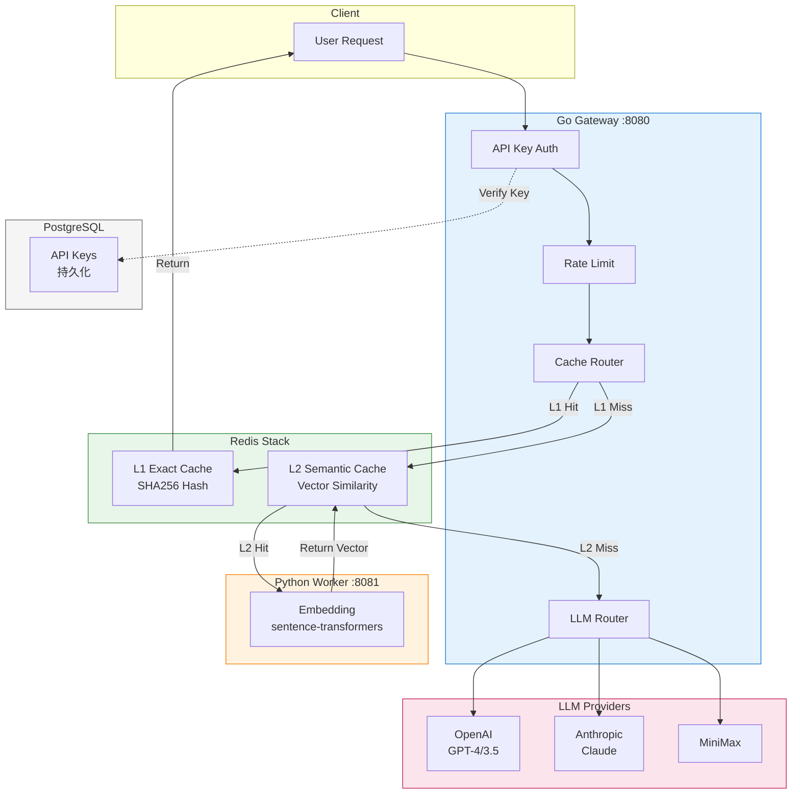

# LLM Gateway Architecture

## Request Flow

1. **Client** sends request to **Go Gateway** (:8080)
2. **API Key Auth** validates the API key (checks PostgreSQL cache)
3. **Rate Limit** enforces token bucket rate limiting
4. **Cache Router** checks:
   - **L1 Exact Cache**: SHA256(prompt+model+temperature) - <1ms
   - **L2 Semantic Cache**: Vector similarity >0.95 - 10-50ms
5. **LLM Router** forwards to provider with weighted round-robin
6. **Response** returned to client

## Component Ports

| Component | Port | Description |
|-----------|------|-------------|
| Go Gateway | 8080 | Main API server |
| Python Worker | 8081 | Embedding service |
| Redis Stack | 6379 | Cache + Vector search |
| PostgreSQL | 5432 | Persistent storage |
